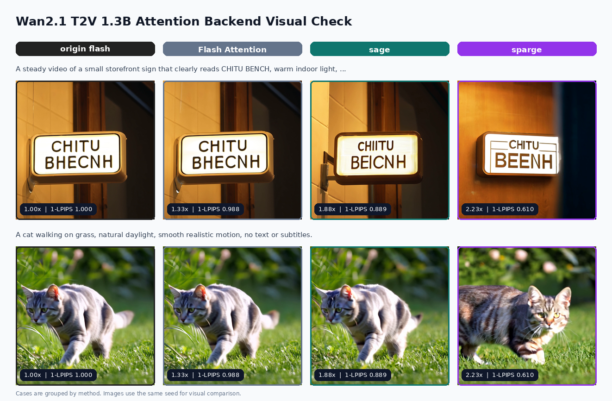

# ChituBench

ChituBench is the reproducible benchmark suite for ChituDiffusion. It compares
attention backends, parallel DiT execution, FlexCache strategies, and parallel
VAE decode with a shared result layout: speed tables, quality metrics, plots,
and visual samples live next to the raw run outputs.

Use this page as the entry point. The full numeric tables and commands are split
by optimization module under the result pages below.

## Result Navigation

| Module | What it measures | Headline result |
| --- | --- | --- |
| [Attention Backend](result_attention.md) | Pluggable attention kernels: Flash, Sage, Sparge, FlashInfer, and Torch SDPA | About 1.16x quality-preserving speedup on Flux; up to 2.23x on Wan video |
| [Parallel DiT](result_parallel_dit.md) | CFG parallelism plus context/sequence parallelism on the denoise stage | Up to 12.81x on Wan2.1-T2V-1.3B with 16 GPUs; Qwen-Image reaches 5.40x |
| [FlexCache](result_flexcache.md) | Step/block-level caching with MeanCache, TeaCache, TaylorSeer, Cubic, PAB, and BlockDance | MeanCache reaches 2.94x at 26 dB on Flux.1 and 3.62x at 24.5 dB on Qwen; Wan MeanCache30 keeps 35.6 dB at 1.66x, Cubic reaches 2.20x |
| [Parallel VAE](result_parallel_vae.md) | Tile-parallel VAE decode, adaptive offload, and serving/benchmark latency split | VAE decode reaches 2.3-2.9x; serving latency is reported without benchmark I/O overhead |

## Visual Highlights

### Parallel DiT Scaling

Wan2.1-T2V-1.3B scales across CFG parallelism, Ring/UP context parallelism, and
16-GPU combined layouts.


Qwen-Image shows strong CFG parallel scaling and useful image-context
parallelism on top of it.


### FlexCache Speed-Quality Curves

FlexCache plots show the trade-off between DiT-forward speedup and reconstruction
quality for each strategy family.


### Visual Contact Sheets

Contact sheets keep the benchmark grounded in generated samples, not only scalar
metrics.




## Benchmark Protocol

- Compare one model and one optimization family at a time.
- Keep every case pure: one case should represent one backend, parallel layout,
  cache policy, or VAE setting.
- Hold prompts, seeds, denoising steps, image/video size, and checkpoint paths
  fixed within each experiment.
- Report speed against the relevant baseline. Attention and FlexCache studies
  also report PSNR, SSIM, 1-LPIPS, and HPSv3 when available.
- Include visual samples for public-facing quality claims. Image benchmarks use
  generated images directly; video benchmarks use a fixed representative frame.
- Preserve raw run directories under `results/` and copy only selected final
  figures into `plots/`.

## Covered Models

- `Flux1-dev`
- `FLUX.2-klein-4B`
- `Qwen-Image`
- `Wan2.1-T2V-1.3B`

## Directory Layout

```text
ChituBench/
  configs/        # Renderable chitu run configs grouped by model and module
  prompts/        # Prompt sets used by experiments
  scripts/        # Run, collect, quality, and visualization scripts
  results/        # Raw benchmark outputs and copied run configs
  plots/          # Curated figures used by result pages and READMEs
```

## Running Benchmarks

The shell scripts in `scripts/` are the preferred entry points because they set
the model-specific ChituBench environment and launch through the same `chitu run`
path used by normal ChituDiffusion workloads.

Examples:

```bash
ChituBench/scripts/run_flux1_attention.sh
ChituBench/scripts/run_flux1_flexcache.sh
ChituBench/scripts/run_qwen_image_parallel.sh
ChituBench/scripts/run_wan2_1_t2v_1_3b_parallel_dit.sh
```

For quick smoke checks, override the common environment knobs:

```bash
CHITUBENCH_STEPS=4 \
CHITUBENCH_NUM_SEEDS=1 \
CHITUBENCH_WARMUP_RUNS=0 \
ChituBench/scripts/run_flux1_attention.sh
```

After a run, use the collection utilities to evaluate quality, aggregate timing,
and refresh plots/contact sheets:

```bash
./.venv/bin/python ChituBench/scripts/evaluate_quality.py <result-dir>
./.venv/bin/python ChituBench/scripts/collect.py <result-dir> --experiment-id <id>
```

For complete commands and per-module notes, open the corresponding result page
from [Result Navigation](#result-navigation).
