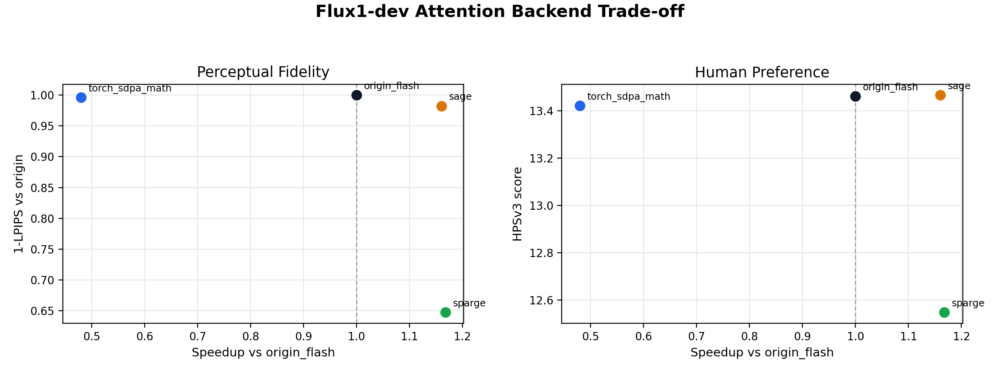
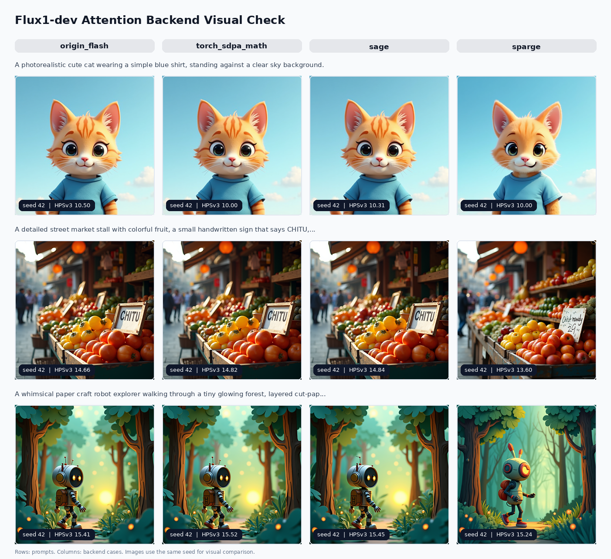
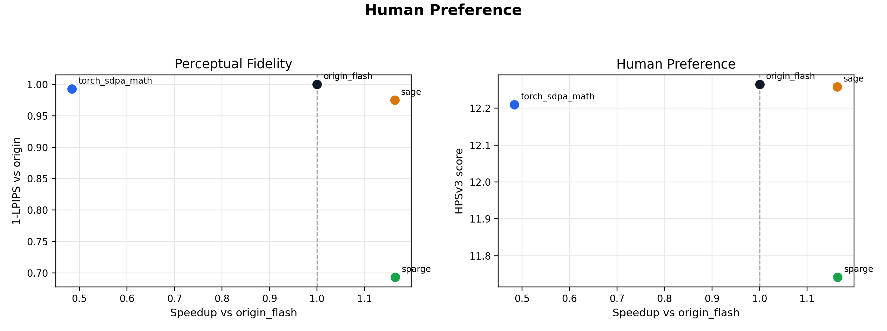
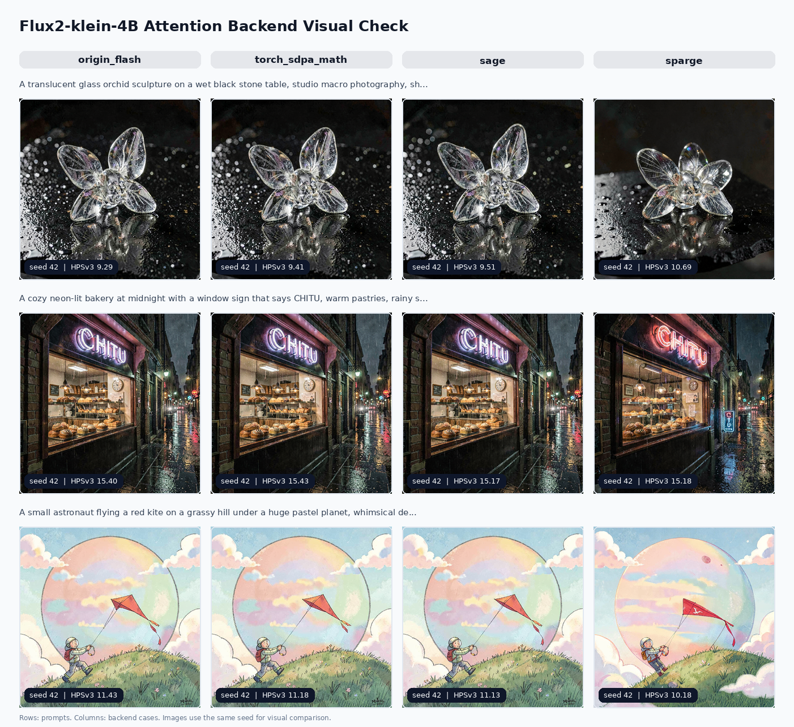

# ChituBench Results

This file collects the numeric tables and key figures for each completed
experiment. The README remains the worklog; this page is the compact result
view.

## flux1_dev_attention

Model: `Flux1-dev`

Family: attention backend, no parallelism, no FlexCache

Run: `flux1_attn_50step_20260613_121311`

Command:

```bash
CHITUBENCH_STEPS=50 \
CHITUBENCH_NUM_SEEDS=3 \
CHITUBENCH_WARMUP_RUNS=1 \
CHITUBENCH_RUN_ID=flux1_attn_50step_20260613_121311 \
CHITUBENCH_HPSV3_CONFIG=ChituBench/results/hpsv3_assets/HPSv3_7B.local.yaml \
CHITUBENCH_HPSV3_CHECKPOINT=ChituBench/results/hpsv3_assets/HPSv3.chitu_compat.safetensors \
ChituBench/scripts/run_flux1_attention.sh
```

Notes:

- Flux1-dev uses 50 denoising steps.
- Each case uses 3 prompts x 3 seeds = 9 measured images, plus 1 warmup image.
- Quality is measured against `origin_flash` for the same prompt and seed.
- HPSv3 was computed on a Slurm compute node because it requires CUDA.

### Summary

| case | tasks | DiT forward mean (s) | speedup vs origin | PSNR | SSIM | 1-LPIPS | HPSv3 |
| --- | ---: | ---: | ---: | ---: | ---: | ---: | ---: |
| origin_flash | 9 | 37.960 | 1.000 | inf | 1.0000 | 1.0000 | 13.461 |
| torch_sdpa_math | 9 | 79.111 | 0.480 | 39.859 | 0.9876 | 0.9961 | 13.422 |
| sage | 9 | 32.711 | 1.160 | 32.918 | 0.9595 | 0.9824 | 13.466 |
| sparge | 9 | 32.502 | 1.168 | 15.048 | 0.6442 | 0.6474 | 12.548 |

### Readout

- `torch_sdpa_math` is the native math SDPA control: it preserves image quality
  closely but is about 0.48x the speed of `origin_flash`.
- `sage` is the best point in this run: about 1.16x speedup with a small HPSv3
  gain and moderate pixel/perceptual drift.
- `sparge` is slightly faster than `sage`, but the quality drop is visible in
  PSNR, SSIM, 1-LPIPS, and HPSv3. It should not be treated as an accepted
  method point before improving the backend or its policy.

### Speed-Quality Trade-off



### Visual Contact Sheet



## flux2_klein_attention

Model: `Flux2-klein-4B`

Family: attention backend, no parallelism, no FlexCache

Run: `flux2_klein_attn_50step_20260613_130859`

Command:

```bash
CHITUBENCH_STEPS=50 \
CHITUBENCH_NUM_SEEDS=3 \
CHITUBENCH_WARMUP_RUNS=1 \
CHITUBENCH_RUN_ID=flux2_klein_attn_50step_20260613_130859 \
CHITUBENCH_HPSV3_CONFIG=ChituBench/results/hpsv3_assets/HPSv3_7B.local.yaml \
CHITUBENCH_HPSV3_CHECKPOINT=ChituBench/results/hpsv3_assets/HPSv3.chitu_compat.safetensors \
ChituBench/scripts/run_flux2_klein_attention.sh
```

Notes:

- Flux2-klein-4B uses 50 denoising steps.
- Each case uses 3 prompts x 3 seeds = 9 measured images, plus 1 warmup image.
- Quality is measured against `origin_flash` for the same prompt and seed.
- HPSv3 was computed on a Slurm compute node because it requires CUDA.

### Summary

| case | tasks | DiT forward mean (s) | speedup vs origin | PSNR | SSIM | 1-LPIPS | HPSv3 |
| --- | ---: | ---: | ---: | ---: | ---: | ---: | ---: |
| origin_flash | 9 | 16.972 | 1.000 | inf | 1.0000 | 1.0000 | 12.264 |
| torch_sdpa_math | 9 | 35.056 | 0.484 | 36.146 | 0.9903 | 0.9929 | 12.209 |
| sage | 9 | 14.591 | 1.163 | 29.587 | 0.9677 | 0.9750 | 12.258 |
| sparge | 9 | 14.576 | 1.164 | 15.938 | 0.6544 | 0.6930 | 11.742 |

### Readout

- `torch_sdpa_math` remains the slow native math SDPA control: about 0.48x the
  speed of `origin_flash`, with quality close to the origin output.
- `sage` gives about 1.16x speedup and keeps HPSv3 nearly identical to
  `origin_flash`, with moderate pixel/perceptual drift.
- `sparge` is only marginally faster than `sage`, while quality drops heavily
  across PSNR, SSIM, 1-LPIPS, and HPSv3. It needs method-side improvement before
  becoming an acceptable open-source performance point for Flux2-klein.

### Speed-Quality Trade-off



### Visual Contact Sheet


