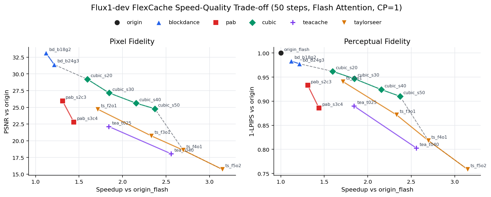
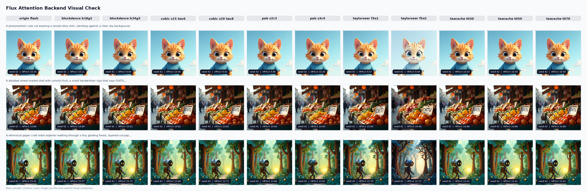
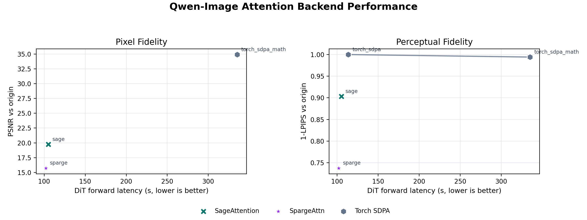
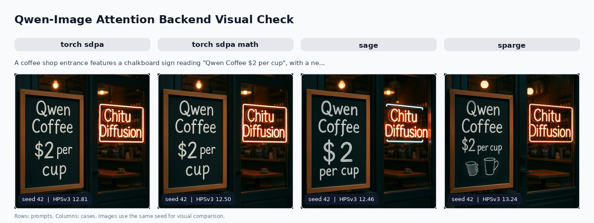

# ChituBench Results

This file collects the numeric tables and key figures for each completed
experiment. The README remains the worklog; this page is the compact result
view.

## flux1_dev_attention

Model: `Flux1-dev`

Family: attention backend, no parallelism, no FlexCache

Run: `flux1_attn_50step_20260613_121311`

Command:

```bash
CHITUBENCH_STEPS=50 \
CHITUBENCH_NUM_SEEDS=3 \
CHITUBENCH_WARMUP_RUNS=1 \
CHITUBENCH_RUN_ID=flux1_attn_50step_20260613_121311 \
CHITUBENCH_HPSV3_CONFIG=ChituBench/results/hpsv3_assets/HPSv3_7B.local.yaml \
CHITUBENCH_HPSV3_CHECKPOINT=ChituBench/results/hpsv3_assets/HPSv3.chitu_compat.safetensors \
ChituBench/scripts/run_flux1_attention.sh
```

Notes:

- Flux1-dev uses 50 denoising steps.
- Each case uses 3 prompts x 3 seeds = 9 measured images, plus 1 warmup image.
- Quality is measured against `origin_flash` for the same prompt and seed.
- HPSv3 was computed on a Slurm compute node because it requires CUDA.

### Summary

| case | tasks | DiT forward mean (s) | speedup vs origin | PSNR | SSIM | 1-LPIPS | HPSv3 |
| --- | ---: | ---: | ---: | ---: | ---: | ---: | ---: |
| origin_flash | 9 | 37.960 | 1.000 | inf | 1.0000 | 1.0000 | 13.461 |
| torch_sdpa_math | 9 | 79.111 | 0.480 | 39.859 | 0.9876 | 0.9961 | 13.422 |
| sage | 9 | 32.711 | 1.160 | 32.918 | 0.9595 | 0.9824 | 13.466 |
| sparge | 9 | 32.502 | 1.168 | 15.048 | 0.6442 | 0.6474 | 12.548 |

### Readout

- `torch_sdpa_math` is the native math SDPA control: it preserves image quality
  closely but is about 0.48x the speed of `origin_flash`.
- `sage` is the best point in this run: about 1.16x speedup with a small HPSv3
  gain and moderate pixel/perceptual drift.
- `sparge` is slightly faster than `sage`, but the quality drop is visible in
  PSNR, SSIM, 1-LPIPS, and HPSv3. It should not be treated as an accepted
  method point before improving the backend or its policy.

### Speed-Quality Trade-off


### Visual Contact Sheet


## flux1_dev_flexcache

Model: `Flux1-dev`

Family: FlexCache strategies, Flash Attention backend, `cp=1`

Run: `flux1_flexcache_50step_20260614_1200` with TeaCache fix retest
`flux1_teacache_fix_50step_20260614_1520` and Cubic 4x4 retest
`flux1_cubic_4x4_w8c2_50step_20260614_1343`, plus TaylorSeer mid-speed
retest `flux1_taylorseer_mid_50step_20260615_1112`

Command:

```bash
CHITUBENCH_RUN_ID=flux1_flexcache_50step_20260614_1200 \
CHITUBENCH_STEPS=50 \
CHITUBENCH_NUM_SEEDS=3 \
CHITUBENCH_WARMUP_RUNS=1 \
CHITUBENCH_HPSV3_CONFIG=ChituBench/results/hpsv3_assets/HPSv3_7B.local.yaml \
CHITUBENCH_HPSV3_CHECKPOINT=ChituBench/results/hpsv3_assets/HPSv3.chitu_compat.safetensors \
ChituBench/scripts/run_flux1_flexcache.sh
```

Notes:

- Flux1-dev uses 50 denoising steps.
- Each case uses 3 prompts x 3 seeds = 9 measured images, plus 1 warmup image.
- Quality is measured against `origin_flash` for the same prompt and seed.
- DiTango is excluded from this run because it is not fully usable yet.
- TeaCache rows use the Flux reference coefficients, `warmup=1`, `cooldown=1`,
  and only the two representative thresholds 0.25/0.40.
- Cubic rows use the 4x4 spatial retest: `block_size=16`,
  `uniform_square_min_splits=4`, `warmup=8`, `cooldown=2`, `tau=8`, and target
  speedups 2/3/4/5.
- TaylorSeer f2o1/f4o1 rows come from the mid-speed retest. Together with the
  original f3o1/f5o2 rows, they form one TaylorSeer speed-quality curve.
- HPSv3 was recomputed for the original all-strategy run on a Slurm compute
  node. The newer TeaCache, Cubic, and TaylorSeer retests are shown with PSNR
  and 1-LPIPS only.

### Summary

| case | tasks | DiT forward mean (s) | speedup vs origin | PSNR | SSIM | 1-LPIPS | HPSv3 |
| --- | ---: | ---: | ---: | ---: | ---: | ---: | ---: |
| origin_flash | 9 | 38.183 | 1.000 | inf | 1.0000 | 1.0000 | - |
| teacache_t025 | 9 | 20.711 | 1.844 | 22.118 | 0.8402 | 0.8898 | - |
| teacache_t040 | 9 | 14.911 | 2.561 | 18.037 | 0.7517 | 0.8026 | - |
| blockdance_b18g2 | 9 | 33.990 | 1.120 | 33.129 | 0.9588 | 0.9833 | 13.435 |
| blockdance_b24g3 | 9 | 31.322 | 1.215 | 31.389 | 0.9482 | 0.9776 | 13.582 |
| pab_s2c3 | 9 | 29.064 | 1.310 | 25.952 | 0.8890 | 0.9330 | 13.475 |
| pab_s3c4 | 9 | 26.443 | 1.439 | 22.805 | 0.8303 | 0.8858 | 13.423 |
| cubic_s20_tau8_4x4_w8c2 | 9 | 23.930 | 1.595 | 29.211 | 0.9275 | 0.9621 | - |
| cubic_s30_tau8_4x4_w8c2 | 9 | 20.678 | 1.846 | 27.156 | 0.9028 | 0.9467 | - |
| cubic_s40_tau8_4x4_w8c2 | 9 | 17.696 | 2.157 | 25.616 | 0.8739 | 0.9241 | - |
| cubic_s50_tau8_4x4_w8c2 | 9 | 16.093 | 2.371 | 24.792 | 0.8572 | 0.9102 | - |
| taylorseer_f2o1 | 9 | 22.089 | 1.716 | 24.713 | 0.8992 | 0.9406 | - |
| taylorseer_f3o1 | 9 | 16.323 | 2.332 | 20.722 | 0.8158 | 0.8716 | 13.639 |
| taylorseer_f4o1 | 9 | 14.050 | 2.698 | 18.590 | 0.7596 | 0.8181 | - |
| taylorseer_f5o2 | 9 | 12.093 | 3.147 | 15.715 | 0.6979 | 0.7585 | 13.482 |

### Readout

- TeaCache now takes effect after aligning the Flux model name, reference
  coefficients, and 1/1 warmup-cooldown policy. The two displayed thresholds
  give 1.84x and 2.56x speedup, but their quality drops faster than Cubic and
  BlockDance in this prompt set.
- BlockDance is the most conservative useful acceleration family: b18g2 gives
  1.12x speedup with the best pixel/perceptual metrics among accelerated cases,
  while b24g3 reaches 1.22x with slightly more drift.
- The Cubic 4x4 retest forms the middle-to-high speed Pareto segment. The
  conservative target-2 point reaches 1.59x with PSNR 29.21 and 1-LPIPS
  0.9621, while target-4 reaches 2.16x with PSNR 25.62 and 1-LPIPS 0.9241.
- TaylorSeer is the fastest family. The new f2o1 point is a conservative 1.72x
  setting with better PSNR/1-LPIPS than TeaCache at similar speed; f3o1 reaches
  2.33x and has the highest HPSv3 in this prompt set. f4o1 lands near the
  requested 2.5x region at 2.70x, while f5o2 is the most aggressive 3.15x
  point.

### Speed-Quality Trade-off



### Visual Contact Sheet



## flux2_klein_attention

Model: `Flux2-klein-4B`

Family: attention backend, no parallelism, no FlexCache

Run: `flux2_klein_attn_50step_20260613_130859`

Command:

```bash
CHITUBENCH_STEPS=50 \
CHITUBENCH_NUM_SEEDS=3 \
CHITUBENCH_WARMUP_RUNS=1 \
CHITUBENCH_RUN_ID=flux2_klein_attn_50step_20260613_130859 \
CHITUBENCH_HPSV3_CONFIG=ChituBench/results/hpsv3_assets/HPSv3_7B.local.yaml \
CHITUBENCH_HPSV3_CHECKPOINT=ChituBench/results/hpsv3_assets/HPSv3.chitu_compat.safetensors \
ChituBench/scripts/run_flux2_klein_attention.sh
```

Notes:

- Flux2-klein-4B uses 50 denoising steps.
- Each case uses 3 prompts x 3 seeds = 9 measured images, plus 1 warmup image.
- Quality is measured against `origin_flash` for the same prompt and seed.
- HPSv3 was computed on a Slurm compute node because it requires CUDA.

### Summary

| case | tasks | DiT forward mean (s) | speedup vs origin | PSNR | SSIM | 1-LPIPS | HPSv3 |
| --- | ---: | ---: | ---: | ---: | ---: | ---: | ---: |
| origin_flash | 9 | 16.972 | 1.000 | inf | 1.0000 | 1.0000 | 12.264 |
| torch_sdpa_math | 9 | 35.056 | 0.484 | 36.146 | 0.9903 | 0.9929 | 12.209 |
| sage | 9 | 14.591 | 1.163 | 29.587 | 0.9677 | 0.9750 | 12.258 |
| sparge | 9 | 14.576 | 1.164 | 15.938 | 0.6544 | 0.6930 | 11.742 |

### Readout

- `torch_sdpa_math` remains the slow native math SDPA control: about 0.48x the
  speed of `origin_flash`, with quality close to the origin output.
- `sage` gives about 1.16x speedup and keeps HPSv3 nearly identical to
  `origin_flash`, with moderate pixel/perceptual drift.
- `sparge` is only marginally faster than `sage`, while quality drops heavily
  across PSNR, SSIM, 1-LPIPS, and HPSv3. It needs method-side improvement before
  becoming an acceptable open-source performance point for Flux2-klein.

### Speed-Quality Trade-off


### Visual Contact Sheet


## qwen_image_attention

Model: `Qwen-Image`

Family: attention backend, no parallelism, no FlexCache

Run: `qwen_image_attn_50step_20260615_1550`

Command:

```bash
CHITUBENCH_STEPS=50 \
CHITUBENCH_NUM_SEEDS=3 \
CHITUBENCH_WARMUP_RUNS=1 \
CHITUBENCH_RUN_ID=qwen_image_attn_50step_20260615_1550 \
CHITUBENCH_HPSV3_CONFIG=ChituBench/results/hpsv3_assets/HPSv3_7B.local.yaml \
CHITUBENCH_HPSV3_CHECKPOINT=ChituBench/results/hpsv3_assets/HPSv3.chitu_compat.safetensors \
ChituBench/scripts/run_qwen_image_attention.sh
```

Notes:

- Qwen-Image uses 50 denoising steps at 1328x1328.
- Each case uses 1 prompt x 3 seeds = 3 measured images, plus 1 warmup image.
- Quality is measured against `torch_sdpa` for the same prompt and seed.
- HPSv3 was computed on a Slurm GPU node and is shown in the visual contact
  sheet labels.
- Qwen-Image currently supports this benchmark on single-GPU attention only;
  sequence/context parallel attention is not included yet.

### Summary

| case | tasks | DiT forward mean (s) | speedup vs torch_sdpa | PSNR | SSIM | 1-LPIPS | HPSv3 |
| --- | ---: | ---: | ---: | ---: | ---: | ---: | ---: |
| torch_sdpa | 3 | 113.564 | 1.000 | inf | 1.0000 | 1.0000 | 12.761 |
| torch_sdpa_math | 3 | 335.033 | 0.339 | 34.913 | 0.9785 | 0.9942 | 12.677 |
| sage | 3 | 105.093 | 1.081 | 19.742 | 0.8222 | 0.9032 | 12.494 |
| sparge | 3 | 101.954 | 1.114 | 15.742 | 0.6549 | 0.7377 | 12.929 |

### Readout

- `torch_sdpa` is the baseline for the current Qwen-Image Chitu attention
  adapter, because this run does not include an origin-flash path.
- `torch_sdpa_math` is the slow native math SDPA control. It preserves outputs
  relatively closely but runs at about 0.34x the speed of `torch_sdpa`.
- `sage` gives a modest 1.08x DiT-forward speedup, but it introduces visible
  output drift in this Qwen-Image processor path. Treat it as an experimental
  performance point rather than an accepted quality-preserving backend.
- `sparge` is the fastest backend in this run at 101.954s mean DiT latency, but
  it has the largest output drift. It is useful as a performance bound, not as
  a quality-preserving point yet.
- HPSv3 scores are close across the four cases and rank `sparge` highest on
  this single coffee prompt. That reward score should be read alongside
  PSNR/SSIM/LPIPS, which measure consistency against the `torch_sdpa` baseline.

### Latency-Quality Trade-off



### Visual Contact Sheet



## flux1_dev_sequence_parallel

Model: `Flux1-dev`

Family: sequence parallel scaling, Flash Attention backend, no FlexCache

Run: `flux1_sp_50step_20260613_144519`

Command:

```bash
CHITUBENCH_STEPS=50 \
CHITUBENCH_NUM_SEEDS=3 \
CHITUBENCH_WARMUP_RUNS=1 \
CHITUBENCH_RUN_ID=flux1_sp_50step_20260613_144519 \
ChituBench/scripts/run_flux1_sequence_parallel.sh
```

Notes:

- Flux1-dev uses 50 denoising steps.
- Each case uses 3 prompts x 3 seeds = 9 measured images, plus 1 warmup image.
- All cases use `infer.attn_type=flash`.
- This experiment records speed only; quality metrics are intentionally omitted.

### Summary

| case | GPUs | parallel mode | tasks | DiT forward mean (s) | speedup vs 1 GPU | efficiency |
| --- | ---: | --- | ---: | ---: | ---: | ---: |
| baseline_1gpu | 1 | none | 9 | 38.027 | 1.000 | 1.000 |
| ring_2gpu | 2 | ring | 9 | 20.860 | 1.823 | 0.911 |
| ulysses_2gpu | 2 | Ulysses | 9 | 21.018 | 1.809 | 0.905 |
| ring_4gpu | 4 | ring | 9 | 12.238 | 3.107 | 0.777 |
| usp_r2u2_4gpu | 4 | USP r2u2 | 9 | 12.395 | 3.068 | 0.767 |
| ulysses_4gpu | 4 | Ulysses | 9 | 11.580 | 3.284 | 0.821 |
| ring_8gpu | 8 | ring | 9 | 10.354 | 3.673 | 0.459 |
| usp_r4u2_8gpu | 8 | USP r4u2 | 9 | 9.811 | 3.876 | 0.484 |
| ulysses_8gpu | 8 | Ulysses | 9 | 7.852 | 4.843 | 0.605 |

### Readout

- 2 GPU ring and Ulysses are close, with ring slightly faster in this run.
- 4 GPU Ulysses is the best CP4 point: 3.284x speedup with 82.1% parallel
  efficiency.
- 8 GPU Ulysses is the best overall point: 4.843x speedup with 60.5% parallel
  efficiency.
- CP8 still improves absolute latency, but the efficiency drop is clear. USP
  r4u2 improves over 8 GPU ring, while full Ulysses remains strongest.

### Parallel Scaling


## flux2_klein_sequence_parallel

Model: `Flux2-klein-4B`

Family: sequence parallel scaling, Flash Attention backend, no FlexCache

Run: `flux2_klein_sp_4step_20260613_1545`

Command:

```bash
CHITUBENCH_STEPS=4 \
CHITUBENCH_NUM_SEEDS=3 \
CHITUBENCH_WARMUP_RUNS=1 \
CHITUBENCH_RUN_ID=flux2_klein_sp_4step_20260613_1545 \
ChituBench/scripts/run_flux2_klein_sequence_parallel.sh
```

Notes:

- Flux2-klein-4B uses 4 denoising steps.
- Each case uses 3 prompts x 3 seeds = 9 measured images, plus 1 warmup image.
- All cases use `infer.attn_type=flash`.
- This experiment records speed only; quality metrics are intentionally omitted.

### Summary

| case | GPUs | parallel mode | tasks | DiT forward mean (s) | speedup vs 1 GPU | efficiency |
| --- | ---: | --- | ---: | ---: | ---: | ---: |
| baseline_1gpu | 1 | none | 9 | 1.358 | 1.000 | 1.000 |
| ring_2gpu | 2 | ring | 9 | 0.732 | 1.857 | 0.928 |
| ulysses_2gpu | 2 | Ulysses | 9 | 0.740 | 1.836 | 0.918 |
| ring_4gpu | 4 | ring | 9 | 0.435 | 3.119 | 0.780 |
| usp_r2u2_4gpu | 4 | USP r2u2 | 9 | 0.439 | 3.095 | 0.774 |
| ulysses_4gpu | 4 | Ulysses | 9 | 0.409 | 3.320 | 0.830 |
| ring_8gpu | 8 | ring | 9 | 0.344 | 3.951 | 0.494 |
| usp_r4u2_8gpu | 8 | USP r4u2 | 9 | 0.335 | 4.057 | 0.507 |
| ulysses_8gpu | 8 | Ulysses | 9 | 0.278 | 4.880 | 0.610 |

### Readout

- 2 GPU ring and Ulysses are close, with ring slightly faster in this run.
- 4 GPU Ulysses is the best CP4 point: 3.320x speedup with 83.0% parallel
  efficiency.
- 8 GPU Ulysses is the best overall point: 4.880x speedup with 61.0% parallel
  efficiency.
- Flux2-klein still benefits from CP8, but because the default workload is only
  4 denoising steps, communication and setup overhead are visible in the
  efficiency curve.

### Parallel Scaling


