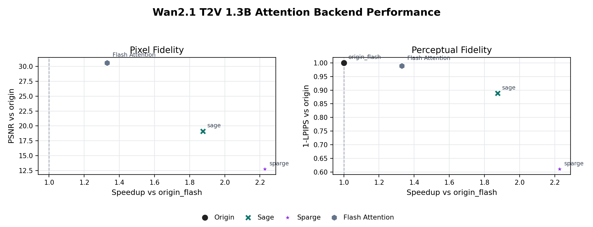

# ChituBench Results: Attention Backend

Pluggable attention backends behind the Chitu attention adapter (Flash / SageAttn /
SpargeAttn / FlashInfer) versus the model's origin attention. Each table reports
the DiT-forward latency and the quality drift relative to the per-model baseline.
This module isolates the attention kernel only: no parallelism, no FlexCache.

Back to [index](result.md).

## flux1_dev_attention

Model: `Flux1-dev`

Family: attention backend, no parallelism, no FlexCache

Run: `flux1_attn_50step_20260613_121311`

Command:

```bash
CHITUBENCH_STEPS=50 \
CHITUBENCH_NUM_SEEDS=3 \
CHITUBENCH_WARMUP_RUNS=1 \
CHITUBENCH_RUN_ID=flux1_attn_50step_20260613_121311 \
CHITUBENCH_HPSV3_CONFIG=ChituBench/results/hpsv3_assets/HPSv3_7B.local.yaml \
CHITUBENCH_HPSV3_CHECKPOINT=ChituBench/results/hpsv3_assets/HPSv3.chitu_compat.safetensors \
ChituBench/scripts/run_flux1_attention.sh
```

Notes:

- Flux1-dev uses 50 denoising steps.
- Each case uses 3 prompts x 3 seeds = 9 measured images, plus 1 warmup image.
- Quality is measured against `origin_flash` for the same prompt and seed.
- HPSv3 was computed on a Slurm compute node because it requires CUDA.

### Summary

| case | tasks | DiT forward mean (s) | speedup vs origin | PSNR | SSIM | 1-LPIPS | HPSv3 |
| --- | ---: | ---: | ---: | ---: | ---: | ---: | ---: |
| origin_flash | 9 | 37.960 | 1.000 | inf | 1.0000 | 1.0000 | 13.461 |
| Torch | 9 | 79.111 | 0.480 | 39.859 | 0.9876 | 0.9961 | 13.422 |
| sage | 9 | 32.711 | 1.160 | 32.918 | 0.9595 | 0.9824 | 13.466 |
| sparge | 9 | 32.502 | 1.168 | 15.048 | 0.6442 | 0.6474 | 12.548 |

### Readout

- Torch is the native math SDPA control: it preserves image quality
  closely but is about 0.48x the speed of `origin_flash`.
- `sage` is the best point in this run: about 1.16x speedup with a small HPSv3
  gain and moderate pixel/perceptual drift.
- `sparge` is slightly faster than `sage`, but the quality drop is visible in
  PSNR, SSIM, 1-LPIPS, and HPSv3. It should not be treated as an accepted
  method point before improving the backend or its policy.

### Speed-Quality Trade-off


### Visual Contact Sheet


## flux2_klein_attention

Model: `Flux2-klein-4B`

Family: attention backend, no parallelism, no FlexCache

Run: `flux2_klein_attn_50step_20260613_130859`

Command:

```bash
CHITUBENCH_STEPS=50 \
CHITUBENCH_NUM_SEEDS=3 \
CHITUBENCH_WARMUP_RUNS=1 \
CHITUBENCH_RUN_ID=flux2_klein_attn_50step_20260613_130859 \
CHITUBENCH_HPSV3_CONFIG=ChituBench/results/hpsv3_assets/HPSv3_7B.local.yaml \
CHITUBENCH_HPSV3_CHECKPOINT=ChituBench/results/hpsv3_assets/HPSv3.chitu_compat.safetensors \
ChituBench/scripts/run_flux2_klein_attention.sh
```

Notes:

- Flux2-klein-4B uses 50 denoising steps.
- Each case uses 3 prompts x 3 seeds = 9 measured images, plus 1 warmup image.
- Quality is measured against `origin_flash` for the same prompt and seed.
- HPSv3 was computed on a Slurm compute node because it requires CUDA.

### Summary

| case | tasks | DiT forward mean (s) | speedup vs origin | PSNR | SSIM | 1-LPIPS | HPSv3 |
| --- | ---: | ---: | ---: | ---: | ---: | ---: | ---: |
| origin_flash | 9 | 16.972 | 1.000 | inf | 1.0000 | 1.0000 | 12.264 |
| Torch | 9 | 35.056 | 0.484 | 36.146 | 0.9903 | 0.9929 | 12.209 |
| sage | 9 | 14.591 | 1.163 | 29.587 | 0.9677 | 0.9750 | 12.258 |
| sparge | 9 | 14.576 | 1.164 | 15.938 | 0.6544 | 0.6930 | 11.742 |

### Readout

- Torch remains the slow native math SDPA control: about 0.48x the
  speed of `origin_flash`, with quality close to the origin output.
- `sage` gives about 1.16x speedup and keeps HPSv3 nearly identical to
  `origin_flash`, with moderate pixel/perceptual drift.
- `sparge` is only marginally faster than `sage`, while quality drops heavily
  across PSNR, SSIM, 1-LPIPS, and HPSv3. It needs method-side improvement before
  becoming an acceptable open-source performance point for Flux2-klein.

### Speed-Quality Trade-off


### Visual Contact Sheet


## wan2_1_t2v_1_3b_attention

Model: `Wan2.1-T2V-1.3B`

Family: video attention backend, no parallelism, no FlexCache

Run: `wan21_13b_attn_2video_50step_20260617`

Command:

```bash
CHITUBENCH_RUN_ID=wan21_13b_attn_2video_50step_20260617 \
CHITUBENCH_STEPS=50 \
CHITUBENCH_NUM_SEEDS=1 \
CHITUBENCH_WARMUP_RUNS=0 \
CHITUBENCH_FRAME_NUM=81 \
ChituBench/scripts/run_wan2_1_t2v_1_3b_attention.sh
```

Notes:

- Wan2.1-T2V-1.3B uses 50 denoising steps, 81 frames, and 832x480 video size.
- This video benchmark uses exactly 2 prompts x 1 seed = 2 videos per case:
  one prompt with visible text and one prompt without text.
- Quality is measured against the single-GPU `origin_flash` videos for the
  same prompt and seed.
- Required quality metrics are PSNR, 1-LPIPS, and HPSv3. SSIM is included as an
  optional diagnostic.
- HPSv3 is scored on the representative middle frame of each video.

### Summary

| case | videos | DiT forward mean (s) | speedup vs origin | PSNR | SSIM | 1-LPIPS | HPSv3 |
| --- | ---: | ---: | ---: | ---: | ---: | ---: | ---: |
| origin_flash | 2 | 311.820 | 1.000 | inf | 1.0000 | 1.0000 | 10.226 |
| Torch | 2 | 234.372 | 1.330 | 30.594 | 0.9542 | 0.9884 | 10.226 |
| sage | 2 | 166.289 | 1.875 | 19.116 | 0.7946 | 0.8888 | 10.226 |
| sparge | 2 | 139.942 | 2.228 | 12.742 | 0.4511 | 0.6105 | 10.226 |

### Readout

- Torch SDPA is faster than `origin_flash` for this Wan video case while keeping
  the closest pixel/perceptual match: 1.33x DiT-forward speedup, PSNR 30.59,
  and 1-LPIPS 0.9884.
- `sage` reaches 1.88x speedup but has visible drift relative to the
  `origin_flash` reference on the two-video set.
- `sparge` reaches 2.23x speedup, but the PSNR/SSIM/1-LPIPS drop is large. It
  should be treated as an aggressive speed point, not a quality-preserving
  default.
- HPSv3 is identical across the middle-frame samples in this two-video run, so
  the pixel and LPIPS metrics are more informative for ranking drift here.

### Speed-Quality Trade-off



### Visual Contact Sheet


## qwen_image_attention

Model: `Qwen-Image`

Family: attention backend, no parallelism, no FlexCache

Run: `qwen_image_attn_50step_20260615_1550`

Additional FlashInfer probe: `chitubench-qwen-image-attn-flashinfer-20260617_121208-flashinfer`

Command:

```bash
CHITUBENCH_STEPS=50 \
CHITUBENCH_NUM_SEEDS=3 \
CHITUBENCH_WARMUP_RUNS=1 \
CHITUBENCH_RUN_ID=qwen_image_attn_50step_20260615_1550 \
CHITUBENCH_HPSV3_CONFIG=ChituBench/results/hpsv3_assets/HPSv3_7B.local.yaml \
CHITUBENCH_HPSV3_CHECKPOINT=ChituBench/results/hpsv3_assets/HPSv3.chitu_compat.safetensors \
ChituBench/scripts/run_qwen_image_attention.sh
```

Notes:

- Qwen-Image uses 50 denoising steps at 1328x1328.
- Each case uses 1 prompt x 3 seeds = 3 measured images, plus 1 warmup image.
- Quality is measured against Flash Attention for the same prompt and seed.
- HPSv3 was computed on a Slurm GPU node and is shown in the visual contact
  sheet labels.
- Qwen-Image currently supports this benchmark on single-GPU attention only;
  sequence/context parallel attention is not included yet.
- FlashInfer was added as a follow-up single-prompt probe after the original
  four-backend sweep. Its first run includes JIT compilation; the table below
  reports a warmed 50-step run with the JIT cache already populated.

### Summary

| case | tasks | DiT forward mean (s) | speedup vs Flash Attention | PSNR | SSIM | 1-LPIPS | HPSv3 |
| --- | ---: | ---: | ---: | ---: | ---: | ---: | ---: |
| Flash Attention | 3 | 113.564 | 1.000 | inf | 1.0000 | 1.0000 | 12.761 |
| Torch | 3 | 335.033 | 0.339 | 34.913 | 0.9785 | 0.9942 | 12.677 |
| flashinfer | 1 | 125.264 | 0.907 | - | - | - | - |
| sage | 3 | 105.093 | 1.081 | 19.742 | 0.8222 | 0.9032 | 12.494 |
| sparge | 3 | 101.954 | 1.114 | 15.742 | 0.6549 | 0.7377 | 12.929 |

### Readout

- Flash Attention is the baseline for the current Qwen-Image Chitu attention
  adapter, because this run does not include an origin-flash path.
- Torch is the slow native math SDPA control. It preserves outputs
  relatively closely but runs at about 0.34x the speed of Flash Attention.
- `flashinfer` is functional through the Chitu attention backend and ran the
  Qwen-Image 50-step coffee prompt end to end, but this dense full-attention
  workload is slower than Flash Attention in the measured single-image run
  (125.264s vs 113.564s DiT-forward latency). It is not a better default for
  Qwen-Image yet.
- `sage` gives a modest 1.08x DiT-forward speedup, but it introduces visible
  output drift in this Qwen-Image processor path. Treat it as an experimental
  performance point rather than an accepted quality-preserving backend.
- `sparge` is the fastest backend in this run at 101.954s mean DiT latency, but
  it has the largest output drift. It is useful as a performance bound, not as
  a quality-preserving point yet.
- HPSv3 scores are close across the four cases and rank `sparge` highest on
  this single coffee prompt. That reward score should be read alongside
  PSNR/SSIM/LPIPS, which measure consistency against the Flash Attention baseline.

### Latency-Quality Trade-off


### Visual Contact Sheet


