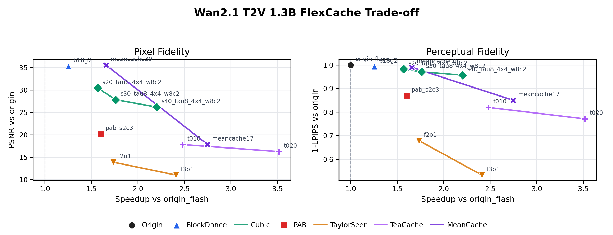
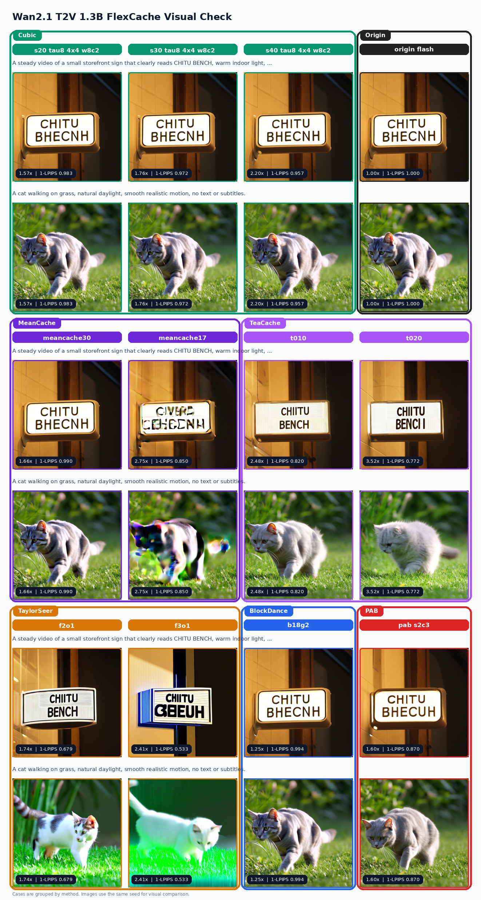

# ChituBench Results: FlexCache

Step-level / block-level caching strategies behind the unified FlexCache interface
(MeanCache, TeaCache, TaylorSeer, Cubic, PAB, BlockDance). Each strategy skips or
approximates DiT work on a subset of denoising steps, trading quality for speed.
Tables report DiT-forward speedup vs the no-cache baseline plus pixel/perceptual
drift; multi-point families form a speed-quality curve.

Back to [index](result.md).

## flux1_dev_flexcache

Model: `Flux1-dev`

Family: FlexCache strategies, Flash Attention backend, `cp=1`

Run: consolidated `flux1_flexcache_with_meancache_50step_20260616`, reusing
`flux1_teacache_fix_50step_20260614_1520`,
`flux1_cubic_4x4_w8c2_50step_20260614_1343`,
`flux1_taylorseer_mid_50step_20260615_1112`, and the original
`flux1_flexcache_50step_20260614_1200`, plus new MeanCache runs
`flux1_meancache25_e2e`, `flux1_meancache17_smoke_rerun`, and
`flux1_meancache10_e2e`

Command:

```bash
# Reuse completed runs by symlinking them into one consolidated result dir,
# then evaluate and collect once.
./.venv/bin/python ChituBench/scripts/evaluate_quality.py \
  ChituBench/results/flux1_dev_flexcache/flux1_flexcache_with_meancache_50step_20260616 \
  --origin-dir ChituBench/results/flux1_dev_flexcache/flux1_teacache_fix_50step_20260614_1520/chitubench-flux1-flexcache-origin_flash-20260614_152038-origin_flash

./.venv/bin/python ChituBench/scripts/collect.py \
  ChituBench/results/flux1_dev_flexcache/flux1_flexcache_with_meancache_50step_20260616 \
  --experiment-id flux1_dev_flexcache \
  --allow-partial \
  --title 'Flux1-dev FlexCache Trade-off' \
  --no-point-labels
```

Additional MeanCache end-to-end runs:

```bash
MASTER_PORT=63431 \
CHITUBENCH_RUN_ID=flux1_meancache25_e2e \
CHITUBENCH_CASE_ID=flux1_meancache25_e2e \
CHITUBENCH_STEPS=50 \
CHITUBENCH_NUM_SEEDS=1 \
CHITUBENCH_WARMUP_RUNS=0 \
CHITUBENCH_IMAGE_SIZE=1024,1024 \
CHITUBENCH_PROMPT_FILE=ChituBench/prompts/flux1_attention.json \
CHITUBENCH_FLEXCACHE_PARAMS='{"strategy":"meancache","fresh_steps":25,"warmup":0,"cooldown":0,"use_jvp":true}' \
./.venv/bin/chitu run \
  ChituBench/results/flux1_dev_flexcache/configs/flux1_meancache17_smoke.yaml \
  --gpus-per-node 1 \
  --cfp 1
```

Notes:

- Flux1-dev uses 50 denoising steps.
- The consolidated chart reuses the existing 9-task strategy runs and adds
  three MeanCache runs with 3 prompts x 1 seed each.
- Quality is measured against `origin_flash` for the same prompt and seed.
- DiTango is excluded from this run because it is not fully usable yet.
- TeaCache rows use the Flux reference coefficients and now keep all four
  thresholds 0.25/0.40/0.60/0.80 so the family curve is visible.
- Cubic rows use the 4x4 spatial retest: `block_size=16`,
  `uniform_square_min_splits=4`, `warmup=8`, `cooldown=2`, `tau=8`, and target
  speedups 2/3/4/5.
- TaylorSeer f2o1/f4o1 rows come from the mid-speed retest. Together with the
  original f3o1/f5o2 rows, they form one TaylorSeer speed-quality curve.
- MeanCache is now adapted through the new FlexCache MeanCache interface for
  Flux1-dev, and the B=25/17/10 points are validated end to end on the real
  launch path.
- HPSv3 was recomputed for the original all-strategy run on a Slurm compute
  node. The consolidated MeanCache update is summarized with PSNR/SSIM/1-LPIPS.

### Summary

| case | tasks | DiT forward mean (s) | speedup vs origin | PSNR | SSIM | 1-LPIPS | HPSv3 |
| --- | ---: | ---: | ---: | ---: | ---: | ---: | ---: |
| origin_flash | 9 | 38.183 | 1.000 | inf | 1.0000 | 1.0000 | - |
| teacache_t025 | 9 | 20.711 | 1.844 | 22.118 | 0.8402 | 0.8898 | - |
| teacache_t040 | 9 | 14.911 | 2.561 | 18.037 | 0.7517 | 0.8026 | - |
| teacache_t060 | 9 | 11.459 | 3.332 | 16.257 | 0.7078 | 0.7403 | - |
| teacache_t080 | 9 | 9.441 | 4.045 | 15.690 | 0.6890 | 0.7015 | - |
| blockdance_b18g2 | 9 | 33.990 | 1.120 | 33.129 | 0.9588 | 0.9833 | 13.435 |
| blockdance_b24g3 | 9 | 31.322 | 1.215 | 31.389 | 0.9482 | 0.9776 | 13.582 |
| pab_s2c3 | 9 | 29.064 | 1.310 | 25.952 | 0.8890 | 0.9330 | 13.475 |
| pab_s3c4 | 9 | 26.443 | 1.439 | 22.805 | 0.8303 | 0.8858 | 13.423 |
| cubic_s20_tau8_4x4_w8c2 | 9 | 23.930 | 1.595 | 29.211 | 0.9275 | 0.9621 | - |
| cubic_s30_tau8_4x4_w8c2 | 9 | 20.678 | 1.846 | 27.156 | 0.9028 | 0.9467 | - |
| cubic_s40_tau8_4x4_w8c2 | 9 | 17.696 | 2.157 | 25.616 | 0.8739 | 0.9241 | - |
| cubic_s50_tau8_4x4_w8c2 | 9 | 16.093 | 2.371 | 24.792 | 0.8572 | 0.9102 | - |
| taylorseer_f2o1 | 9 | 22.089 | 1.716 | 24.713 | 0.8992 | 0.9406 | - |
| taylorseer_f3o1 | 9 | 16.323 | 2.332 | 20.722 | 0.8158 | 0.8716 | 13.639 |
| taylorseer_f4o1 | 9 | 14.050 | 2.698 | 18.590 | 0.7596 | 0.8181 | - |
| taylorseer_f5o2 | 9 | 12.093 | 3.147 | 15.715 | 0.6979 | 0.7585 | 13.482 |
| flux1_meancache25_e2e | 3 | 19.009 | 2.009 | 28.684 | 0.9164 | 0.9488 | - |
| flux1_meancache17_smoke_rerun | 3 | 12.991 | 2.939 | 26.424 | 0.8750 | 0.9135 | - |
| flux1_meancache10_e2e | 3 | 7.654 | 4.989 | 19.888 | 0.7734 | 0.8438 | - |

### Readout

- TeaCache and MeanCache are now both visible as step-reduction curves. TeaCache
  reaches the highest raw speed among the older Flux1 strategies, but MeanCache
  is noticeably better in pixel and perceptual quality at similar or higher
  speedups.
- BlockDance is the most conservative useful acceleration family: b18g2 gives
  1.12x speedup with the best pixel/perceptual metrics among accelerated cases,
  while b24g3 reaches 1.22x with slightly more drift.
- The Cubic 4x4 retest forms the middle-to-high speed Pareto segment. The
  conservative target-2 point reaches 1.59x with PSNR 29.21 and 1-LPIPS
  0.9621, while target-4 reaches 2.16x with PSNR 25.62 and 1-LPIPS 0.9241.
- TaylorSeer is the fastest family. The new f2o1 point is a conservative 1.72x
  setting with better PSNR/1-LPIPS than TeaCache at similar speed; f3o1 reaches
  2.33x and has the highest HPSv3 in this prompt set. f4o1 lands near the
  requested 2.5x region at 2.70x, while f5o2 is the most aggressive 3.15x
  point.
- Flux1 MeanCache is now adapted through the new FlexCache interface and forms
  a clean three-point curve: `B=25` is the conservative quality-first point,
  `B=17` is a strong middle setting around 2.94x, and `B=10` pushes to 4.99x
  with a visible quality trade-off.

### Speed-Quality Trade-off


### Visual Contact Sheet


## qwen_image_flexcache

Model: `Qwen-Image`

Family: FlexCache strategies, Flash Attention backend, CFP2

Run: `qwen_image_flexcache_50step_20260616`

Command:

```bash
# Reuse the completed 50-step coffee prompt runs by symlinking them into the
# qwen_image_flexcache result directory, then evaluate and collect once.
./.venv/bin/python ChituBench/scripts/evaluate_quality.py \
  ChituBench/results/qwen_image_flexcache/qwen_image_flexcache_50step_20260616 \
  --origin-dir ChituBench/results/qwen_image_attention/qwen_image_attn_50step_20260615_1550/chitubench-qwen-image-attn-torch-sdpa-20260615_154538-torch_sdpa \
  --skip-hpsv3

./.venv/bin/python ChituBench/scripts/collect.py \
  ChituBench/results/qwen_image_flexcache/qwen_image_flexcache_50step_20260616 \
  --experiment-id qwen_image_flexcache \
  --allow-partial \
  --title 'Qwen-Image FlexCache 50-step Trade-off'
```

Additional sweeps, sharing model loads:

```bash
MASTER_PORT=63121 \
CHITUBENCH_RUN_ID=qwen_flexcache_extra_meancache \
CHITUBENCH_CASES=flexcache_sweep \
CHITUBENCH_STEPS=50 \
CHITUBENCH_NUM_SEEDS=1 \
CHITUBENCH_WARMUP_RUNS=0 \
CHITUBENCH_ATTN_TYPE=torch_sdpa \
CHITUBENCH_IMAGE_SIZE=1328,1328 \
CHITUBENCH_FLEXCACHE_SWEEP='[
  {"case_id":"qwen_meancache17_50_cfp2","flexcache_params":{"strategy":"meancache","fresh_steps":17,"warmup":0,"cooldown":0,"use_jvp":true}},
  {"case_id":"qwen_meancache10_50_cfp2","flexcache_params":{"strategy":"meancache","fresh_steps":10,"warmup":0,"cooldown":0,"use_jvp":true}}
]' \
./.venv/bin/python ChituBench/scripts/qwen_image_benchmark.py \
  --gpus-per-node 2 \
  --cfp 2
```

```bash
MASTER_PORT=63231 \
SRUN_EXTRA_ARGS='--exclusive --exclude=bjdb-h20-node-021' \
CHITU_RUN_TASK_ID=qwen_flexcache_extra_sweep \
CHITUBENCH_RUN_ID=qwen_flexcache_extra_sweep \
CHITUBENCH_STEPS=50 \
CHITUBENCH_NUM_SEEDS=1 \
CHITUBENCH_WARMUP_RUNS=0 \
CHITUBENCH_ATTN_TYPE=torch_sdpa \
CHITUBENCH_IMAGE_SIZE=1328,1328 \
CHITUBENCH_FLEXCACHE_SWEEP='[
  {"case_id":"qwen_pab_s3c4_50_cfp2","flexcache_params":{"strategy":"pab","warmup":5,"cooldown":5,"skip_self_range":3,"skip_cross_range":4}},
  {"case_id":"qwen_pab_s4c5_50_cfp2","flexcache_params":{"strategy":"pab","warmup":5,"cooldown":5,"skip_self_range":4,"skip_cross_range":5}},
  {"case_id":"qwen_blockdance_g3_50_cfp2","flexcache_params":{"strategy":"blockdance","warmup":5,"cooldown":5,"boundary_block":20,"group_size":3,"start_fraction":0.40,"end_fraction":0.95}},
  {"case_id":"qwen_blockdance_g4_50_cfp2","flexcache_params":{"strategy":"blockdance","warmup":5,"cooldown":5,"boundary_block":20,"group_size":4,"start_fraction":0.40,"end_fraction":0.95}},
  {"case_id":"qwen_cubic20_50_cfp2","flexcache_params":{"strategy":"cubic","target_speedup":2.0,"warmup":7,"cooldown":3,"tau_max":8,"block_size":8,"uniform_square_min_splits":4}}
]' \
./.venv/bin/chitu run \
  ChituBench/results/qwen_image_flexcache/qwen_image_flexcache_50step_20260616/configs/qwen_flexcache_extra_sweep_cfp2.yaml \
  --gpus-per-node 2 \
  --cfp 2
```

Notes:

- Qwen-Image uses 50 denoising steps at 1328x1328.
- Each FlexCache point uses the same coffee-sign prompt with seed 42; the
  Flash Attention baseline reuses the existing three-seed attention-backend run.
- The result directory reuses completed PAB, BlockDance, MeanCache25, Cubic1.5,
  and Cubic3.0 runs via symlinks, then adds two batched sweeps for MeanCache
  and the missing PAB/BlockDance/Cubic points.
- PAB, BlockDance, Cubic, and MeanCache each have three points, so the
  speed-quality plot shows method curves rather than isolated single markers.
- Quality is measured against the Flash Attention coffee image with PSNR, SSIM,
  and 1-LPIPS. HPSv3 is skipped for this FlexCache trade-off pass.
- The speedup column uses the rank-0 `dit_forward` timer total, matching the
  other ChituBench FlexCache summaries.

### Summary

| case | DiT forward mean (s) | speedup vs Flash Attention | PSNR | SSIM | 1-LPIPS |
| --- | ---: | ---: | ---: | ---: | ---: |
| Flash Attention | 113.564 | 1.000 | inf | 1.0000 | 1.0000 |
| qwen_pab50_cfp2 | 49.907 | 2.276 | 20.817 | 0.9083 | 0.9514 |
| qwen_blockdance50_cfp2 | 57.362 | 1.980 | 23.826 | 0.9500 | 0.9596 |
| qwen_cubic15_50_cfp2 | 51.216 | 2.217 | 19.108 | 0.8657 | 0.9162 |
| qwen_pab_s3c4_50_cfp2 | 46.011 | 2.468 | 17.227 | 0.8321 | 0.8779 |
| qwen_pab_s4c5_50_cfp2 | 43.362 | 2.619 | 17.683 | 0.8345 | 0.8916 |
| qwen_blockdance_g3_50_cfp2 | 55.468 | 2.047 | 23.841 | 0.9403 | 0.9593 |
| qwen_blockdance_g4_50_cfp2 | 54.554 | 2.082 | 23.710 | 0.9193 | 0.9578 |
| qwen_cubic20_50_cfp2 | 43.104 | 2.635 | 22.912 | 0.9351 | 0.9549 |
| qwen_cubic30_w9c1_tau10_50_cfp2 | 37.396 | 3.037 | 21.794 | 0.9118 | 0.9434 |
| qwen_meancache25_50_cfp2 | 31.410 | 3.616 | 24.507 | 0.9299 | 0.9533 |
| qwen_meancache17_50_cfp2 | 21.302 | 5.331 | 22.451 | 0.9161 | 0.9468 |
| qwen_meancache10_50_cfp2 | 12.490 | 9.092 | 10.375 | 0.3403 | 0.6008 |

### Readout

- MeanCache spans the widest range. `mc25` is the best quality-speed point in
  that family, `mc17` is the aggressive usable point, and `mc10` is a fast
  lower-quality bound.
- Cubic now forms a clearer middle frontier. The `cubic2` point is the best
  Cubic balance in this sweep: 2.63x speedup with 0.9549 1-LPIPS, while
  `cubic3.0` trades text quality for more speed.
- PAB speeds up as skip ranges increase, but the two more aggressive settings
  drop PSNR/LPIPS sharply on the coffee prompt.
- BlockDance preserves high fidelity across all three points, but its current
  Qwen-Image settings only move from 1.98x to 2.08x speedup, so it is quality
  preserving rather than latency optimal here.

### Speed-Quality Trade-off


### Visual Contact Sheet


## wan2_1_t2v_1_3b_flexcache

Model: `Wan2.1-T2V-1.3B`

Family: FlexCache strategies, Flash Attention backend, CFP2

Run: `wan21_13b_flexcache_cfp2_2video_50step_20260622`

Command:

```bash
CHITUBENCH_RUN_ID=wan21_13b_flexcache_cfp2_2video_50step_20260622 \
CHITUBENCH_STEPS=50 \
CHITUBENCH_FRAME_NUM=81 \
CHITUBENCH_NUM_SEEDS=1 \
CHITUBENCH_WARMUP_RUNS=0 \
bash ChituBench/scripts/run_wan2_1_t2v_1_3b_flexcache.sh
```

Notes:

- Wan video FlexCache uses two prompts, one seed, 50 denoising steps, and
  81-frame 832x480 videos.
- All cases use 2 GPUs with CFG parallelism enabled as `cfp=2`, `cp=1`, and
  `up=1`. The baseline is `origin_flash` from the same run directory.
- FlexCache is request-driven through per-case `flexcache_params`; the
  `origin_flash` requests do not carry FlexCache params.
- Required quality metrics are present: PSNR, 1-LPIPS, and HPSv3. HPSv3 is
  computed on a single representative middle frame per video. The readout still
  uses PSNR and 1-LPIPS as the main quality-separation metrics, with HPSv3 kept
  as a prompt-reward signal rather than a reconstruction metric.
- MeanCache17, TeaCache t0.20, MeanCache30, TaylorSeer f2o1, TeaCache t0.10,
  Cubic s30, and Cubic s40 were added after the initial Wan FlexCache pass,
  reusing the same `origin_flash` baseline and benchmark settings. MeanCache30
  adds a conservative 30-fresh-step schedule for Wan; the older MeanCache17,
  TaylorSeer f3o1, and TeaCache t0.20 points are kept as aggressive drift
  references rather than recommended settings.
- Cubic is now swept at target speedups 2.0 / 3.0 / 4.0. Other methods remain
  representative points rather than complete multi-point sweeps.

### Summary

| case | tasks | DiT forward mean (s) | speedup vs origin | PSNR | SSIM | 1-LPIPS | HPSv3 |
| --- | ---: | ---: | ---: | ---: | ---: | ---: | ---: |
| origin_flash | 2 | 155.950 | 1.000 | inf | 1.0000 | 1.0000 | 10.226 |
| blockdance_b18g2 | 2 | 124.396 | 1.254 | 35.342 | 0.9680 | 0.9941 | 10.017 |
| cubic_s20_tau8_4x4_w8c2 | 2 | 99.443 | 1.568 | 30.472 | 0.9375 | 0.9834 | 9.641 |
| cubic_s30_tau8_4x4_w8c2 | 2 | 88.541 | 1.761 | 27.842 | 0.9140 | 0.9715 | 9.765 |
| cubic_s40_tau8_4x4_w8c2 | 2 | 70.803 | 2.203 | 26.212 | 0.8902 | 0.9571 | 9.354 |
| meancache30 | 2 | 94.085 | 1.658 | 35.596 | 0.9666 | 0.9902 | 10.174 |
| pab_s2c3 | 2 | 97.350 | 1.602 | 20.187 | 0.7962 | 0.8703 | 10.732 |
| meancache17 | 2 | 56.757 | 2.748 | 17.868 | 0.7593 | 0.8504 | 0.364 |
| teacache_t010 | 2 | 62.882 | 2.480 | 17.824 | 0.7315 | 0.8201 | 10.607 |
| teacache_t020 | 2 | 44.346 | 3.517 | 16.257 | 0.6920 | 0.7718 | 8.144 |
| taylorseer_f2o1 | 2 | 89.877 | 1.735 | 13.894 | 0.5890 | 0.6790 | 8.797 |
| taylorseer_f3o1 | 2 | 64.700 | 2.410 | 11.005 | 0.4713 | 0.5331 | 3.518 |

### Readout

- MeanCache30 is the strongest Wan FlexCache point in this pass: 1.66x speedup
  while keeping PSNR 35.60 and 1-LPIPS 0.9902.
- BlockDance is the most conservative quality-preserving point: 1.25x speedup
  with PSNR 35.34 and the highest non-origin 1-LPIPS at 0.9941.
- Cubic now forms a clean three-point speed-quality curve: s20 keeps PSNR
  30.47 / 1-LPIPS 0.9834 at 1.57x, s30 reaches 1.76x with PSNR 27.84, and
  s40 reaches 2.20x with PSNR 26.21.
- PAB has similar speed to Cubic but much larger visual drift on the two video
  prompts.
- MeanCache17, TeaCache t0.10, TeaCache t0.20, and both TaylorSeer points are
  useful as speed/drift references, but none are visually competitive with
  MeanCache30, BlockDance, or the Cubic curve on this two-video Wan setup.

### Speed-Quality Trade-off



### Visual Contact Sheet


