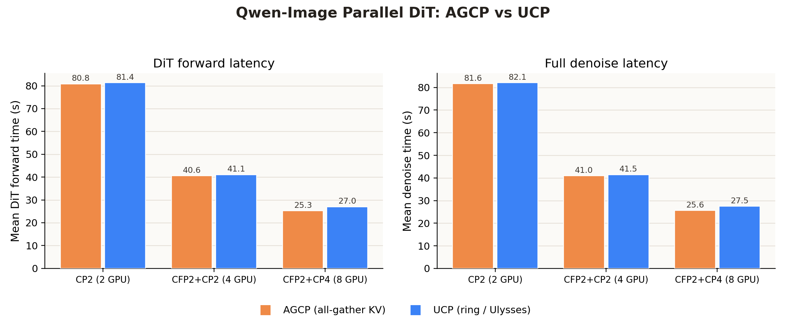
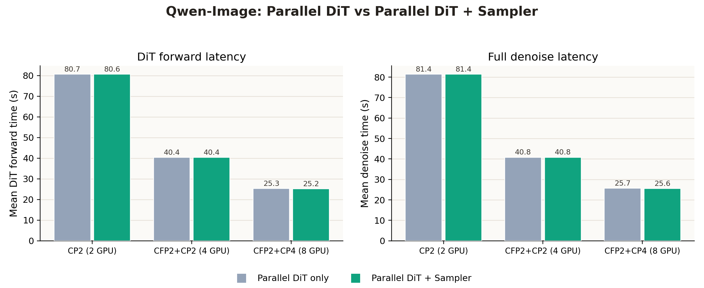
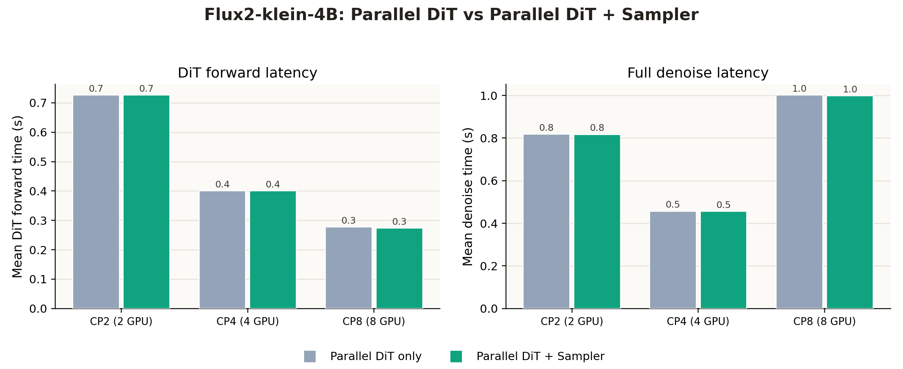
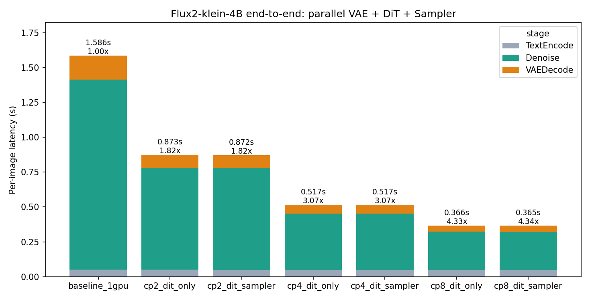

# ChituBench Results: Parallel DiT

Multi-GPU parallelism on the DiT denoise stage: CFG parallel (split the two CFG
branches across ranks) and context/sequence parallel (Ulysses, ring, USP, or the
Qwen joint-attention CP path). Tables report rank-0 `dit_forward` latency,
speedup vs the 1-GPU baseline, and parallel efficiency (speedup / GPUs). Speed
only; quality is covered by the attention/FlexCache modules.

Back to [index](result.md).

## Headline: scaling by GPU count

Best parallel point at each GPU count (DiT-forward speedup vs 1 GPU):

| model | 1 GPU | 4 GPU | 8 GPU | 16 GPU |
| --- | ---: | ---: | ---: | ---: |
| Flux.1-dev (50-step, Ulysses) | 1.00x | 3.28x | 4.84x | - |
| Flux2-klein-4B (4-step, Ulysses) | 1.00x | 3.32x | 4.88x | - |
| Qwen-Image (50-step, CFG+CP) | 1.00x | 3.36x | 5.40x | - |
| Wan2.1-T2V-1.3B (50-step video, CFP+Ring/UP) | 1.00x | 3.85x | 7.25x | 12.81x |

## flux1_dev_sequence_parallel

Model: `Flux1-dev`

Family: sequence parallel scaling, Flash Attention backend, no FlexCache

Run: `flux1_sp_50step_20260613_144519`

Command:

```bash
CHITUBENCH_STEPS=50 \
CHITUBENCH_NUM_SEEDS=3 \
CHITUBENCH_WARMUP_RUNS=1 \
CHITUBENCH_RUN_ID=flux1_sp_50step_20260613_144519 \
ChituBench/scripts/run_flux1_sequence_parallel.sh
```

Notes:

- Flux1-dev uses 50 denoising steps; 3 prompts x 3 seeds = 9 measured images.
- All cases use `infer.attn_type=flash`. Speed only; quality omitted.

### Summary

| case | GPUs | parallel mode | DiT forward mean (s) | speedup vs 1 GPU | efficiency |
| --- | ---: | --- | ---: | ---: | ---: |
| baseline_1gpu | 1 | none | 38.027 | 1.000 | 1.000 |
| ring_2gpu | 2 | ring | 20.860 | 1.823 | 0.911 |
| ulysses_2gpu | 2 | Ulysses | 21.018 | 1.809 | 0.905 |
| ring_4gpu | 4 | ring | 12.238 | 3.107 | 0.777 |
| usp_r2u2_4gpu | 4 | USP r2u2 | 12.395 | 3.068 | 0.767 |
| ulysses_4gpu | 4 | Ulysses | 11.580 | 3.284 | 0.821 |
| ring_8gpu | 8 | ring | 10.354 | 3.673 | 0.459 |
| usp_r4u2_8gpu | 8 | USP r4u2 | 9.811 | 3.876 | 0.484 |
| ulysses_8gpu | 8 | Ulysses | 7.852 | 4.843 | 0.605 |

### Readout

- 2 GPU ring and Ulysses are close, with ring slightly faster in this run.
- 4 GPU Ulysses is the best CP4 point: 3.284x speedup with 82.1% efficiency.
- 8 GPU Ulysses is the best overall point: 4.843x speedup with 60.5% efficiency.
- CP8 still improves absolute latency, but the efficiency drop is clear. USP
  r4u2 improves over 8 GPU ring, while full Ulysses remains strongest.

### Parallel Scaling


## flux2_klein_sequence_parallel

Model: `Flux2-klein-4B`

Family: sequence parallel scaling, Flash Attention backend, no FlexCache

Run: `flux2_klein_sp_4step_20260613_1545`

Command:

```bash
CHITUBENCH_STEPS=4 \
CHITUBENCH_NUM_SEEDS=3 \
CHITUBENCH_WARMUP_RUNS=1 \
CHITUBENCH_RUN_ID=flux2_klein_sp_4step_20260613_1545 \
ChituBench/scripts/run_flux2_klein_sequence_parallel.sh
```

Notes:

- Flux2-klein-4B uses only 4 denoising steps; 3 prompts x 3 seeds = 9 images.
- All cases use `infer.attn_type=flash`. Speed only; quality omitted.
- Because the DiT is tiny (4 steps), per-image latency is small and
  communication/setup overhead is visible in the efficiency curve.

### Summary

| case | GPUs | parallel mode | DiT forward mean (s) | speedup vs 1 GPU | efficiency |
| --- | ---: | --- | ---: | ---: | ---: |
| baseline_1gpu | 1 | none | 1.358 | 1.000 | 1.000 |
| ring_2gpu | 2 | ring | 0.732 | 1.857 | 0.928 |
| ulysses_2gpu | 2 | Ulysses | 0.740 | 1.836 | 0.918 |
| ring_4gpu | 4 | ring | 0.435 | 3.119 | 0.780 |
| usp_r2u2_4gpu | 4 | USP r2u2 | 0.439 | 3.095 | 0.774 |
| ulysses_4gpu | 4 | Ulysses | 0.409 | 3.320 | 0.830 |
| ring_8gpu | 8 | ring | 0.344 | 3.951 | 0.494 |
| usp_r4u2_8gpu | 8 | USP r4u2 | 0.335 | 4.057 | 0.507 |
| ulysses_8gpu | 8 | Ulysses | 0.278 | 4.880 | 0.610 |

### Readout

- 4 GPU Ulysses is the best CP4 point: 3.320x speedup with 83.0% efficiency.
- 8 GPU Ulysses is the best overall point: 4.880x speedup with 61.0% efficiency.
- For a 4-step distilled model the DiT is no longer the bottleneck once
  parallelized; VAE decode becomes the dominant stage (see
  [Parallel VAE](result_parallel_vae.md)).

### Parallel Scaling


## qwen_image_parallel

Model: `Qwen-Image`

Family: CFG parallel and UP/Ulysses context parallel scaling, Flash Attention
backend, no FlexCache

Run: `qwen_parallel_50step_20260616_stable`, plus the 2-GPU CFP1+UP2 retest
`qwen_image_cfp1up2_2gpu_20260616_155741` and 8-GPU CFP2+UP4 retest
`qwen_image_cfp2up4_8gpu_20260616_154411`

Command:

```bash
MASTER_PORT=62531 \
SRUN_EXTRA_ARGS='--exclusive --exclude=bjdb-h20-node-021' \
CHITUBENCH_RUN_ID=qwen_parallel_50step_20260616_stable \
CHITUBENCH_CASES=baseline_1gpu,cfp2_2gpu,cfp2up2_4gpu,cfp2ring2_4gpu \
CHITUBENCH_STEPS=50 \
CHITUBENCH_NUM_SEEDS=1 \
CHITUBENCH_WARMUP_RUNS=0 \
CHITUBENCH_IMAGE_SIZE=1328,1328 \
CHITUBENCH_ATTN_TYPE=flash_attn \
ChituBench/scripts/run_qwen_image_parallel.sh
```

Notes:

- Qwen-Image uses 50 denoising steps at 1328x1328; single coffee-sign prompt,
  seed 42. Speed only; quality omitted.
- Qwen-Image CP uses the dedicated joint-attention path where text states stay
  replicated and image states are sharded. Ring/USP variants are not reported
  because they would require a separate Qwen joint-attention implementation.

### Summary

| case | GPUs | parallel mode | DiT forward mean (s) | speedup vs 1 GPU | efficiency |
| --- | ---: | --- | ---: | ---: | ---: |
| baseline_1gpu | 1 | none | 138.819 | 1.000 | 1.000 |
| cfp1up2_2gpu | 2 | Qwen image CP2 | 80.935 | 1.715 | 0.858 |
| cfp2_2gpu | 2 | CFG parallel | 69.569 | 1.995 | 0.998 |
| cfp2up2_4gpu | 4 | CFG parallel + Ulysses CP2 | 41.325 | 3.359 | 0.840 |
| cfp2ring2_4gpu | 4 | CFG parallel + ring CP2 | 41.154 | 3.373 | 0.843 |
| cfp2up4_8gpu | 8 | CFG parallel + Qwen image CP4 | 25.688 | 5.404 | 0.676 |

### Readout

- CFG parallel is almost ideal for this single-image workload: `cfp2_2gpu`
  reaches 1.995x speedup at ~100% efficiency.
- Pure Qwen image CP2 (`cfp1up2_2gpu`) reaches 1.715x; slower than CFG parallel
  on 2 GPUs because the Qwen CP path gathers image K/V inside joint attention.
- Adding CP2 on top of CFG parallel reaches ~3.37x on 4 GPUs (ring ~= Ulysses).
- The 8-GPU `cfp2up4_8gpu` point is the best Qwen parallel result: 25.688s
  DiT-forward, 5.404x speedup, 67.6% efficiency, output visually verified.

### Parallel Scaling


## qwen_image_cp_backend (AGCP vs UCP)

Model: `Qwen-Image`

Family: Parallel DiT context-parallel backend ablation. The context-parallel
attention backend is selected with `infer.cp_backend`: **AGCP** (all-gather the
image K/V then run one local joint attention) vs **UCP** (the ring / Ulysses
joint-attention path with LSE merge). Everything else is held fixed (Flash
Attention, parallel sampler on, same prompt/seed/resolution/steps), so the only
variable per pair is the CP backend.

Run: `qwen_cp_backend_50step_20260622`

Command:

```bash
CHITUBENCH_PARTITION=ci \
SRUN_EXTRA_ARGS='--exclusive' \
CHITUBENCH_RUN_ID=qwen_cp_backend_50step_20260622 \
CHITUBENCH_STEPS=50 \
CHITUBENCH_NUM_SEEDS=1 \
CHITUBENCH_WARMUP_RUNS=0 \
CHITUBENCH_IMAGE_SIZE=1328,1328 \
CHITUBENCH_ATTN_TYPE=flash_attn \
bash ChituBench/scripts/run_qwen_image_cp_backend.sh

./.venv/bin/python ChituBench/scripts/plot_qwen_parallel_ablation.py \
  ChituBench/results/qwen_image_cp_backend/qwen_cp_backend_50step_20260622 --kind cp_backend
```

Notes:

- 50 denoising steps at 1328x1328, single coffee-sign prompt, seed 42, one image
  per case. Speed only; quality omitted (both backends are numerically
  equivalent up to LSE-merge ordering).
- Each pair fixes the GPU layout (`cfp`/`up`) and toggles only `infer.cp_backend`.
- AGCP is what the `auto` heuristic already selects for `cp_size <= 4`, so this
  ablation confirms the heuristic on Qwen.

### Summary

| layout | GPUs | backend | DiT forward (s) | denoise (s) | speedup vs 1 GPU | AGCP advantage |
| --- | ---: | --- | ---: | ---: | ---: | ---: |
| CP2 | 2 | AGCP | 80.846 | 81.614 | 1.724 | - |
| CP2 | 2 | UCP | 81.373 | 82.128 | 1.712 | +0.7% |
| CFP2+CP2 | 4 | AGCP | 40.565 | 40.980 | 3.435 | - |
| CFP2+CP2 | 4 | UCP | 41.071 | 41.460 | 3.393 | +1.2% |
| CFP2+CP4 | 8 | AGCP | 25.257 | 25.645 | 5.517 | - |
| CFP2+CP4 | 8 | UCP | 27.023 | 27.465 | 5.157 | +7.0% |

(1-GPU baseline DiT forward: 139.344 s.)

### Readout

- AGCP is faster than UCP at every tested context-parallel layout, and the gap
  widens with CP size: +0.7% at CP2, +1.2% at CP4-over-4-GPU, and +7.0% at
  CP4-over-8-GPU (`cfp2cp4`).
- The reason is structural: AGCP replaces the ring's per-step P2P sends and
  online-softmax merge with a single all-gather plus one fused attention kernel.
  For Qwen at this resolution the gathered image K/V still fits comfortably in
  memory, so the kernel-launch/merge savings dominate.
- The crossover where UCP wins (large `cp_size`, memory-tight, gathered K/V too
  big for one kernel) is beyond this 8-GPU / 1328x1328 sweep; within it AGCP is
  the right default, matching the `cp_backend=auto` policy.



## qwen_image_sampler (Parallel DiT vs Parallel DiT + Sampler)

Model: `Qwen-Image`

Family: Parallel sampler ablation on top of Parallel DiT. **Parallel sampler**
(Qwen `local_latent` plan, toggled with `CHITU_QWEN_PERSISTENT_CP_LATENTS`) keeps
each rank's latent shard local across scheduler steps instead of gathering the
full latent at every DiT-forward exit and re-splitting it on entry. It only
applies when `cp_size > 1`, so every case uses a context-parallel layout; AGCP is
pinned so the only variable per pair is the sampler toggle.

Run: `qwen_sampler_50step_20260622`

Command:

```bash
CHITUBENCH_PARTITION=ci \
SRUN_EXTRA_ARGS='--exclusive' \
CHITUBENCH_RUN_ID=qwen_sampler_50step_20260622 \
CHITUBENCH_STEPS=50 \
CHITUBENCH_NUM_SEEDS=1 \
CHITUBENCH_WARMUP_RUNS=0 \
CHITUBENCH_IMAGE_SIZE=1328,1328 \
CHITUBENCH_ATTN_TYPE=flash_attn \
bash ChituBench/scripts/run_qwen_image_sampler.sh

./.venv/bin/python ChituBench/scripts/plot_qwen_parallel_ablation.py \
  ChituBench/results/qwen_image_sampler/qwen_sampler_50step_20260622 --kind sampler
```

Notes:

- 50 denoising steps at 1328x1328, single coffee-sign prompt, seed 42, one image
  per case. Speed only; output is identical with and without parallel sampler.
- "Parallel DiT only" sets `CHITU_QWEN_PERSISTENT_CP_LATENTS=0` (latents gathered
  every step); "Parallel DiT + Sampler" leaves it at the default `1`.
- `denoise` (the full per-image denoise loop) is reported alongside `dit_forward`
  because the sampler benefit (avoided per-step latent gather + sharded scheduler
  math) lives partly outside the DiT forward.

### Summary

| layout | GPUs | variant | DiT forward (s) | denoise (s) | speedup vs 1 GPU | sampler delta |
| --- | ---: | --- | ---: | ---: | ---: | ---: |
| CP2 | 2 | Parallel DiT only | 80.708 | 81.439 | 1.729 | - |
| CP2 | 2 | + Parallel sampler | 80.640 | 81.380 | 1.730 | +0.1% |
| CFP2+CP2 | 4 | Parallel DiT only | 40.442 | 40.838 | 3.449 | - |
| CFP2+CP2 | 4 | + Parallel sampler | 40.418 | 40.839 | 3.452 | +0.1% |
| CFP2+CP4 | 8 | Parallel DiT only | 25.287 | 25.669 | 5.517 | - |
| CFP2+CP4 | 8 | + Parallel sampler | 25.188 | 25.578 | 5.539 | +0.4% |

(1-GPU baseline DiT forward: 139.504 s. Peak GPU memory is identical with and
without parallel sampler: 58.11 GB at CP2, 56.31 GB at CP4.)

### Readout

- On Qwen-Image text-to-image, parallel sampler adds essentially nothing on top
  of parallel DiT: +0.1% at CP2/CP4-over-4-GPU and +0.4% at CP4-over-8-GPU on
  DiT forward, with denoise and peak memory effectively unchanged.
- The effect is directionally positive and grows slightly with `cp_size` (a
  larger latent gather is avoided per step), but the Qwen image latent
  (`1 x 6889 x 64`) is tiny relative to the DiT compute, so the avoided
  gather/scatter and the sharded scheduler math are below the noise floor here.
- Parallel sampler is therefore best viewed as a correctness/consistency feature
  that keeps latents sharded to match the sharded DiT I/O (and avoids redundant
  gather/scatter), rather than a speedup for single-image T2I. Its payoff should
  grow for workloads with much larger latents (very high resolution, large
  batches, or video), which is left as future work.



## flux2_klein_sampler (Parallel DiT vs Parallel DiT + Sampler)

Model: `Flux2-klein-4B`

Family: Parallel sampler ablation on top of Parallel DiT, ported to Flux2-klein.
Flux2 uses the **generic** CP path (it does not own attention CP), so the parallel
sampler is implemented by adding a `local_latent_mode` to the generic
`ContextParallelDispatcher`: when enabled the model-compute wrapper receives the
rank-local latent shard directly and skips both the per-call latent split and the
per-call output all-gather. The latent is split once before denoise and gathered
once before VAE decode (toggled with `CHITU_FLUX2_PERSISTENT_CP_LATENTS`). Flux2
has no CFG parallel, so each context-parallel layout is pure Ulysses (`up=gpus`).
The motivation: Flux2-klein is a 4-step distilled model, so the per-rank DiT
compute is ~12x smaller than the 50-step Qwen case and the fixed per-step gather
is a relatively larger share of the loop.

Run: `flux2_sampler_full`

Command:

```bash
CHITUBENCH_PARTITION=ci \
CHITUBENCH_RUN_ID=flux2_sampler_full \
bash ChituBench/scripts/run_flux2_klein_sampler.sh

./.venv/bin/python ChituBench/scripts/plot_qwen_parallel_ablation.py \
  ChituBench/results/flux2_klein_sampler/flux2_sampler_full --kind sampler_flux2
```

Notes:

- 4 denoising steps at 1024x1024 (latent `1 x 4096 x 128`), 3 prompts x 3 seeds = 9
  measured images per case, 1 warmup. Output is **bit-identical** with and without
  parallel sampler (max |pixel diff| = 0 across all prompts) -- flow-match Euler is
  elementwise, so stepping on shards equals stepping on the full latent.
- "Parallel DiT only" sets `CHITU_FLUX2_PERSISTENT_CP_LATENTS=0`; "Parallel DiT +
  Sampler" leaves it at the default `1`.
- The avoided all-gather happens inside the wrapped `model_compute`, so its saving
  shows up in `dit_forward` (not in the denoise-minus-DiT overhead).

### Summary

| layout | GPUs | variant | DiT forward (s) | denoise (s) | DiT speedup vs 1 GPU | sampler delta |
| --- | ---: | --- | ---: | ---: | ---: | ---: |
| CP2 | 2 | Parallel DiT only | 0.727 | 0.730 | 1.856 | - |
| CP2 | 2 | + Parallel sampler | 0.726 | 0.729 | 1.858 | +0.1% |
| CP4 | 4 | Parallel DiT only | 0.401 | 0.404 | 3.366 | - |
| CP4 | 4 | + Parallel sampler | 0.401 | 0.404 | 3.366 | ~0.0% |
| CP8 | 8 | Parallel DiT only | 0.278 | 0.273 | 4.860 | - |
| CP8 | 8 | + Parallel sampler | 0.273 | 0.272 | 4.938 | +1.6% |

(1-GPU baseline DiT forward: 1.349 s. `denoise` is the clean per-image denoise
loop from the `debug`-partition `flux2_sampler_e2e` run, warmup excluded; it
tracks `dit_forward` closely because the scheduler step is negligible.)

### Readout

- The hypothesis holds **directionally**: with only 4 steps the relative saving is
  more visible than on 50-step Qwen and it grows as the per-rank shard shrinks --
  within noise at CP2/CP4, but **+1.6% DiT forward at CP8** (vs ~0.4% on Qwen).
  As `cp_size` rises the per-rank DiT compute shrinks while the fixed 4 output
  gathers stay, so the gather is a larger fraction of the (smaller) per-rank work.
- It is still a small absolute win (~5 ms over 4 steps at CP8): saving *4* gathers
  on a tiny `4096 x 128` latent is latency-bound, and the denoise loop at CP8 is
  dominated by Ulysses comm + Python/scheduler overhead rather than the latent
  gather. For this 4-step model VAE decode, not denoise, is the end-to-end
  bottleneck.
- Net: parallel sampler is a free, output-exact consistency feature for Flux2 that
  keeps latents sharded to match the sharded DiT I/O; its speed payoff is marginal
  but real and increases with CP degree (and would grow further with larger
  latents / more steps).



### End-to-end (parallel VAE + DiT + Sampler)

Per-image end-to-end latency (TextEncode + Denoise + VAEDecode) with all three
parallel features on, reconstructed from the per-task `stage_elapsed` records
(warmup excluded). VAE decode is split spatially (`parallel_tiled_vae_decode`),
the DiT is context-parallel, and the sampler keeps latents sharded. Run on the
`debug` partition (`flux2_sampler_e2e`).

Command:

```bash
CHITUBENCH_PARTITION=debug CHITUBENCH_RUN_ID=flux2_sampler_e2e \
bash ChituBench/scripts/run_flux2_klein_sampler.sh
./.venv/bin/python ChituBench/scripts/plot_e2e_ablation.py \
  ChituBench/results/flux2_klein_sampler/flux2_sampler_e2e \
  --order baseline_1gpu,cp2_dit_only,cp2_dit_sampler,cp4_dit_only,cp4_dit_sampler,cp8_dit_only,cp8_dit_sampler
```

| case | TextEncode (s) | Denoise (s) | VAEDecode (s) | End-to-end (s) | E2E speedup vs 1 GPU |
| --- | ---: | ---: | ---: | ---: | ---: |
| baseline_1gpu | 0.050 | 1.364 | 0.171 | 1.586 | 1.00x |
| cp2 (DiT only) | 0.050 | 0.730 | 0.094 | 0.873 | 1.82x |
| cp2 (DiT + sampler) | 0.049 | 0.729 | 0.094 | 0.872 | 1.82x |
| cp4 (DiT only) | 0.049 | 0.404 | 0.063 | 0.517 | 3.07x |
| cp4 (DiT + sampler) | 0.049 | 0.404 | 0.063 | 0.517 | 3.07x |
| cp8 (DiT only) | 0.049 | 0.273 | 0.044 | 0.366 | 4.33x |
| cp8 (DiT + sampler) | 0.049 | 0.272 | 0.044 | 0.365 | 4.34x |

Readout:

- End-to-end the combined parallelism scales well: **1.82x / 3.07x / 4.34x at
  2 / 4 / 8 GPUs**. Both the parallel DiT (Denoise) and parallel VAE (VAEDecode)
  stages scale near-linearly; TextEncode (~50 ms) is replicated and becomes the
  fixed floor (≈13% of the 8-GPU end-to-end).
- The parallel-sampler toggle moves the end-to-end number by only +0.15% / 0% /
  +0.30% (CP2/CP4/CP8) -- the avoided 4 latent gathers are a tiny share of the
  whole pipeline, matching the DiT-forward ablation above.
- Falling short of ideal linear scaling (4.34x on 8 GPUs, not 8x) is expected:
  the replicated TextEncode floor plus per-step Ulysses comm in the 4-step DiT
  cap the achievable speedup, not the sampler.



## wan2_1_t2v_1_3b_parallel

Model: `Wan2.1-T2V-1.3B`

Family: CFG parallel plus Ring/UP context parallel scaling, Flash Attention
backend, no FlexCache

Run: `wan21_13b_parallel_2video_50step_20260619`

Command:

```bash
CHITUBENCH_RUN_ID=wan21_13b_parallel_2video_50step_20260619 \
CHITUBENCH_STEPS=50 \
CHITUBENCH_NUM_SEEDS=1 \
CHITUBENCH_WARMUP_RUNS=0 \
CHITUBENCH_FRAME_NUM=81 \
CHITUBENCH_CASES='baseline_1gpu cfp2_2gpu up2_2gpu cfp2up2_4gpu cfp2up4_8gpu ring2up4_8gpu cfp2ring2up4_16gpu' \
bash ChituBench/scripts/run_wan2_1_t2v_1_3b_parallel_dit.sh
```

Notes:

- Wan2.1-T2V-1.3B uses 50 denoising steps, 81 frames, 832x480 output, and two
  prompts: one text/signage prompt and one no-text motion prompt.
- Each case uses one seed (`42`), so each method generates exactly two videos.
- All cases use `infer.attn_type=flash`. Speed only; quality is covered by the
  attention/FlexCache modules.
- For Wan, `up` is a Ulysses group-size limit inside the CP group. With 8 GPUs
  and `cfp=2`, the CP group is only 4 ranks, so an `up8` request would be capped
  by CP size; the explicit 8-rank CP tests use `ring2up4_8gpu`, and the 16-GPU
  test uses two 8-rank CP groups via `cfp2ring2up4_16gpu`.
- Graph Ring retest points were kept in the raw result directory but omitted
  from this summary and plot because they did not improve the best USP points.
  The closest retest, `cfp2graph_ring2up4_16gpu`, reached 24.546s / 12.687x vs
  24.305s / 12.813x for `cfp2ring2up4_16gpu`.

### Summary

| case | GPUs | parallel mode | DiT forward mean (s) | speedup vs 1 GPU | efficiency |
| --- | ---: | --- | ---: | ---: | ---: |
| baseline_1gpu | 1 | none | 311.412 | 1.000 | 1.000 |
| cfp2_2gpu | 2 | CFG parallel | 155.658 | 2.001 | 1.000 |
| up2_2gpu | 2 | UP2 / Ulysses CP2 | 161.462 | 1.929 | 0.964 |
| cfp2up2_4gpu | 4 | CFP2 + UP2 / Ulysses CP2 | 80.912 | 3.849 | 0.962 |
| cfp2up4_8gpu | 8 | CFP2 + UP4 / Ulysses CP4 | 42.939 | 7.252 | 0.907 |
| ring2up4_8gpu | 8 | Ring2 + UP4 / 8-rank CP | 46.798 | 6.654 | 0.832 |
| cfp2ring2up4_16gpu | 16 | CFP2 + Ring2 + UP4 / 8-rank CP per CFG branch | 24.305 | 12.813 | 0.801 |

### Readout

- CFG parallel is nearly ideal on 2 GPUs: `cfp2_2gpu` reaches 2.001x speedup.
- Pure UP2/Ulysses CP2 (`up2_2gpu`) reaches 1.929x, slightly behind CFG
  parallel on 2 GPUs.
- Stacking CFP with UP keeps high efficiency: 3.849x on 4 GPUs and
  7.252x on 8 GPUs.
- On 8 GPUs, `cfp2up4_8gpu` is faster than pure 8-rank CP with ring2+UP4:
  42.939s vs 46.798s DiT-forward.
- The 16-GPU `cfp2ring2up4_16gpu` point is the best Wan Parallel DiT result:
  24.305s DiT-forward, 12.813x speedup, and 80.1% parallel efficiency.

### Parallel Scaling


