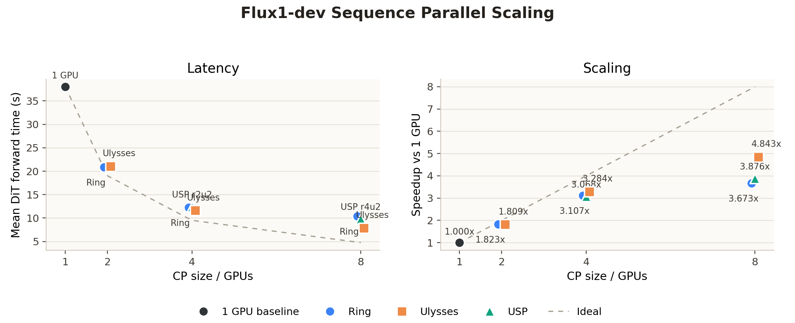
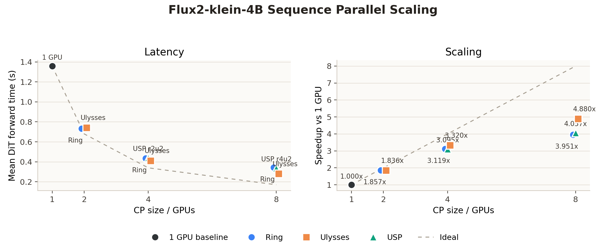
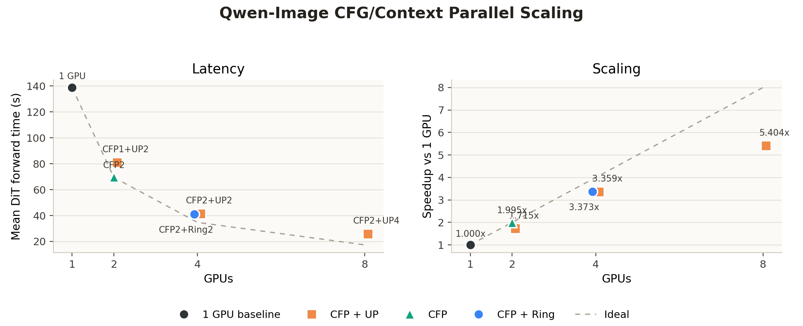
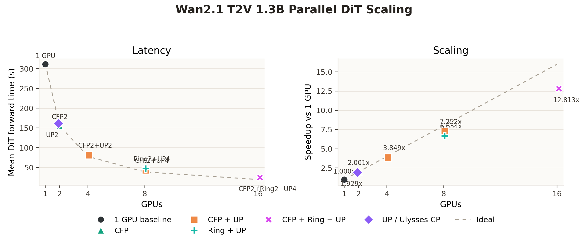

# ChituBench Results: Parallel DiT

Multi-GPU parallelism on the DiT denoise stage: CFG parallel (split the two CFG
branches across ranks) and context/sequence parallel (Ulysses, ring, USP, or the
Qwen joint-attention CP path). Tables report rank-0 `dit_forward` latency,
speedup vs the 1-GPU baseline, and parallel efficiency (speedup / GPUs). Speed
only; quality is covered by the attention/FlexCache modules.

Back to [index](result.md).

## Headline: scaling by GPU count

Best parallel point at each GPU count (DiT-forward speedup vs 1 GPU):

| model | 1 GPU | 4 GPU | 8 GPU | 16 GPU |
| --- | ---: | ---: | ---: | ---: |
| Flux.1-dev (50-step, Ulysses) | 1.00x | 3.28x | 4.84x | - |
| Flux2-klein-4B (4-step, Ulysses) | 1.00x | 3.32x | 4.88x | - |
| Qwen-Image (50-step, CFG+CP) | 1.00x | 3.36x | 5.40x | - |
| Wan2.1-T2V-1.3B (50-step video, CFP+Ring+UP) | 1.00x | 3.85x | 7.25x | 12.81x |

## flux1_dev_sequence_parallel

Model: `Flux1-dev`

Family: sequence parallel scaling, Flash Attention backend, no FlexCache

Run: `flux1_sp_50step_20260613_144519`

Command:

```bash
CHITUBENCH_STEPS=50 \
CHITUBENCH_NUM_SEEDS=3 \
CHITUBENCH_WARMUP_RUNS=1 \
CHITUBENCH_RUN_ID=flux1_sp_50step_20260613_144519 \
ChituBench/scripts/run_flux1_sequence_parallel.sh
```

Notes:

- Flux1-dev uses 50 denoising steps; 3 prompts x 3 seeds = 9 measured images.
- All cases use `infer.attn_type=flash`. Speed only; quality omitted.

### Summary

| case | GPUs | parallel mode | DiT forward mean (s) | speedup vs 1 GPU | efficiency |
| --- | ---: | --- | ---: | ---: | ---: |
| baseline_1gpu | 1 | none | 38.027 | 1.000 | 1.000 |
| ring_2gpu | 2 | ring | 20.860 | 1.823 | 0.911 |
| ulysses_2gpu | 2 | Ulysses | 21.018 | 1.809 | 0.905 |
| ring_4gpu | 4 | ring | 12.238 | 3.107 | 0.777 |
| usp_r2u2_4gpu | 4 | USP r2u2 | 12.395 | 3.068 | 0.767 |
| ulysses_4gpu | 4 | Ulysses | 11.580 | 3.284 | 0.821 |
| ring_8gpu | 8 | ring | 10.354 | 3.673 | 0.459 |
| usp_r4u2_8gpu | 8 | USP r4u2 | 9.811 | 3.876 | 0.484 |
| ulysses_8gpu | 8 | Ulysses | 7.852 | 4.843 | 0.605 |

### Readout

- 2 GPU ring and Ulysses are close, with ring slightly faster in this run.
- 4 GPU Ulysses is the best CP4 point: 3.284x speedup with 82.1% efficiency.
- 8 GPU Ulysses is the best overall point: 4.843x speedup with 60.5% efficiency.
- CP8 still improves absolute latency, but the efficiency drop is clear. USP
  r4u2 improves over 8 GPU ring, while full Ulysses remains strongest.

### Parallel Scaling



## flux2_klein_sequence_parallel

Model: `Flux2-klein-4B`

Family: sequence parallel scaling, Flash Attention backend, no FlexCache

Run: `flux2_klein_sp_4step_20260613_1545`

Command:

```bash
CHITUBENCH_STEPS=4 \
CHITUBENCH_NUM_SEEDS=3 \
CHITUBENCH_WARMUP_RUNS=1 \
CHITUBENCH_RUN_ID=flux2_klein_sp_4step_20260613_1545 \
ChituBench/scripts/run_flux2_klein_sequence_parallel.sh
```

Notes:

- Flux2-klein-4B uses only 4 denoising steps; 3 prompts x 3 seeds = 9 images.
- All cases use `infer.attn_type=flash`. Speed only; quality omitted.
- Because the DiT is tiny (4 steps), per-image latency is small and
  communication/setup overhead is visible in the efficiency curve.

### Summary

| case | GPUs | parallel mode | DiT forward mean (s) | speedup vs 1 GPU | efficiency |
| --- | ---: | --- | ---: | ---: | ---: |
| baseline_1gpu | 1 | none | 1.358 | 1.000 | 1.000 |
| ring_2gpu | 2 | ring | 0.732 | 1.857 | 0.928 |
| ulysses_2gpu | 2 | Ulysses | 0.740 | 1.836 | 0.918 |
| ring_4gpu | 4 | ring | 0.435 | 3.119 | 0.780 |
| usp_r2u2_4gpu | 4 | USP r2u2 | 0.439 | 3.095 | 0.774 |
| ulysses_4gpu | 4 | Ulysses | 0.409 | 3.320 | 0.830 |
| ring_8gpu | 8 | ring | 0.344 | 3.951 | 0.494 |
| usp_r4u2_8gpu | 8 | USP r4u2 | 0.335 | 4.057 | 0.507 |
| ulysses_8gpu | 8 | Ulysses | 0.278 | 4.880 | 0.610 |

### Readout

- 4 GPU Ulysses is the best CP4 point: 3.320x speedup with 83.0% efficiency.
- 8 GPU Ulysses is the best overall point: 4.880x speedup with 61.0% efficiency.
- For a 4-step distilled model the DiT is no longer the bottleneck once
  parallelized; VAE decode becomes the dominant stage (see
  [Parallel VAE](result_parallel_vae.md)).

### Parallel Scaling



## qwen_image_parallel

Model: `Qwen-Image`

Family: CFG parallel and UP/Ulysses context parallel scaling, Flash Attention
backend, no FlexCache

Run: `qwen_parallel_50step_20260616_stable`, plus the 2-GPU CFP1+UP2 retest
`qwen_image_cfp1up2_2gpu_20260616_155741` and 8-GPU CFP2+UP4 retest
`qwen_image_cfp2up4_8gpu_20260616_154411`

Command:

```bash
MASTER_PORT=62531 \
SRUN_EXTRA_ARGS='--exclusive --exclude=bjdb-h20-node-021' \
CHITUBENCH_RUN_ID=qwen_parallel_50step_20260616_stable \
CHITUBENCH_CASES=baseline_1gpu,cfp2_2gpu,cfp2up2_4gpu,cfp2ring2_4gpu \
CHITUBENCH_STEPS=50 \
CHITUBENCH_NUM_SEEDS=1 \
CHITUBENCH_WARMUP_RUNS=0 \
CHITUBENCH_IMAGE_SIZE=1328,1328 \
CHITUBENCH_ATTN_TYPE=flash_attn \
ChituBench/scripts/run_qwen_image_parallel.sh
```

Notes:

- Qwen-Image uses 50 denoising steps at 1328x1328; single coffee-sign prompt,
  seed 42. Speed only; quality omitted.
- Qwen-Image CP uses the dedicated joint-attention path where text states stay
  replicated and image states are sharded. Ring/USP variants are not reported
  because they would require a separate Qwen joint-attention implementation.

### Summary

| case | GPUs | parallel mode | DiT forward mean (s) | speedup vs 1 GPU | efficiency |
| --- | ---: | --- | ---: | ---: | ---: |
| baseline_1gpu | 1 | none | 138.819 | 1.000 | 1.000 |
| cfp1up2_2gpu | 2 | Qwen image CP2 | 80.935 | 1.715 | 0.858 |
| cfp2_2gpu | 2 | CFG parallel | 69.569 | 1.995 | 0.998 |
| cfp2up2_4gpu | 4 | CFG parallel + Ulysses CP2 | 41.325 | 3.359 | 0.840 |
| cfp2ring2_4gpu | 4 | CFG parallel + ring CP2 | 41.154 | 3.373 | 0.843 |
| cfp2up4_8gpu | 8 | CFG parallel + Qwen image CP4 | 25.688 | 5.404 | 0.676 |

### Readout

- CFG parallel is almost ideal for this single-image workload: `cfp2_2gpu`
  reaches 1.995x speedup at ~100% efficiency.
- Pure Qwen image CP2 (`cfp1up2_2gpu`) reaches 1.715x; slower than CFG parallel
  on 2 GPUs because the Qwen CP path gathers image K/V inside joint attention.
- Adding CP2 on top of CFG parallel reaches ~3.37x on 4 GPUs (ring ~= Ulysses).
- The 8-GPU `cfp2up4_8gpu` point is the best Qwen parallel result: 25.688s
  DiT-forward, 5.404x speedup, 67.6% efficiency, output visually verified.

### Parallel Scaling



## wan2_1_t2v_1_3b_parallel

Model: `Wan2.1-T2V-1.3B`

Family: CFG parallel plus Ring/UP context parallel scaling, Flash Attention
backend, no FlexCache

Run: `wan21_13b_parallel_2video_50step_20260619`

Command:

```bash
CHITUBENCH_RUN_ID=wan21_13b_parallel_2video_50step_20260619 \
CHITUBENCH_STEPS=50 \
CHITUBENCH_NUM_SEEDS=1 \
CHITUBENCH_WARMUP_RUNS=0 \
CHITUBENCH_FRAME_NUM=81 \
CHITUBENCH_CASES='baseline_1gpu cfp2_2gpu up2_2gpu cfp2up2_4gpu cfp2up4_8gpu ring2up4_8gpu cfp2ring2up4_16gpu' \
bash ChituBench/scripts/run_wan2_1_t2v_1_3b_parallel_dit.sh
```

Notes:

- Wan2.1-T2V-1.3B uses 50 denoising steps, 81 frames, 832x480 output, and two
  prompts: one text/signage prompt and one no-text motion prompt.
- Each case uses one seed (`42`), so each method generates exactly two videos.
- All cases use `infer.attn_type=flash`. Speed only; quality is covered by the
  attention/FlexCache modules.
- For Wan, `up` is a Ulysses group-size limit inside the CP group. With 8 GPUs
  and `cfp=2`, the CP group is only 4 ranks, so an `up8` request would be capped
  by CP size; the explicit 8-rank CP tests use `ring2up4_8gpu`, and the 16-GPU
  test uses two 8-rank CP groups via `cfp2ring2up4_16gpu`.

### Summary

| case | GPUs | parallel mode | DiT forward mean (s) | speedup vs 1 GPU | efficiency |
| --- | ---: | --- | ---: | ---: | ---: |
| baseline_1gpu | 1 | none | 311.412 | 1.000 | 1.000 |
| cfp2_2gpu | 2 | CFG parallel | 155.658 | 2.001 | 1.000 |
| up2_2gpu | 2 | UP2 / Ulysses CP2 | 161.462 | 1.929 | 0.964 |
| cfp2up2_4gpu | 4 | CFP2 + UP2 / Ulysses CP2 | 80.912 | 3.849 | 0.962 |
| cfp2up4_8gpu | 8 | CFP2 + UP4 / Ulysses CP4 | 42.939 | 7.252 | 0.907 |
| ring2up4_8gpu | 8 | Ring2 + UP4 / 8-rank CP | 46.798 | 6.654 | 0.832 |
| cfp2ring2up4_16gpu | 16 | CFP2 + Ring2 + UP4 / 8-rank CP per CFG branch | 24.305 | 12.813 | 0.801 |

### Readout

- CFG parallel is nearly ideal on 2 GPUs: `cfp2_2gpu` reaches 2.001x speedup.
- Pure UP2/Ulysses CP2 (`up2_2gpu`) reaches 1.929x, slightly behind CFG
  parallel on 2 GPUs.
- Stacking CFP with UP keeps high efficiency: 3.849x on 4 GPUs and
  7.252x on 8 GPUs.
- On 8 GPUs, `cfp2up4_8gpu` is faster than pure 8-rank CP with ring2+UP4:
  42.939s vs 46.798s DiT-forward.
- The 16-GPU `cfp2ring2up4_16gpu` point is the best Wan Parallel DiT result:
  24.305s DiT-forward, 12.813x speedup, and 80.1% parallel efficiency.

### Parallel Scaling


