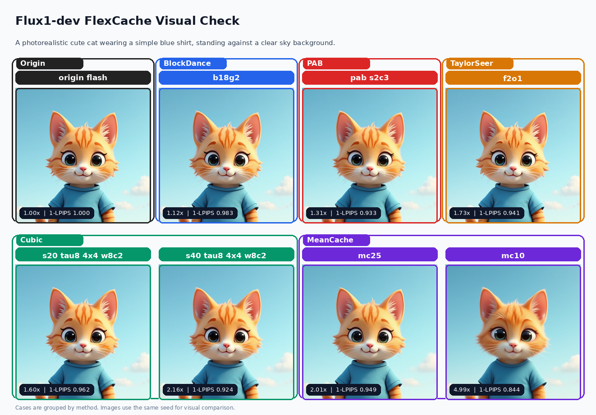
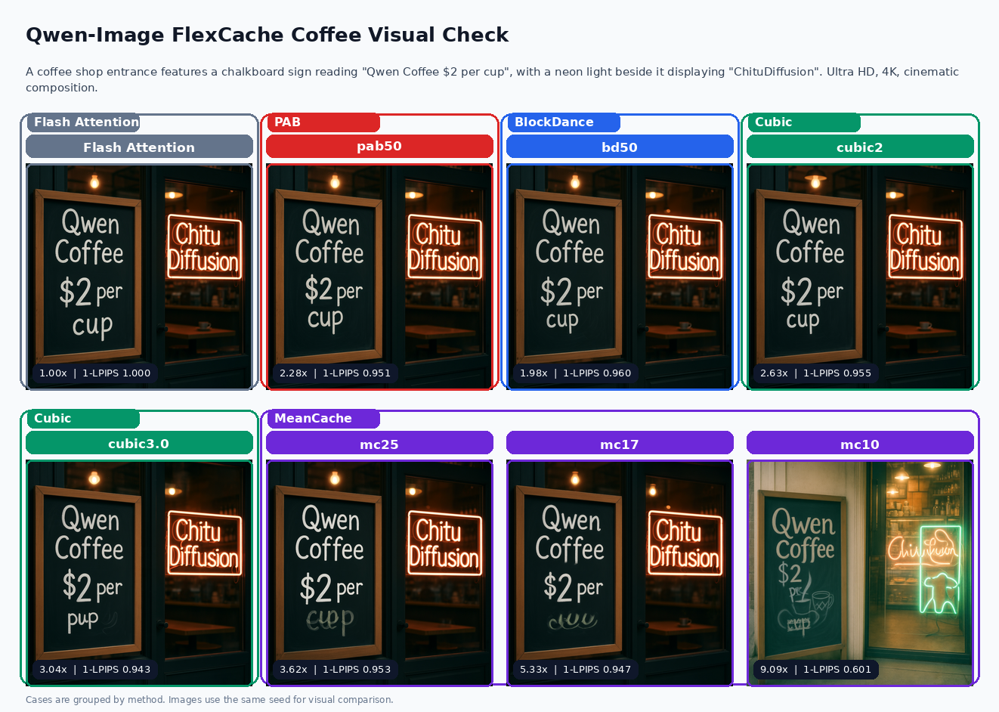

# ChituDiffusion

<p align="center">
  
</p>

<h3 align="center">ChituDiffusion: Fast diffusion inference, parallel generation, and cache acceleration for AIGC workloads.</h3>

<p align="center">
  <a href="#quick-start">Quick Start</a> |
  <a href="ChituBench/result.md">ChituBench Results</a> |
  <a href="ChituBench/README.md">Benchmark Protocol</a> |
  <a href="chitu_diffusion/flexcache/README.md">FlexCache</a> |
  <a href="service_framework/README.md">Service Framework</a>
</p>

<p align="center">
  
  
  
  
</p>

ChituDiffusion is a high-performance diffusion inference framework for fast
image and video generation at research scale. It brings together distributed
inference, modern attention backends, FlexCache acceleration, DiTango runtime
experiments, reproducible benchmarking, and a single `chitu` CLI for running
real model workloads.

## Why ChituDiffusion

- **One runtime for serious diffusion inference.** Run Wan, Flux, and
  Qwen-Image style workloads through the same `chitu run` entry point.
- **Distributed from the start.** Context parallelism, CFG parallelism, ring,
  Ulysses, and combined parallel layouts are wired into the runtime.
- **Acceleration is measurable, not just implemented.** Attention backends,
  FlexCache strategies, and parallel scaling are tracked in ChituBench with
  speed, quality metrics, and visual contact sheets.
- **Research features stay close to production paths.** FlexCache, DiTango,
  timing, memory, logging, and evaluation are exercised through the real launch
  flow instead of isolated demos.

## News

- **2026-06-17:** Qwen-Image attention now includes a FlashInfer probe in
  ChituBench; FlashInfer is functional but not yet faster than Flash Attention
  on the dense 50-step coffee prompt.
- **2026-06-16:** Qwen-Image parallel scaling reaches **5.404x** DiT-forward
  speedup on 8 GPUs with CFG parallel + image context parallelism.
- **2026-06-16:** Qwen-Image FlexCache now has PAB, BlockDance, Cubic, and
  MeanCache trade-off curves, including a **9.092x** MeanCache upper-speed point.
- **2026-06-16:** Flux1-dev FlexCache results were consolidated with MeanCache;
  the best MeanCache point reaches **4.989x** DiT-forward speedup.
- **2026-06-13:** ChituBench was reset as the public benchmark workspace with
  numeric result tables, plots, and visual contact sheets.

## ChituBench Highlights

Full tables, commands, notes, and figures live in
[ChituBench/result.md](ChituBench/result.md).

| Workload | Best headline result | Link |
| --- | --- | --- |
| Flux1-dev attention | SageAttention reaches **1.160x** speedup vs origin flash with close HPSv3 | [result](ChituBench/result.md#flux1_dev_attention) |
| Flux1-dev FlexCache | MeanCache reaches **4.989x**; Cubic and TaylorSeer cover the middle/high-speed frontier | [result](ChituBench/result.md#flux1_dev_flexcache) |
| Flux1-dev sequence parallel | 8-GPU Ulysses reaches **4.843x** speedup vs 1 GPU | [result](ChituBench/result.md#flux1_dev_sequence_parallel) |
| Flux2-klein attention | SageAttention reaches **1.163x** speedup with moderate drift | [result](ChituBench/result.md#flux2_klein_attention) |
| Qwen-Image parallel | 8-GPU CFG parallel + image CP4 reaches **5.404x** speedup | [result](ChituBench/result.md#qwen_image_parallel) |
| Qwen-Image FlexCache | MeanCache spans **3.616x**, **5.331x**, and **9.092x** speed-quality points | [result](ChituBench/result.md#qwen_image_flexcache) |

### Speed-Quality Snapshots


### Visual Samples





## Feature Map

| Area | What is included |
| --- | --- |
| Runtime | `chitu run`, config loading, distributed launch, task execution, output packaging |
| Parallelism | CFG parallelism, context parallelism, ring, Ulysses, mixed CP/CFG layouts |
| Attention | Torch SDPA, FlashAttention, SageAttention, SpargeAttention, FlashInfer experiments |
| FlexCache | TeaCache, PAB, BlockDance, Cubic, MeanCache, TaylorSeer, DiTango request params |
| DiTango | Planner/runtime experiments for cache-aware distributed attention |
| Evaluation | PSNR, SSIM, LPIPS, HPSv3, VBench-oriented utilities |
| Observability | Timing JSON, memory JSON, run logs, task metadata, debug visualizations |

## Supported Models

Current model configuration includes:

- `Wan2.1-T2V-1.3B`
- `Wan2.1-T2V-14B`
- `Wan2.2-T2V-A14B`
- `Flux1-dev`
- `FLUX.2-klein-4B`
- `Qwen-Image`

Availability depends on local checkpoint paths and the corresponding config
under `chitu_diffusion/core/config/models/`.

## Quick Start

Install the base environment:

```bash
git clone <repo-url>
cd ChituDiffusion
git submodule update --init --recursive
uv sync
```

Activate the project environment, or use `uv run chitu ...`:

```bash
source .venv/bin/activate
chitu --help
```

Point `system_config.yaml` to a local checkpoint:

```yaml
model:
  name: Wan2.1-T2V-1.3B
  ckpt_dir: /path/to/Wan2.1-T2V-1.3B

launch:
  num_nodes: 1
  gpus_per_node: 8

parallel:
  cfp: 2
  up: 8

infer:
  attn_type: torch_sdpa
```

Run generation:

```bash
chitu run system_config.yaml
```

Common launch overrides:

```bash
chitu run system_config.yaml --gpus-per-node 8 --cfp 2
```

## Optional Extras

Install only the acceleration or evaluation stack you need:

```bash
uv sync --extra sage
uv sync --extra sparge
uv sync --extra flash
uv sync --extra flashinfer
uv sync --extra eval
uv sync --extra vbench
```

Build CUDA extension extras on a GPU compute node whose CUDA toolkit matches
the selected PyTorch build.

Manual environments are also supported:

```bash
pip install -r requirements.txt
pip install -e .
```

## Using FlexCache

FlexCache is request-driven: include strategy params when a task should use an
acceleration strategy, and omit them for the default full-compute path. The
current strategy set is documented in
[chitu_diffusion/flexcache/README.md](chitu_diffusion/flexcache/README.md).

Current strategy families include TeaCache, PAB, BlockDance, Cubic, MeanCache,
and TaylorSeer. DiTango is an independent planner/runtime path with request
params wired through the same task flow.

## Evaluation

Evaluation can be enabled from `system_config.yaml`:

```yaml
eval:
  eval_type: [psnr, lpips]
  reference_path: /path/to/reference/videos
```

Install metric dependencies with:

```bash
uv sync --extra eval
```

For reproducible public results, prefer the ChituBench scripts and protocol in
[ChituBench/README.md](ChituBench/README.md).

## Outputs

Each run writes a structured output directory:

```text
outputs/<tag>-<YYYYMMDD_HHMMSS>-<taskid>/
  request_params.json
  system_params.json
  run_config.yaml
  results/
    <task_id>/
      *.mp4
      *.json
  metrics/
    timing/
      summary.json
      <task_id>.json
    memory/
      rank<N>.json
    quality/
      summary.json
  logs/
    command.log
    run.log
    run.rank<N>.log
    <task_id>/
      *.ppm
```

`results/<task_id>/` contains generated media and sidecar metadata. `metrics/`
contains timing, memory, and quality JSON. `logs/command.log` captures the full
launch output, including `chitu run`, Slurm wrapper output, and Python stdout or
stderr.

## Repository Layout

```text
chitu_diffusion/core/            Configuration, schemas, distributed utilities, registry
chitu_diffusion/runtime/         Backend, generator, scheduler, task, runtime API
chitu_diffusion/modules/         Model-specific and reusable diffusion modules
chitu_diffusion/flexcache/       FlexCache strategies and shared cache utilities
chitu_diffusion/ditango/         DiTango planner, runtime attention, visualization
chitu_diffusion/evaluation/      Evaluation manager, strategies, metric helpers
chitu_diffusion/observability/   Timing and magnitude logging helpers
ChituBench/                      Reproducible benchmark workspace and result figures
service_framework/               Long-lived service workflow
script/                          Launch helpers for local and Slurm execution
test/                            Generation and acceleration test entry points
system_config.yaml               Default runtime configuration
```

## Development

Run a lightweight import check:

```bash
python - <<'PY'
import chitu_diffusion.core
from chitu_diffusion.runtime.task import DiffusionUserParams
from chitu_diffusion.observability import Timer
print("imports ok")
PY
```

Run tests with:

```bash
pytest test
```

Some tests require CUDA, local checkpoints, and distributed launch settings.

### Codex Skills

Repository-specific Codex skills live under `.codex/skills/`. They capture
ChituDiffusion conventions for model adaptation, FlexCache benchmarking, result
visualization, cleanup, and commit slicing.

Install them into the local Codex skill directory after cloning:

```bash
./.venv/bin/python script/install_codex_skills.py --force
```

By default this creates symlinks in `${CODEX_HOME:-~/.codex}/skills`, so updates
pulled from the repository are visible to Codex without reinstalling. Use
`--copy` if symlinks are not desired.

## License

This project is licensed under the Apache License 2.0. See [LICENSE](LICENSE)
for details.
