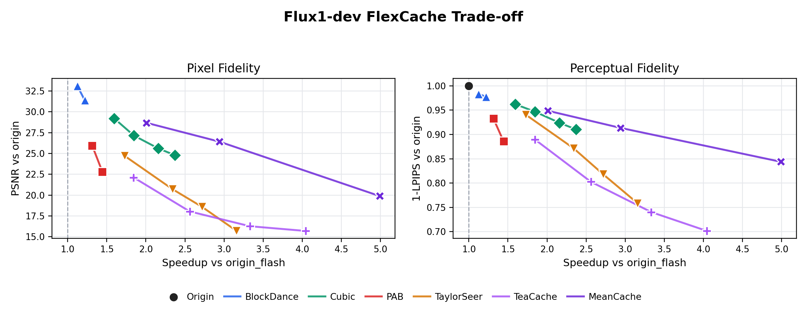
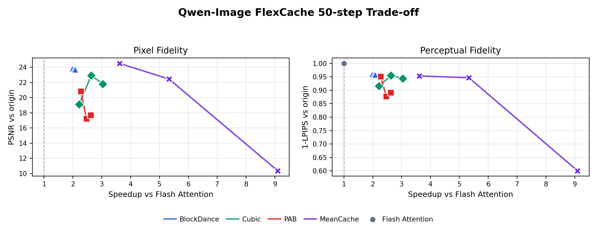

<p align="center">
  
</p>

<p align="center">
  <b>🇨🇳 中文</b> &nbsp;·&nbsp; <a href="#english-version">🇺🇸 English</a>
</p>

---

<h3 align="center">ChituDiffusion: 高性能扩散推理框架 — 分布式并行 · 缓存加速 · 可复现评测</h3>

<p align="center">
  
  
  <a href="docs/zhihu_cudagraph_compile/article.md"></a>
  <a href="ChituBench/README.md"></a>
  <a href="ChituBench/result_flexcache.md"></a>
  
  
  <a href="https://arxiv.org/abs/2603.00519"></a>
  <a href="https://dl.acm.org/doi/10.1145/3774934.3786424"></a>
</p>

## ✨ 为什么选择 ChituDiffusion

<table>
<tr>
<td width="50%">

### 🧩 Stage-Level Diffusion 抽象 + 调度器
将扩散推理过程抽象为统一的 Stage 管线，内建调度器自动编排多模型、多策略的执行流程，告别手工拼接。

</td>
<td width="50%">

### 🌐 强可扩展混合并行
原生支持 CFG Parallel 与 Hybrid Context Parallel（Graph-Ring / Async-Ulysses / AGKV），灵活组合并行拓扑，数十GPU近线性扩展。

</td>
</tr>
<tr>
<td width="50%">

### ⚡ FlexCache：统一 Feature Cache API
一套 API 同时支持并行场景与多粒度缓存（步级 / 层级 / Token 级），策略热插拔，覆盖 AI 顶会 SOTA 方法。

</td>
<td width="50%">

### 📊 ChituBench：延迟-质量-内存全局评测
专为 Feature Cache 设计的评测体系，从速度、质量、显存三个维度横向对比，可视化快照 + Contact Sheet 让结果一目了然。

</td>
</tr>
</table>
---

## 📊 ChituBench 性能一览

> 完整数据表、命令与图表见 [ChituBench/result.md](ChituBench/result.md)。

| 工作负载 | 🏆 最佳结果 | 详情 |
|:---|:---|:---|
| **Flux1-dev** Attention | SageAttention 达 **1.160x** 加速（质量无损） | [→](ChituBench/result.md#flux1_dev_attention) |
| **Flux1-dev** FlexCache | MeanCache 达 **4.989x**；Cubic 与 TaylorSeer 覆盖中高速区间 | [→](ChituBench/result_flexcache.md#flux1_dev_flexcache) |
| **Flux1-dev** 序列并行 | 8-GPU Ulysses 达 **4.843x**（vs 1 GPU） | [→](ChituBench/result.md#flux1_dev_sequence_parallel) |
| **Flux2-klein** Attention | SageAttention 达 **1.163x** | [→](ChituBench/result.md#flux2_klein_attention) |
| **Wan2.1-T2V-1.3B** Attention | Sparge 达 **2.228x**；Torch SDPA 保持最佳质量 | [→](ChituBench/result.md#wan2_1_t2v_1_3b_attention) |
| **Wan2.1-T2V-1.3B** 并行 | 16-GPU 达 **12.813x**（vs 1 GPU）🔥 | [→](ChituBench/result_parallel_dit.md#wan2_1_t2v_1_3b_parallel) |
| **Wan2.1-T2V-1.3B** FlexCache | MeanCache30 达 **1.658x**（PSNR 35.60）；Cubic **1.568-2.203x** | [→](ChituBench/result_flexcache.md#wan2_1_t2v_1_3b_flexcache) |
| **Qwen-Image** 并行 | 8-GPU CFG + image CP4 达 **5.404x** | [→](ChituBench/result.md#qwen_image_parallel) |
| **Qwen-Image** FlexCache | MeanCache 覆盖 **3.616x / 5.331x / 9.092x** 三档 | [→](ChituBench/result_flexcache.md#qwen_image_flexcache) |

### 📈 速度-质量曲线快照

<p align="center">
  
  &nbsp;
  
</p>

---

## 🎯 核心特性

| 领域 | 包含内容 |
|:---|:---|
| **运行时** | `chitu run`、配置加载、分布式启动、任务执行、输出打包 |
| **并行策略** | CFG 并行、上下文并行、Ring、Ulysses、混合 CP/CFG 布局 |
| **Attention 后端** | Torch SDPA、FlashAttention、SageAttention、SpargeAttention、FlashInfer |
| **FlexCache 加速** | TeaCache、PAB、BlockDance、Cubic、MeanCache、TaylorSeer、DiTango |
| **DiTango** | 面向通信受限场景的 cache-aware 分布式 Attention 规划器/运行时 |
| **评估** | PSNR、SSIM、LPIPS、HPSv3、VBench 工具链 |
| **可观测性** | 计时 JSON、内存 JSON、运行日志、任务元数据、调试可视化 |

---

## 🎬 支持的模型

| 模型 | 类型 |
|:---|:---|
| `Wan2.1-T2V-1.3B` | 文生视频 |
| `Wan2.1-T2V-14B` | 文生视频 |
| `Wan2.2-T2V-A14B` | 文生视频 |
| `Flux1-dev` | 文生图 |
| `FLUX.2-klein-4B` | 文生图 |
| `Qwen-Image` | 文生图 |

> 模型可用性取决于本地 checkpoint 路径及 `chitu_diffusion/core/config/models/` 下的对应配置。

---

## ⚡ 快速开始

### 1. 安装基础环境

```bash
git clone <repo-url>
cd ChituDiffusion
git submodule update --init --recursive
uv sync
```

### 2. 激活环境

```bash
source .venv/bin/activate
chitu --help
```

> 也可直接用 `uv run chitu ...` 免激活。

### 3. 配置模型路径

编辑 `system_config.yaml` 指向你的本地 checkpoint：

```yaml
model:
  name: Wan2.1-T2V-1.3B
  ckpt_dir: /path/to/Wan2.1-T2V-1.3B

launch:
  num_nodes: 1
  gpus_per_node: 8

parallel:
  cfp: 2
  up: 8

infer:
  attn_type: torch_sdpa
```

### 4. 启动推理

```bash
chitu run system_config.yaml
```

### 5. 常用启动参数覆盖

```bash
chitu run system_config.yaml --gpus-per-node 8 --cfp 2
```

---

## 📦 可选扩展

按需安装加速或评估依赖：

```bash
uv sync --extra sage          # SageAttention
uv sync --extra sparge        # SpargeAttention
uv sync --extra flash         # FlashAttention
uv sync --extra flashinfer    # FlashInfer
uv sync --extra eval          # 评估指标 (PSNR, LPIPS, HPSv3...)
uv sync --extra vbench        # VBench
```

> ⚠️ CUDA 扩展需要在 GPU 计算节点上编译，确保 CUDA toolkit 与 PyTorch 版本匹配。

也支持手动环境配置：

```bash
pip install -r requirements.txt
pip install -e .
```

---

## 🧠 FlexCache 缓存加速

FlexCache 是**请求驱动**的：仅在任务需要加速策略时传入参数，省略参数则走默认全量计算路径。

### 当前策略家族

| 策略 | 原理 | 论文 |
|:---|:---|:---|
| **MeanCache** | 步级噪声预测缓存 + JVP 速度更新 | ICLR 2026 |
| **Cubic (Jano)** | 区域感知 / Token 选择性前向 | CVPR Findings 2026 |
| **TeaCache** | 基于时间步嵌入变化的残差复用 | CVPR 2025 |
| **TaylorSeer** | 模块输出缓存 + Taylor 展开预测 | ICCV 2025 |
| **BlockDance** | 层级块复用 + 活动去噪窗口 | CVPR 2025 |
| **PAB** | 注意力输出广播复用 | ICLR 2025 |

详细文档：[chitu_diffusion/flexcache/README.md](chitu_diffusion/flexcache/README.md)

---

## 📐 评估

在 `system_config.yaml` 中开启评估：

```yaml
eval:
  eval_type: [psnr, lpips]
  reference_path: /path/to/reference/videos
```

安装评估依赖：

```bash
uv sync --extra eval
```

> 需要可复现的公开评测结果？推荐使用 [ChituBench](ChituBench/README.md) 脚本与协议。

---

## 📁 输出结构

每次运行都会生成结构化的输出目录：

```text
outputs/<tag>-<YYYYMMDD_HHMMSS>-<taskid>/
  request_params.json          # 请求参数
  system_params.json           # 系统参数
  run_config.yaml              # 运行时配置
  results/<task_id>/
    *.mp4 / *.png              # 生成的媒体文件
    *.json                     # 元数据
  metrics/
    timing/summary.json        # 计时汇总
    memory/rank<N>.json        # 内存统计
    quality/summary.json       # 质量评估
  logs/
    command.log                # 完整启动输出
    run.log                    # 运行日志
```

---

## 🗂️ 仓库结构

```text
chitu_diffusion/core/            配置、Schema、分布式工具、注册中心
chitu_diffusion/runtime/         后端、生成器、调度器、任务、运行时 API
chitu_diffusion/modules/         模型专用与可复用的扩散模块
chitu_diffusion/flexcache/       FlexCache 策略与共享缓存工具
chitu_diffusion/ditango/         DiTango 规划器、运行时 Attention、可视化
chitu_diffusion/evaluation/      评估管理器、策略、指标工具
chitu_diffusion/observability/   计时与量级日志工具
ChituBench/                      可复现评测工作区与结果图表
service_framework/               常驻式 Web 服务
script/                          本地与 Slurm 启动辅助脚本
test/                            生成与加速测试入口
system_config.yaml               默认运行时配置
```

---

## 🛠️ 开发指南

### 快速导入检查

```bash
python - <<'PY'
import chitu_diffusion.core
from chitu_diffusion.runtime.task import DiffusionUserParams
from chitu_diffusion.observability import Timer
print("imports ok")
PY
```

### 运行测试

```bash
pytest test
```

> 部分测试需要 CUDA、本地 checkpoint 以及分布式启动环境。

### Codex Skills

仓库内置了 Codex 技能文件（`.codex/skills/`），涵盖模型适配、FlexCache 评测、结果可视化、清理与提交切片等 ChituDiffusion 专属惯例。

安装到本地 Codex 技能目录：

```bash
./.venv/bin/python script/install_codex_skills.py --force
```

默认在 `${CODEX_HOME:-~/.codex}/skills` 下创建符号链接，仓库更新后 Codex 无需重新安装即可生效。

---

## 🏆 学术成果

ChituDiffusion 已有多篇学术论文发表：

| 🎉 论文 | 会议/期刊 | 说明 |
|:---|:---|:---|
| **DiTango** | **HPDC 2026** | 通信受限场景下的 cache-accelerated parallelism |
| [**Jano**](https://arxiv.org/abs/2603.00519) | **CVPR Findings 2026** | FlexCache-Cubic 的前身工作 |
| [**Difflow**](https://dl.acm.org/doi/10.1145/3774934.3786424) | **PPoPP 2026** | ChituDiffusion 的 stage-level scheduling 起点 |

---

## 📄 许可证

本项目基于 **Apache License 2.0** 开源。详见 [LICENSE](LICENSE)。

---

---

<a name="english-version"></a>

<p align="center">
  
</p>

<p align="center">
  <a href="#chitudiffusion">🇨🇳 中文</a> &nbsp;·&nbsp; <b>🇺🇸 English</b>
</p>

---

<h3 align="center">ChituDiffusion: High-Performance Diffusion Inference — Distributed Parallelism · Cache Acceleration · Reproducible Benchmarks</h3>

<p align="center">
  
  
  <a href="docs/zhihu_cudagraph_compile/article.md"></a>
  <a href="ChituBench/README.md"></a>
  <a href="ChituBench/result_flexcache.md"></a>
  
  
  <a href="https://arxiv.org/abs/2603.00519"></a>
  <a href="https://dl.acm.org/doi/10.1145/3774934.3786424"></a>
</p>

## ✨ Why ChituDiffusion

<table>
<tr>
<td width="50%">

### 🧩 Stage-Level Diffusion Abstraction + Scheduler
Models diffusion inference as a unified stage pipeline. A built-in scheduler orchestrates multi-model, multi-strategy execution — no more manual glue code.

</td>
<td width="50%">

### 🌐 Scalable Hybrid Parallelism
Native CFG Parallel and Hybrid Context Parallel (Graph-Ring / Async-Ulysses / AGKV). Compose flexible topologies and scale near-linearly across dozens of GPUs.

</td>
</tr>
<tr>
<td width="50%">

### ⚡ FlexCache: Unified Feature Cache API
A single API for parallel and multi-granularity caching (step / layer / token level). Hot-swappable strategies covering top-tier SOTA methods.

</td>
<td width="50%">

### 📊 ChituBench: Latency-Quality-Memory Benchmark
A Feature-Cache-native evaluation suite that compares speed, quality, and memory in one view. Visual snapshots and contact sheets make results instantly clear.

</td>
</tr>
</table>

---

## 📊 ChituBench Highlights

> Full tables, commands, and figures live in [ChituBench/result.md](ChituBench/result.md).

| Workload | 🏆 Best Headline Result | Details |
|:---|:---|:---|
| **Flux1-dev** Attention | SageAttention reaches **1.160x** (quality-preserving) | [→](ChituBench/result.md#flux1_dev_attention) |
| **Flux1-dev** FlexCache | MeanCache reaches **4.989x**; Cubic & TaylorSeer cover mid/high-speed frontier | [→](ChituBench/result_flexcache.md#flux1_dev_flexcache) |
| **Flux1-dev** Sequence Parallel | 8-GPU Ulysses reaches **4.843x** (vs 1 GPU) | [→](ChituBench/result.md#flux1_dev_sequence_parallel) |
| **Flux2-klein** Attention | SageAttention reaches **1.163x** | [→](ChituBench/result.md#flux2_klein_attention) |
| **Wan2.1-T2V-1.3B** Attention | Sparge reaches **2.228x**; Torch SDPA keeps best quality | [→](ChituBench/result.md#wan2_1_t2v_1_3b_attention) |
| **Wan2.1-T2V-1.3B** Parallel | 16-GPU reaches **12.813x** (vs 1 GPU) 🔥 | [→](ChituBench/result_parallel_dit.md#wan2_1_t2v_1_3b_parallel) |
| **Wan2.1-T2V-1.3B** FlexCache | MeanCache30 reaches **1.658x** (PSNR 35.60); Cubic **1.568-2.203x** | [→](ChituBench/result_flexcache.md#wan2_1_t2v_1_3b_flexcache) |
| **Qwen-Image** Parallel | 8-GPU CFG + image CP4 reaches **5.404x** | [→](ChituBench/result.md#qwen_image_parallel) |
| **Qwen-Image** FlexCache | MeanCache spans **3.616x / 5.331x / 9.092x** speed-quality points | [→](ChituBench/result_flexcache.md#qwen_image_flexcache) |

### 📈 Speed-Quality Snapshots

<p align="center">
  
  &nbsp;
  
</p>

---

## 🎯 Core Features

| Area | What's Included |
|:---|:---|
| **Runtime** | `chitu run`, config loading, distributed launch, task execution, output packaging |
| **Parallelism** | CFG parallelism, context parallelism, Ring, Ulysses, mixed CP/CFG layouts |
| **Attention** | Torch SDPA, FlashAttention, SageAttention, SpargeAttention, FlashInfer |
| **FlexCache** | TeaCache, PAB, BlockDance, Cubic, MeanCache, TaylorSeer, DiTango |
| **DiTango** | Planner/runtime experiments for cache-aware distributed attention |
| **Evaluation** | PSNR, SSIM, LPIPS, HPSv3, VBench-oriented utilities |
| **Observability** | Timing JSON, memory JSON, run logs, task metadata, debug visualizations |

---

## 🎬 Supported Models

| Model | Type |
|:---|:---|
| `Wan2.1-T2V-1.3B` | Text-to-Video |
| `Wan2.1-T2V-14B` | Text-to-Video |
| `Wan2.2-T2V-A14B` | Text-to-Video |
| `Flux1-dev` | Text-to-Image |
| `FLUX.2-klein-4B` | Text-to-Image |
| `Qwen-Image` | Text-to-Image |

> Availability depends on local checkpoint paths and the corresponding config under `chitu_diffusion/core/config/models/`.

---

## ⚡ Quick Start

### 1. Install Base Environment

```bash
git clone <repo-url>
cd ChituDiffusion
git submodule update --init --recursive
uv sync
```

### 2. Activate Environment

```bash
source .venv/bin/activate
chitu --help
```

> Alternatively, use `uv run chitu ...` without activation.

### 3. Configure Model Path

Edit `system_config.yaml` to point to your local checkpoint:

```yaml
model:
  name: Wan2.1-T2V-1.3B
  ckpt_dir: /path/to/Wan2.1-T2V-1.3B

launch:
  num_nodes: 1
  gpus_per_node: 8

parallel:
  cfp: 2
  up: 8

infer:
  attn_type: torch_sdpa
```

### 4. Run Inference

```bash
chitu run system_config.yaml
```

### 5. Common Launch Overrides

```bash
chitu run system_config.yaml --gpus-per-node 8 --cfp 2
```

---

## 📦 Optional Extras

Install only the acceleration or evaluation stack you need:

```bash
uv sync --extra sage          # SageAttention
uv sync --extra sparge        # SpargeAttention
uv sync --extra flash         # FlashAttention
uv sync --extra flashinfer    # FlashInfer
uv sync --extra eval          # Metrics (PSNR, LPIPS, HPSv3...)
uv sync --extra vbench        # VBench
```

> ⚠️ Build CUDA extension extras on a GPU compute node whose CUDA toolkit matches the selected PyTorch build.

Manual environments are also supported:

```bash
pip install -r requirements.txt
pip install -e .
```

---

## 🧠 FlexCache Acceleration

FlexCache is **request-driven**: include strategy params when a task should use an acceleration strategy, and omit them for the default full-compute path.

### Current Strategy Families

| Strategy | Principle | Paper |
|:---|:---|:---|
| **MeanCache** | Step-level noise-prediction cache + JVP velocity update | ICLR 2026 |
| **Cubic (Jano)** | Region-aware / token-selective forward | CVPR Findings 2026 |
| **TeaCache** | Residual reuse driven by timestep-embedding change | CVPR 2025 |
| **TaylorSeer** | Module-output cache + Taylor expansion forecast | ICCV 2025 |
| **BlockDance** | Layerwise block reuse + active denoising window | CVPR 2025 |
| **PAB** | Attention-output broadcast reuse | ICLR 2025 |

Full documentation: [chitu_diffusion/flexcache/README.md](chitu_diffusion/flexcache/README.md)

---

## 📐 Evaluation

Enable evaluation from `system_config.yaml`:

```yaml
eval:
  eval_type: [psnr, lpips]
  reference_path: /path/to/reference/videos
```

Install metric dependencies:

```bash
uv sync --extra eval
```

> For reproducible public results, prefer the ChituBench scripts and protocol in [ChituBench/README.md](ChituBench/README.md).

---

## 📁 Output Structure

Each run writes a structured output directory:

```text
outputs/<tag>-<YYYYMMDD_HHMMSS>-<taskid>/
  request_params.json          # Request parameters
  system_params.json           # System parameters
  run_config.yaml              # Runtime configuration
  results/<task_id>/
    *.mp4 / *.png              # Generated media
    *.json                     # Sidecar metadata
  metrics/
    timing/summary.json        # Timing summary
    memory/rank<N>.json        # Memory stats
    quality/summary.json       # Quality evaluation
  logs/
    command.log                # Full launch output
    run.log                    # Run logs
```

---

## 🗂️ Repository Layout

```text
chitu_diffusion/core/            Configuration, schemas, distributed utilities, registry
chitu_diffusion/runtime/         Backend, generator, scheduler, task, runtime API
chitu_diffusion/modules/         Model-specific and reusable diffusion modules
chitu_diffusion/flexcache/       FlexCache strategies and shared cache utilities
chitu_diffusion/ditango/         DiTango planner, runtime attention, visualization
chitu_diffusion/evaluation/      Evaluation manager, strategies, metric helpers
chitu_diffusion/observability/   Timing and magnitude logging helpers
ChituBench/                      Reproducible benchmark workspace and result figures
service_framework/               Long-lived web service
script/                          Launch helpers for local and Slurm execution
test/                            Generation and acceleration test entry points
system_config.yaml               Default runtime configuration
```

---

## 🛠️ Development

### Quick Import Check

```bash
python - <<'PY'
import chitu_diffusion.core
from chitu_diffusion.runtime.task import DiffusionUserParams
from chitu_diffusion.observability import Timer
print("imports ok")
PY
```

### Run Tests

```bash
pytest test
```

> Some tests require CUDA, local checkpoints, and distributed launch settings.

### Codex Skills

Repository-specific Codex skills live under `.codex/skills/`. They capture ChituDiffusion conventions for model adaptation, FlexCache benchmarking, result visualization, cleanup, and commit slicing.

Install them into the local Codex skill directory:

```bash
./.venv/bin/python script/install_codex_skills.py --force
```

By default this creates symlinks in `${CODEX_HOME:-~/.codex}/skills`, so updates pulled from the repository are visible to Codex without reinstalling. Use `--copy` if symlinks are not desired.

---

## 🏆 Publications

ChituDiffusion has multiple academic publications:

| 🎉 Paper | Venue | Description |
|:---|:---|:---|
| **DiTango** | **HPDC 2026** | Cache-accelerated parallelism under communication constraints |
| [**Jano**](https://arxiv.org/abs/2603.00519) | **CVPR Findings 2026** | Precursor to FlexCache-Cubic |
| [**Difflow**](https://dl.acm.org/doi/10.1145/3774934.3786424) | **PPoPP 2026** | Stage-level scheduling origin for ChituDiffusion |

---

## 📄 License

This project is licensed under the **Apache License 2.0**. See [LICENSE](LICENSE) for details.
