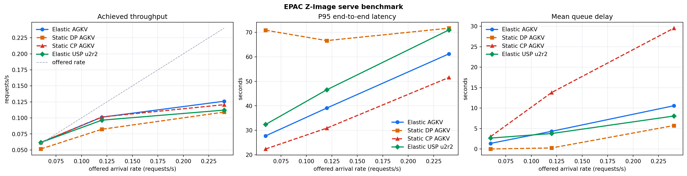
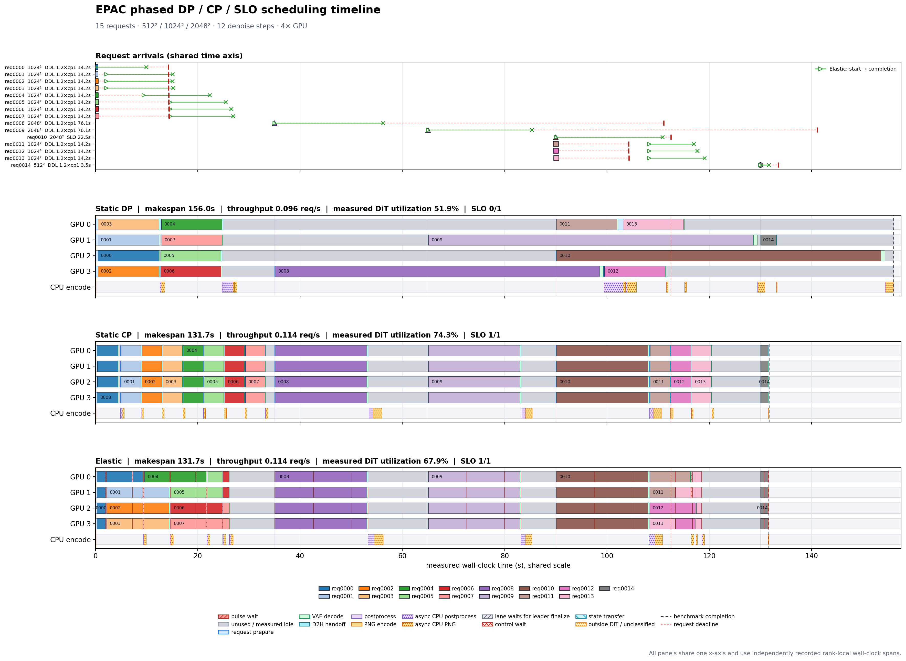

# chitu_diffusers EPAC Developer Preview

EPAC（Elastic Parallel Caching Engine）是 `chitu_diffusers` 面向社区接口的重构原型。
它不接管完整
Diffusers pipeline，而是把 DiT denoise loop 提取成可暂停、可调度的模型级执行单元；
tokenizer、encoder、scheduler、VAE module 和 image processor 继续使用上游 Diffusers；
EPAC 只在 VAE 调用外增加动态 lane 的 tile/halo 通信层。

## 当前结构

```text
Diffusers pipeline
        |
DiffusersModelAdapter                    model-specific
  prepare_request
  prepare_step
  model_forward <---- OptimizationChain  FlexCache boundary
  process_model_output
  scheduler_step
  finalize_request
        |
DiffusersEngine                          model-independent
  request-local state / admission / abort / exactly-once result
        |
SchedulingPolicy <---- measured cost     EPAC pulse boundary
  request + lane ranks + K steps
```

源码按所有权分为四部分：`epac/` 是模型无关核心，`models/` 只保存 Z-Image、Flux.1 等
模型差异，`parallel/` 是模型无关的并行 group 与通信实现，`serve/` 是 HTTP 与 torchrun 生命周期。
详细协议见 `epac/README.md`。
新增 image decoder 的实现清单和验收条件见
[`INTEGRATING_IMAGE_DECODER.md`](INTEGRATING_IMAGE_DECODER.md)。
Flux.1 的 Diffusers-native 适配范围、代码映射和 bring-up 顺序见
[`models/flux1/README.md`](models/flux1/README.md)。

这两个边界有意分开：

- EPE 只根据 request profile 和 warmup cost table 生成 `StepPlan(request, lane, K)`，
  不接触 tensor、HTTP 或 Omni payload。
- FlexCache 接口分别预留 DiT forward 和 CFG 后 prediction 边界；当前尚未接入具体策略。
- model adapter 只保存某个 Diffusers 模型家族无法统一的 tensor glue，不负责创建进程组、
  接收请求或选择 lane。

## 已实现

| 模块 | 当前能力 |
| --- | --- |
| `epac/engine.py` | pending/running state、逐 pulse 推进、取消、失败隔离、typed result |
| `epac/pulse.py` | lane lease、deadline、report rendezvous 和 producer-consumer pull 协议 |
| `epac/scheduling.py` | 通用 `StepPlan`、`RequestProfile` 和三策略 lane constraints |
| `epac/epe.py` | measured-cost SLO layout、动态 lane、balanced-K pulse |
| `epac/model_scheduling.py` | 所有模型共享的 cost/calibration/planner facade |
| `epac/model_executor.py` | stage world、request/state、decode/postprocess 通用生命周期 |
| `epac/api.py` | typed request helper 与同步 full-world Diffusers facade |
| `epac/cost.py` | 启动实测的 DiT step、VAE/D2H terminal 和 state-transfer cost table |
| `epac/optimization.py` | 可组合的 DiT forward wrapper，是新 FlexCache 公共入口 |
| `parallel/` | 动态 lane group、AGKV、xDiT/yunchang Ulysses x Ring 和 tile-parallel VAE |
| `models/zimage/` | Z-Image pipeline、transformer、adapter 和 API 门面 |
| `models/flux1/` | FLUX.1-dev split-step pipeline、动态 AGKV CP、embedded executor 和 API 门面 |
| `serve/` | HTTP schema、服务配置、Z-Image runtime 和 torchrun 生命周期 |

公共 EPE cost model 兼容 warmup 报告中的 `image_tokens`、`width`、`batch_size`、
`cfg_conditions`、`terminal_ms` 和 `state_bytes`。`terminal_ms` 是当前 lane 的 VAE
critical path 加 leader D2H；`transfer_rows` 则按 state bytes 和 GPU rank pair 实测。

## Pipeline API

```python
import torch

from chitu_diffusers import (
    EPACPipeline,
    EPACRequest,
    EPACServeConfig,
)

pipeline = EPACPipeline.from_pretrained(
    model_path,
    torch_dtype=torch.bfloat16,
    local_files_only=True,
    attention_mode="agkv",
)

# Offline: fixed full-world lane, no warmup or elastic planner.
result = pipeline.generate(
    EPACRequest(
        prompt="a red cube",
        width=1024,
        height=1024,
        num_steps=50,
        seed=7,
    )
)
image = result.images[0]

# Online: startup warmup followed by elastic pulse scheduling.
pipeline.serve(
    EPACServeConfig(
        warmup_resolutions=((512, 512), (1024, 1024), (2048, 2048)),
        warmup_steps=5,
        pulse_steps=5,
        default_deadline_ms=30_000,  # request.deadline_ms can override this SLO
        schedule_strategy="elastic",  # or "static_cp" / "static_dp" baseline
        cfg_parallel=True,
        parallel_vae=True,
        vae_parallel_halo=8,
    )
)
```

`serve()` 是 blocking 调用：所有 torchrun ranks 都进入该方法，rank 0 提供 HTTP，
其他 ranks 运行 follower loop。完整命令见 `chitu_diffusers/examples/README.md`。
安装 `usp` 可选依赖后，可使用 `attention_mode="usp", ulysses_degree=2`；cp4/cp2 lane
分别映射为 u2r2/u2r1。

Z-Image 默认优先使用 CFP2：开启 CFG 时，偶数宽度 lane 先拆成 cond/uncond
两条分支，每条分支再使用 `width/2` 路 CP（例如四卡为 CFP2 x CP2）。设置
`cfg_parallel=False` 或 CLI `--no-cfg-parallel` 可回到整 lane 串行执行两条 CFG
分支的纯 CP baseline。warmup 会测量实际采用的 CFP/CP 组合。

Z-Image VAE 包含全局 mid-block attention/normalization，因此空间 tile decode 是质量近似，
不是逐像素等价。4x H20、512、halo=8 的同 seed/request 端到端对照为 34.91 dB
PSNR，最大像素差 10/255，未观察到 tile seam；对要求 bitwise/native decode 的场景可设置
`parallel_vae=False` 或 CLI `--no-parallel-vae`。启动 warmup 会分别测量每个 lane width，
因此 scheduler 使用的是所选模式的真实 terminal cost。

## SLO-aware Elastic Scheduling

`default_deadline_ms` 是从请求到达开始计算的默认端到端 SLO；请求携带的
`deadline_ms` 优先于默认值。两者都不设置时，elastic 退化为 throughput/fairness/
flow-time 调度，而不是伪造 deadline。`deadline_guard_ms`（默认 3000ms）仍用于覆盖
控制面和 CPU 结果发布等未稳定建模的尾部；VAE、D2H 和 state transfer 已进入实测模型。

每个 pulse 都会用启动 warmup 得到的 sequence-length/lane-width cost table 前向预测完整
pending + running 队列。布局评分按 SLO miss 数、最大与总 tardiness、starvation、并发
admission、等价单卡工作吞吐、slowdown 和 flow time 依次排序。等价单卡工作吞吐使用
`Σ(T_cp1 / T_lane)`，避免 raw steps/s 将全部 GPU 分给扩展效率较低的短序列。
`max_inflight_requests` 只限制已创建 request state 的数量；等待请求即使尚未 admission，
也会参与预测，避免队首以外的紧急请求对 planner 不可见。

balanced-K 以完整 phase 而非纯 denoise 时间确定 pulse。若一个 lane 将在 nominal pulse
前完成 denoise，它的预测 VAE/D2H 被视为不可抢占 terminal section；其他独立 lane 会把
这段时间换算成额外的一到数个 denoise step，随后一起进入 pulse。宽 lane 的 VAE 使用
当前动态 group 做空间 tile + halo decode 和 lane-local gather，不创建新通信组，也不做
lane shrink；只有 leader 保留完整 image tensor 并执行 D2H。

## Embedded Runtime API

宿主已经创建 stage processes 时，不需要启动 HTTP，也不需要让 EPAC 重新 spawn worker：

```python
from chitu_diffusers import (
    EmbeddedDiffusionRuntime,
    EmbeddedRuntimeConfig,
    HotSwitchPoolConfig,
    StageWorldSpec,
    ZImageExecutorFactory,
)

world = StageWorldSpec.from_torchrun("image_decode")
pool = HotSwitchPoolConfig(
    allowed_lane_widths=(1, 2, 4),
    default_deadline_ms=30_000,
)
runtime = EmbeddedDiffusionRuntime.create(
    world=world,
    pool=pool,
    executor_factory=ZImageExecutorFactory(model_path=model_path),
    config=EmbeddedRuntimeConfig(output_root="outputs/image_decode"),
)
runtime.start()
```

所有 rank 创建并启动实例；只有 `world.leader_rank` 调用 `submit/cancel/poll`。
`poll()` exactly-once 返回 raw PIL completion，HTTP PNG 或 Omni event 由外层 connector
生成。`stop(graceful=True)` 先停止 ingress、等待 leader queue/inflight drain，再停止
worker 并按 process-group ownership 关闭 executor。

4-GPU Slurm 服务脚本、mixed-resolution trace、HTTP 回放器和最新实测结果位于
`chitu_diffusers/benchmarks/`。

## Z-Image Serve Benchmark

2026-07-21 完成 `4 x H20` serve benchmark。SLO-aware Elastic AGKV 使用 Slurm job
`195614` 在 node-021 完成三个到达率后按本次范围主动终止剩余 USP 子任务；Static DP/CP
AGKV 来自 node-038 的 job `195443`，Elastic USP u2r2 保留 node-033 的 job `195317` 数据。
后两者均以 `0:0` 完成，wall time 分别为 `25:26` 和 `23:46`。
每次服务都独立加载模型、执行 `512/1024/2048 x cp1/cp2/cp4` 的 5-step random-tensor
warmup，再回放相同的 12-request Poisson trace。每种分辨率各四个请求，每个请求 12 个
denoise steps，cache 关闭。两个节点的 AGKV warmup cost 差异约在 1% 范围，但这仍不是
严格的同 allocation 四策略对照。

```bash
mkdir -p outputs/epac-attention
export ZIMAGE_MODEL_PATH=/path/to/Z-Image
export EPAC_ARRIVAL_RATES="0.06 0.12 0.24"
sbatch chitu_diffusers/benchmarks/run_attention_comparison_slurm.sh
```

0.12 req/s 运行的启动实测单步耗时如下。cp1 不经过跨卡 attention 通信；USP 的 cp2 为
u2r1，cp4 为 u2r2。

| Resolution | AGKV cp1 | AGKV cp2 | AGKV cp4 | USP cp1 | USP cp2 | USP cp4 |
| --- | ---: | ---: | ---: | ---: | ---: | ---: |
| 512 | 241.33 ms | 166.24 ms | 109.34 ms | 239.77 ms | 184.38 ms | 152.10 ms |
| 1024 | 989.80 ms | 545.76 ms | 321.21 ms | 984.26 ms | 582.34 ms | 347.82 ms |
| 2048 | 5310.78 ms | 2790.03 ms | 1490.98 ms | 5280.83 ms | 3292.42 ms | 1755.66 ms |

Serve 端到端结果：

| Variant | Offered rate | Throughput | Mean latency | P95 latency | Mean queue | P95 queue | Makespan |
| --- | ---: | ---: | ---: | ---: | ---: | ---: | ---: |
| Elastic AGKV | 0.06 req/s | 0.0617 req/s | 11.65s | 27.73s | 1.37s | 4.65s | 194.49s |
| Static DP AGKV | 0.06 req/s | 0.0515 req/s | 28.90s | 70.87s | 0.00s | 0.01s | 232.85s |
| Static CP AGKV | 0.06 req/s | 0.0617 req/s | 11.97s | 22.37s | 3.02s | 13.51s | 194.50s |
| Elastic USP u2r2 | 0.06 req/s | 0.0616 req/s | 14.54s | 32.39s | 2.67s | 8.07s | 194.86s |
| Elastic AGKV | 0.12 req/s | 0.1011 req/s | 16.06s | 39.08s | 4.32s | 9.46s | 118.65s |
| Static DP AGKV | 0.12 req/s | 0.0823 req/s | 28.04s | 66.63s | 0.25s | 1.36s | 145.86s |
| Static CP AGKV | 0.12 req/s | 0.1015 req/s | 22.75s | 30.87s | 13.80s | 23.11s | 118.23s |
| Elastic USP u2r2 | 0.12 req/s | 0.0965 req/s | 22.28s | 46.54s | 3.78s | 10.02s | 124.38s |
| Elastic AGKV | 0.24 req/s | 0.1260 req/s | 30.39s | 61.22s | 10.57s | 29.99s | 95.24s |
| Static DP AGKV | 0.24 req/s | 0.1091 req/s | 34.58s | 71.71s | 5.73s | 23.91s | 110.04s |
| Static CP AGKV | 0.24 req/s | 0.1206 req/s | 38.49s | 51.58s | 29.53s | 46.92s | 99.46s |
| Elastic USP u2r2 | 0.24 req/s | 0.1122 req/s | 28.81s | 70.99s | 8.05s | 19.24s | 106.97s |

该多到达率表和对应曲线来自 cp1-normalized useful-throughput tie-break 引入前的 job
`195614/195443/195317`，用于保留 attention backend 与 static baseline 对照；当前调度器的
最新端到端回归是下方同节点三策略 job `196740`。因此不能将该曲线视为最新策略的性能复测。



Static CP 在 0.06 req/s 的稀疏负载下与 offered rate 基本一致，并取得最低 p95；Static DP
则始终受单卡 2048 请求限制。到 0.24 req/s，Elastic AGKV 的吞吐为 `0.1260 req/s`，高于
Static CP 的 `0.1206`、Elastic USP 的 `0.1122` 和 Static DP 的 `0.1091 req/s`。由于 trace
只有 12 个固定顺序请求，p95 对尺寸顺序敏感，不能单凭这三点宣称 elastic 在所有 latency
分位都占优。

与重构前 job `195317` 的 Elastic AGKV 相比，新 planner 在 0.24 req/s 将 p95 从
`64.60s` 降到 `61.22s`（-5.2%），mean latency 从 `31.24s` 降到 `30.39s`（-2.7%），
但 mean queue 基本持平（`10.53s` 到 `10.57s`）。0.06 req/s 的 mean queue 从 `1.70s`
降到 `1.37s`，同时 p95 因 2048 后处理长尾从 `24.47s` 升到 `27.73s`；0.12 req/s 各项
基本复现旧值。因此这组无 deadline mixed trace 只显示高负载尾延迟的有限改善，不能支持
“平均等待时间普遍大幅下降”的结论。SLO-first 行为由下方带 deadline 的 phased trace 验证。

在当前 Z-Image/H20/FlashAttention 组合上，USP 已验证动态 cp4 u2r2、cp2 u2r1 和 cp1
u1r1 的正确执行，但没有形成性能收益。0.12 req/s 的 rank-local timeline 中，Elastic AGKV
与 Elastic USP 的 measured DiT utilization 分别为 `77.9%` 和 `80.9%`；USP 利用率更高但
单步更慢，因而吞吐仍低。这说明当前瓶颈是 USP 通信/计算实现本身，而不是 EPAC 没有向它
分配工作。

所有 12 个点均完成 `12/12` 请求，共 144 张 PNG；benchmark client 重新解码图片并验证
实际分辨率。以上为
每点单次、短 trace 的交付回归数据，用于验证服务和观察策略趋势，不应作为跨硬件的最终
scaling 结论。原始 metrics、warmup、rank timeline、日志和图片位于
`outputs/epac-attention/job-{195614,195443,195317}/`，由 Git 忽略。

### Parallel-VAE / SLO 三策略回归

2026-07-22 的 Slurm job `196740` 在同一 node-033、4 x H20 allocation 中顺序运行
Static DP、Static CP 和 Elastic AGKV。每种策略都独立执行 5-step startup warmup，再回放
`phased_dp_cp_slo_n15_12step.json`；三组均以 `15/15` 完成，共生成并重新解码验证 45 张
PNG。Elastic warmup 的 DiT step 与 `VAE critical path + leader D2H` terminal 如下：

| Resolution | DiT cp1 | DiT cp2 | DiT cp4 | Terminal cp1 | Terminal cp2 | Terminal cp4 |
| --- | ---: | ---: | ---: | ---: | ---: | ---: |
| 512 | 239.81ms | 165.85ms | 109.27ms | 42.84ms | 27.28ms | 22.12ms |
| 1024 | 983.80ms | 543.75ms | 320.40ms | 170.99ms | 95.28ms | 63.13ms |
| 2048 | 5284.10ms | 2780.21ms | 1486.92ms | 771.58ms | 378.29ms | 219.37ms |

CP4 parallel VAE 相对单卡 terminal 分别加速 `1.94x / 2.71x / 3.52x`。本次 Elastic
发生 9 次实际 state transfer（source/destination timeline 共 18 条），合计约
`2.01 GPU-ms`、单条最大 `0.162ms`；虽然当前节点上它不是主要瓶颈，planner 仍使用按
state bytes 和 rank pair 启动实测的 transfer cost。

| Strategy | Throughput | Mean latency | P95 latency | Mean queue | P95 queue | SLO request | SLO met | Tardiness | DiT util. | Makespan |
| --- | ---: | ---: | ---: | ---: | ---: | ---: | ---: | ---: | ---: | ---: |
| Static DP | 0.0962 req/s | 28.62s | 67.41s | 4.78s | 12.57s | 65.98s | 0/1 | 43.48s | 51.9% | 155.98s |
| Static CP | 0.1139 req/s | 19.99s | 31.66s | 12.39s | 27.20s | 20.59s | 1/1 | 0ms | 74.3% | 131.67s |
| Elastic | 0.1139 req/s | 20.23s | 28.05s | 7.57s | 18.21s | 20.85s | 1/1 | 0ms | 67.9% | 131.65s |

Elastic 保持了 Static CP 的吞吐和 SLO 命中，同时将 P95 latency 降低 `11.4%`、mean
queue 降低 `38.9%`。相较于 parallel VAE 和 terminal/transfer 建模前的单策略 job
`196541`，本次 Elastic mean latency 从 `22.48s` 降至 `20.23s`，P95 从 `31.37s`
降至 `28.05s`；这是不同节点上的单次回归对照，不能拆分为 VAE 与调度器各自的独立收益。

Elastic 的 180 个 request-step 中，cp1/cp2/cp4 分别为 `98/26/56`：dense 1024 burst
主要使用 cp1，稀疏 2048 和 512 请求使用 cp4，末段并发 1024 请求在 cp1/cp2/cp4 间
逐步合并。显式 22.5s SLO 的 `req0010` 到达后立即获得 cp4，并在 `20.85s` 完成。



上方 request panel 中，圆/方/三角是请求到达，绿色 `> ... ×` 只表示 Elastic 的首次
调度与完成，红色竖线是 DDL。trace 未显式提供 deadline 时，图中默认使用
`1.2 × measured cp1 denoise time`，仅用于解释 timeline，不会反向修改服务调度。下方
三组 GPU panel 直接合并各 rank 独立记录的 wall-clock spans，包括 VAE、D2H、state
transfer、pulse/control wait 和异步 CPU postprocess/PNG。

该短 trace 用于交付回归和解释调度行为，不代表 SLO 的统计置信区间。原始 metrics、
warmup、日志、rank timeline 和图片位于 `outputs/epac-phased/parallel-vae-final/`，由 Git
忽略；可复现命令为：

```bash
ZIMAGE_MODEL_PATH=/path/to/Z-Image \
  sbatch chitu_diffusers/benchmarks/run_strategy_comparison_slurm.sh
```

## 本地验证

该目录尚未作为独立 wheel 安装，直接从仓库运行时需要显式保留仓库根目录：

```bash
PYTHONPATH="$PWD" ../ChituDiffusion/.venv/bin/pytest -q \
  test/test_chitu_diffusers_*.py \
  experiments/chitu_api/test_zimage_standalone.py
```

GPU 端到端验收不能由 CPU 单测替代；4x H20 Slurm 的复现命令、配置和实测指标记录在
本文的 benchmark 章节。

## API 约束

- 对外使用 `EPACRequest`；内部才投影为通用 `DiffusionRequest`。
- 每个 adapter 必须创建 request-local scheduler、latent、timesteps 和 step cursor。
- `StepPlan.lane_ranks` 由 EPE 给出；adapter 不缓存固定 CP world size。
- `from_pretrained()` 根据 torchrun 环境初始化 world 和 canonical lane groups。
- capabilities 用于显式声明支持范围，未支持能力不得静默退回整段 `pipeline.__call__()`。

## 尚未完成

- 把 warmup tensor 生成与多 rank latency 聚合提升为公共 profiler。
- 将旧 `FlexCacheManager` 和各策略从全局 `DiffusionBackend.flexcache` 迁移为
  request-local `DenoiseOptimization`；当前 `CacheConfig` 仅保留 MeanCache/TeaCache 接口，
  非 `none` 策略会 fail fast。
- 验收 Flux.1 的 USP、true CFG 和 FlexCache；当前已验收 AGKV、动态 cp1/cp2/cp4、
  parallel VAE、offline/embedded API 和三策略 benchmark。
- distributed worker 当前只取消 pending request；running request 的 step-boundary cancel
  和任意 rank fatal-state broadcast 尚未接入 control transport。
- `StageWorldSpec` 支持自建或复用 stage WORLD；任意 torch.distributed subgroup 注入尚未
  支持，当前会显式 fail fast。

因此当前交付边界是 **EPAC developer preview + 可运行的 Z-Image 服务适配和 Flux.1
Diffusers-native offline/embedded 适配**。它足以让另一个模型团队按 executor contract
接入并运行 Slurm/torchrun 验证，但尚不应标记为具备跨 rank 容灾保证的 production GA。
LLaDA2 的 VQ/SigVQ、模型 state 和 decode 细节不在本仓库中，本次不做猜测性实现。

现有可运行的 4-GPU 服务、Z-Image 模型实现和压测入口均已迁入 `chitu_diffusers`；
`experiments/chitu_api` 只保留历史记录、兼容 launcher 和回归测试。新包不会 import
该实验目录或旧 Chitu backend/runtime。
