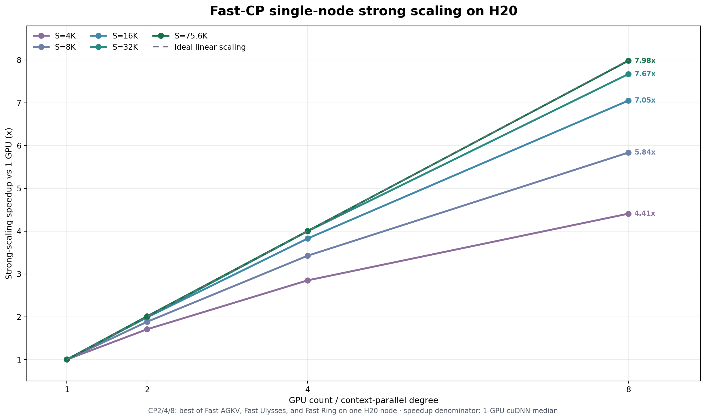
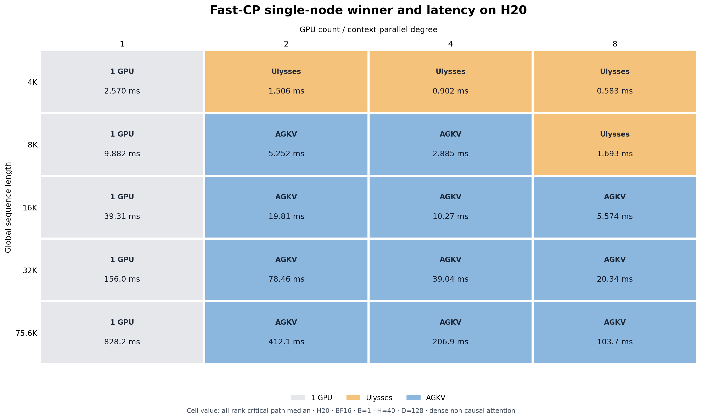

# Fast CP

Fast CP 包含两种单机 Context Parallel 实现：Fast AGKV 和 Fast Ulysses。两者都用
NVSHMEM 在 GPU 之间传输数据，并用 Copy Engine 执行可以与计算重叠的拷贝。目录中
还保留了 Fast Ring，供低显存 Ring Attention 实验使用。

## 使用条件与要解决的问题

标准 AGKV 会先 all-gather 完整 K/V，再启动 attention。标准 Ulysses 会在
attention 前后各执行一次 NCCL all-to-all。这些 collective 会引入 stream 同步和
启动开销。短序列的计算时间少，固定开销所占比例更高。长序列还会产生较大的 K/V
中间张量。

Fast CP 用 symmetric buffer 保存通信结果。发送方直接写入目标 GPU 的 buffer，
接收方通过 arrival flag 判断数据是否可读。Copy Engine 传输 K/V 时，SM 可以计算
已经到达的数据。这个设计减少了 collective 完成后的等待时间，也省去了一次中间
数据搬运。

当前实现需要以下环境：

- 单机 2、4 或 8 张 Hopper GPU，当前性能数据来自 NVIDIA H20；
- GPU 之间支持 CUDA P2P，推荐使用 NVLink 或 NVSwitch；
- CUDA、PyTorch、NCCL 和 NVSHMEM 3.7 或更高版本；
- FP16 或 BF16 的 4D `[B, S, H, D]` 张量；
- dense non-causal attention。

扩展包含针对 GPU 架构编译的 CUDA 代码。CUDA、NVSHMEM 或 GPU 架构变化后需要
重新编译。`auto` 模式会在设备、拓扑或张量形状不满足要求时改用 Torch/NCCL。

## Fast AGKV

Fast AGKV 让每个 rank 保留自己的 Q 分片，并接收所有 rank 的 K/V。发送方把 K/V
直接写入每个目标 rank 的 symmetric buffer。Attention kernel 根据 arrival flag
读取已经到达的 K/V，无需等待完整 all-gather。

这种方法有三个性质：

- Q 按序列切分，不要求 head 数能被 CP 整除；
- 长序列可以用 attention 计算覆盖 K/V 传输；
- 每张卡需要保存全局 K/V，K/V 显存随全局序列长度线性增长。

K/V 能放入显存且序列较长时，Fast AGKV 通常是三种实现中延迟最低的方案。

代码提供两个 AGKV 接口。`FastAgkvAttention` 把 Full-Mesh K/V 传输和 CuTe
attention 合并，当前用于 benchmark 和研究。`FastAgkvTransport` 只负责 K/V
传输，可以通过 `--agkv-transport fast_agkv` 接入现有 attention 后端。

Full-Mesh 默认使用单 chunk fixed scheduler。多 chunk 和 ready-mask scheduler
的 H20 结果比默认实现慢 0.4% 到 3.3%，所以只保留实验接口。

## Fast Ulysses

Fast Ulysses 先把 `[局部序列, 全部 heads]` 重排成
`[全部序列, 局部 heads]`。每个 rank 计算一部分 heads，随后通过反向重排恢复原始
布局。

两次重排由 NVSHMEM Copy Engine 完成。同一节点上的 Ulysses subgroup 共享一个
symmetric pool，避免为每个 subgroup 创建独立的 NVSHMEM runtime。

每个 rank 只保存一部分 heads，因此 Fast Ulysses 的显存低于 Fast AGKV。它要求
Ulysses degree 同时整除 CP degree 和 head 数。运行时选择不超过节点 GPU 数的最大
合法 degree。例如，CP8/H40 使用 U8，CP8/H12 使用 U4。

Fast Ulysses 已接入 transport factory，可以通过
`--ulysses-transport fast_ulysses` 使用。CUDA Graph capture 和不支持的张量形状
会改用 NCCL all-to-all。

## Fast Ring 实验

Fast Ring 让 K/V 分片沿 Ring 依次传到相邻 rank。每个 rank 对当前 K/V 分片计算
partial attention，再用 FP32 online softmax 合并结果。每张卡只保存本地分片和
两个接收 buffer，K/V 显存为 `O(S / CP)`。

当前实现包含双 landing buffer、Copy Engine forwarding、CuTe partial attention
和 GPU arrival ticket。它不要求 head 数能被 CP 整除。

H20 的统一评测中，Fast Ring 没有在任何已测序列长度和 CP degree 下取得最低延迟。
它目前用于测试 Ring 通信与 attention 重叠，以及评估低显存方案。模型 pipeline
不会自动选择 Fast Ring。

## H20 单机结果

下图使用同一组 1 GPU cuDNN latency 计算 speedup。CP2、CP4 和 CP8 的每个点取
Fast AGKV、Fast Ulysses、Fast Ring 中 latency 最低的实现。



4K 序列由 Fast Ulysses 获胜。8K 序列在 CP2 和 CP4 使用 Fast AGKV，在 CP8
使用 Fast Ulysses。16K 及以上的已测配置均由 Fast AGKV 获胜。



测试使用 BF16、`B=1`、`H=40`、`D=128` 和 dense non-causal attention。方阵中的
latency 是所有 rank 中最慢 rank 的 median。

运行 `python tools/plotting/fast_cp_scaling_matrix.py` 可以重新生成两张图。

## 运行时接口

模型 pipeline 默认使用 Torch/NCCL。以下参数显式启用 Fast transport：

```bash
--ulysses-transport fast_ulysses
--agkv-transport fast_agkv
```

环境变量提供相同设置：

```bash
CHITU_ULYSSES_TRANSPORT=fast_ulysses
CHITU_AGKV_TRANSPORT=fast_agkv
```

这两个 AGKV 接口的含义不同。`fast_agkv` selector 选择
`FastAgkvTransport`。Fused `FastAgkvAttention` 和 Fast Ring 需要由 benchmark
或测试代码直接创建。

## 安装说明

安装 Fast Ulysses 依赖并应用仓库中的 overlay：

```bash
uv sync --extra fast-ulysses
python tools/install/install_fast_agkv.py refs/fast-ulysses
```

CUDA 13 wheel 环境还需要 CCCL headers：

```bash
uv pip install --python .venv/bin/python nvidia-cuda-cccl
```

Fused Fast AGKV 还需要对 FlashAttention 源码应用 CuTe overlay：

```bash
python tools/install/install_full_mesh_cute.py refs/kernels/flash-attention
python tools/install/install_fast_agkv.py refs/fast-ulysses
```

overlay 只修改指定的源码 checkout。应用 overlay 后，根据目标机器设置 CUDA
toolkit、`NVSHMEM_HOME` 和运行时库路径，然后重新编译并安装 `fast-ulysses` 和
FlashAttention。

以下环境变量控制实验参数：

- `CHITU_FAST_ULYSSES_POOL_BYTES` 设置 symmetric pool 大小，默认值为 2 GiB。
- `CHITU_FAST_ULYSSES_ASYNC_CE=0/1` 控制 Ulysses Copy Engine 异步路径。
- `CHITU_FAST_ULYSSES_USE_TMA=auto/0/1` 选择 TMA transport。
- `CHITU_FAST_AGKV_POOL_BYTES` 设置 AGKV symmetric pool 大小。
- `CHITU_FAST_AGKV_USE_CE=0/1` 控制 AGKV Copy Engine transport。
- `CHITU_FAST_AGKV_ASYNC=auto/on/off` 控制 AGKV 通信与计算重叠策略。

## 目录说明

- `agkv_transport.py` 实现独立的 K/V gather transport。
- `ulysses.py` 实现 Fast Ulysses transport、node runtime 和 logical subgroup。
- `_runtime.py` 适配 Fast Ulysses 和 NVSHMEM 扩展。
- `experimental/agkv.py` 实现 fused Full-Mesh Fast AGKV attention。
- `experimental/ring.py` 实现单节点 Fast Ring。
- `experimental/_cute.py` 和 `experimental/_ring_merge.py` 支持实验 attention。

公共 transport 协议和 factory 位于 `chitu_diffusion/parallel/`。NCCL 实现位于
`chitu_diffusion/parallel/nccl/`。当前 Fast Ulysses 审查基线为 commit
`6e5dcb24dc44e781ac3091d1d9b3f9fef314fb87`。

## 致谢

Fast CP 的 Fast Ulysses 后端基于
[`triple-mu/fast-ulysses`](https://github.com/triple-mu/fast-ulysses)
开发。感谢原作者开源 NVSHMEM Ulysses 实现。本项目在该实现上增加了
logical subgroup，以及 Fast AGKV 和 Fast Ring 所需的通信接口。
