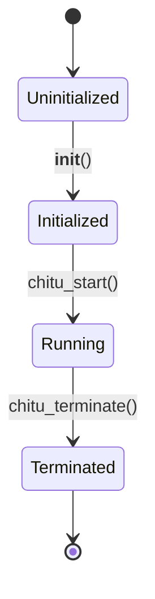

# Backend API

This page documents the `DiffusionBackend` class, which manages model loading, initialization, and resource coordination for ChituDiffusion.

## DiffusionBackend

The central backend manager that coordinates all components of the diffusion system.

### Class Definition

```python
class DiffusionBackend:
    """
    Backend manager for diffusion models.
    
    Manages:
    - Model loading and initialization
    - Distributed group setup
    - Memory management
    - Component coordination (encoder, DiT, VAE, scheduler, generator)
    """
```

### Static Class Attributes

```python
class DiffusionBackend:
    model_pool: List[nn.Module] = []
    text_encoder: nn.Module = None
    vae: nn.Module = None
    scheduler: DiffusionScheduler = None
    generator: Generator = None
    flexcache_manager: FlexCacheManager = None
    attn_backend: DiffusionAttnBackend = None
    state: BackendState = BackendState.Uninitialized
```

### Initialization

#### __init__

```python
def __init__(self, args, logging_level=None)
```

Initialize the backend with configuration.

**Parameters**:
- `args`: Hydra configuration object
  - `args.models`: Model configuration (checkpoint path, architecture)
  - `args.infer`: Inference configuration (attention type, memory level)
  - `args.distributed`: Distributed training configuration
- `logging_level`: Optional logging level override

**Example**:
```python
from chitu_diffusion.backend import DiffusionBackend
from hydra import compose, initialize

initialize(config_path="config", version_base=None)
args = compose(config_name="wan")
args.models.ckpt_dir = "/path/to/checkpoint"

backend = DiffusionBackend(args)
```

### Component Management

#### Model Pool

Access loaded DiT models:

```python
models = DiffusionBackend.model_pool
print(f"Loaded {len(models)} DiT models")
```

For multi-stage models (e.g., Wan2.2-A14B):
```python
stage1_model = DiffusionBackend.model_pool[0]  # Base stage
stage2_model = DiffusionBackend.model_pool[1]  # Refinement stage
```

#### Text Encoder

```python
text_encoder = DiffusionBackend.text_encoder

# Encode prompt
embeddings = text_encoder(
    input_ids=token_ids,
    attention_mask=attention_mask
)
```

#### VAE

```python
vae = DiffusionBackend.vae

# Decode latent to pixels
video = vae.decode(latent)
```

#### Scheduler

```python
scheduler = DiffusionBackend.scheduler

# Get next task to process
task_id = scheduler.schedule()
```

#### Generator

```python
generator = DiffusionBackend.generator

# Run generation step
generator.generate_step(task)
```

### Backend State

```python
from chitu_diffusion.backend import BackendState

class BackendState(Enum):
    Uninitialized = 0
    Initialized = 1
    Running = 2
    Terminated = 3
```

#### State Transitions



#### State Checking

```python
from chitu_diffusion.backend import DiffusionBackend, BackendState

# Check current state
if DiffusionBackend.state == BackendState.Running:
    print("Backend is running")

# Set state
DiffusionBackend.state = BackendState.Running
```

### Distributed Groups

The backend manages several process groups for distributed execution:

#### Process Group Types

```python
class DiffusionBackend:
    cp_group: dist.ProcessGroup  # Context Parallelism
    cfg_group: dist.ProcessGroup  # CFG Parallelism
    world_group: dist.ProcessGroup  # Global world
```

#### Group Information

```python
# Get group sizes
cp_size = DiffusionBackend.get_cp_size()
cfg_size = DiffusionBackend.get_cfg_size()
world_size = dist.get_world_size()

# Get ranks
cp_rank = DiffusionBackend.get_cp_rank()
cfg_rank = DiffusionBackend.get_cfg_rank()
global_rank = dist.get_rank()
```

### Memory Management

The backend implements multi-level memory management:

#### Low Memory Levels

```python
# Configure memory level in args
args.infer.diffusion.low_mem_level = 2
```

**Levels**:
- **0**: All models on GPU (fastest, most VRAM)
- **1**: VAE uses tiling (slight slowdown)
- **2**: T5 encoder on CPU (moderate slowdown)
- **3**: DiT models on CPU (significant slowdown)

#### Model Offloading

```python
def offload_to_cpu(self, component: str):
    """Move component to CPU to save VRAM"""
    if component == "text_encoder":
        self.text_encoder.to("cpu")
    elif component == "vae":
        self.vae.to("cpu")
```

#### Memory Monitoring

```python
import torch

print(f"Allocated: {torch.cuda.memory_allocated()/1024**3:.2f} GB")
print(f"Reserved: {torch.cuda.memory_reserved()/1024**3:.2f} GB")
print(f"Max allocated: {torch.cuda.max_memory_allocated()/1024**3:.2f} GB")
```

### Model Loading

#### Checkpoint Loading

```python
def _load_checkpoint(self, model: nn.Module, ckpt_dir: str):
    """Load model weights from checkpoint directory"""
    # Loads .safetensors or .bin files
    # Handles sharded checkpoints automatically
```

#### Architecture Construction

```python
@staticmethod
def _build_model_architecture(args, attn_backend, rope_impl):
    """Build model architecture from configuration"""
    model_type = ModelType(args.type)
    model_cls = get_model_class(model_type)
    
    return model_cls(
        in_channels=args.transformer.in_channels,
        hidden_size=args.transformer.hidden_size,
        depth=args.transformer.depth,
        num_heads=args.transformer.num_heads,
        # ... more parameters
    )
```

### FlexCache Integration

#### FlexCache Manager

```python
flexcache_manager = DiffusionBackend.flexcache_manager

# Check if cache is enabled
if flexcache_manager is not None:
    cache_strategy = flexcache_manager.strategy
    print(f"Using {cache_strategy} caching")
```

#### Cache Strategies

- **TeaCache**: Temporal cache reuse
- **PAB**: Pyramid Attention Broadcast

### Attention Backend

#### Backend Selection

```python
attn_backend = DiffusionBackend.attn_backend

print(f"Using attention backend: {attn_backend.type}")
```

#### Backend Types

- `flash_attn`: FlashAttention
- `sage`: SageAttention (INT8)
- `sparge`: SpargeAttention (Sparse + INT8)
- `auto`: Automatic selection

### Error Handling

#### Common Exceptions

**ValueError**: Invalid configuration

```python
try:
    backend = DiffusionBackend(args)
except ValueError as e:
    print(f"Configuration error: {e}")
    # Fix configuration and retry
```

**FileNotFoundError**: Checkpoint not found

```python
try:
    backend = DiffusionBackend(args)
except FileNotFoundError as e:
    print(f"Checkpoint not found: {e}")
    # Check ckpt_dir path
```

**RuntimeError**: CUDA errors

```python
try:
    backend = DiffusionBackend(args)
except RuntimeError as e:
    print(f"CUDA error: {e}")
    # Check GPU memory, CUDA version
```

### Complete Example

```python
from chitu_diffusion.backend import DiffusionBackend, BackendState
from hydra import compose, initialize
import torch.distributed as dist

# Initialize configuration
initialize(config_path="config", version_base=None)
args = compose(config_name="wan")
args.models.ckpt_dir = "/path/to/checkpoint"
args.infer.attn_type = "sage"
args.infer.diffusion.low_mem_level = 2

# Initialize distributed (if using multiple GPUs)
dist.init_process_group(backend="nccl")

# Create backend
backend = DiffusionBackend(args)

# Check state
assert backend.state == BackendState.Initialized

# Access components
print(f"Loaded {len(backend.model_pool)} models")
print(f"Text encoder: {backend.text_encoder is not None}")
print(f"VAE: {backend.vae is not None}")
print(f"Scheduler: {backend.scheduler is not None}")
print(f"Generator: {backend.generator is not None}")

# Start backend
backend.state = BackendState.Running

# ... perform inference ...

# Cleanup
backend.state = BackendState.Terminated
dist.destroy_process_group()
```

## See Also

- [Core API](core.md) - Main interface functions
- [Generator API](generator.md) - Generation pipeline
- [Scheduler API](scheduler.md) - Task scheduling
- [Architecture Overview](../architecture/overview.md)
