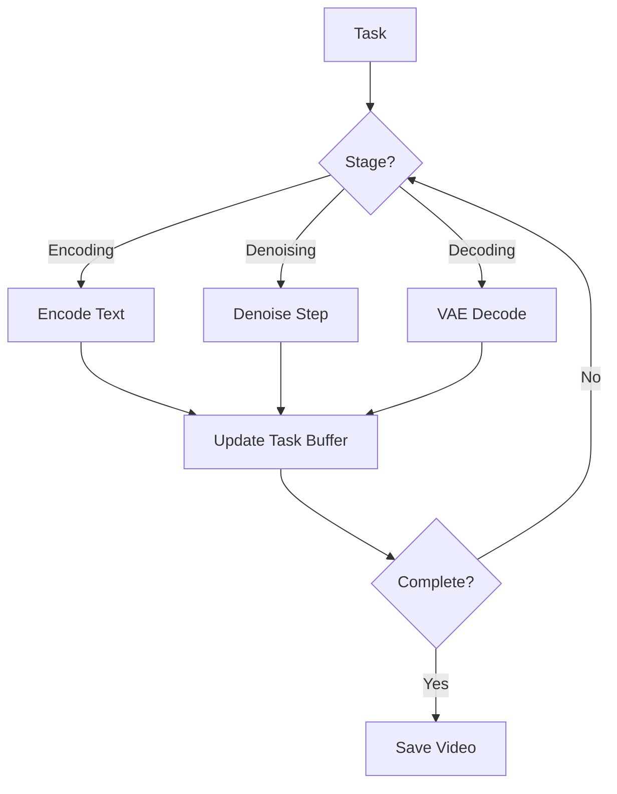

# Generator API

This page documents the `Generator` class, which executes the diffusion generation pipeline.

## Generator

The generator orchestrates the complete video generation pipeline from text encoding to VAE decoding.

### Class Definition

```python
class Generator:
    """
    Diffusion generation pipeline executor.
    
    Handles:
    - Text encoding
    - Iterative denoising through DiT model
    - VAE decoding
    - Multi-stage generation (for advanced models)
    """
```

### Initialization

```python
def __init__(self, backend: DiffusionBackend):
    """
    Initialize generator with backend reference.
    
    Args:
        backend: DiffusionBackend instance with loaded models
    """
```

**Example**:
```python
from chitu_diffusion.backend import DiffusionBackend
from chitu_diffusion.generator import Generator

backend = DiffusionBackend(args)
generator = Generator(backend)
```

### Pipeline Stages

The generator executes three main stages:

#### 1. Text Encoding

Convert text prompt to embeddings:

```python
def encode_text(self, prompt: str) -> torch.Tensor:
    """
    Encode text prompt using T5 encoder.
    
    Args:
        prompt: Text description
    
    Returns:
        embeddings: Text embeddings [B, seq_len, hidden_size]
    """
```

**Example**:
```python
embeddings = generator.encode_text("A cat walking on grass")
print(f"Embedding shape: {embeddings.shape}")
```

#### 2. Denoising Loop

Iteratively denoise latent representation:

```python
def denoise_loop(
    self,
    latent: torch.Tensor,
    embeddings: torch.Tensor,
    num_steps: int = 50,
    guidance_scale: float = 7.0
) -> torch.Tensor:
    """
    Run denoising diffusion loop.
    
    Args:
        latent: Initial noise [B, C, T, H, W]
        embeddings: Text embeddings
        num_steps: Number of denoising steps
        guidance_scale: CFG scale
    
    Returns:
        denoised_latent: Clean latent representation
    """
```

**Denoising Process**:
```python
for step in range(num_steps):
    # Predict noise
    noise_pred = model(latent, embeddings, timestep)
    
    # Apply CFG
    if guidance_scale > 1.0:
        noise_cond, noise_uncond = noise_pred.chunk(2)
        noise_pred = noise_uncond + guidance_scale * (noise_cond - noise_uncond)
    
    # Update latent
    latent = scheduler.step(noise_pred, timestep, latent)
```

#### 3. VAE Decoding

Convert latent to pixel space:

```python
def decode_vae(self, latent: torch.Tensor) -> torch.Tensor:
    """
    Decode latent to video frames.
    
    Args:
        latent: Latent representation [B, C, T, H, W]
    
    Returns:
        video: Video frames [B, T, C, H, W]
    """
```

**Example**:
```python
video = generator.decode_vae(denoised_latent)
print(f"Video shape: {video.shape}")
```

### Main Generation Method

```python
def generate_step(self, task: DiffusionTask):
    """
    Execute one generation step for a task.
    
    This is the main entry point called by chitu_generate().
    
    Args:
        task: DiffusionTask to process
    """
```

**Workflow**:


### Multi-Stage Generation

For advanced models like Wan2.2-A14B:

```python
def generate_multi_stage(self, task: DiffusionTask):
    """
    Execute multi-stage generation.
    
    Stage 1: Base generation (lower resolution)
    Stage 2: Refinement (higher resolution)
    """
```

**Example Flow**:
```python
# Stage 1: Base generation
latent_stage1 = denoise_loop(
    model=model_pool[0],
    resolution=(240, 424),
    num_steps=30
)

# Stage 2: Refinement
latent_stage2 = denoise_loop(
    model=model_pool[1],
    init_latent=upsample(latent_stage1),
    resolution=(480, 848),
    num_steps=20
)

# Final decode
video = decode_vae(latent_stage2)
```

### Distributed Execution

The generator handles distributed communication automatically:

#### Context Parallelism

```python
def forward_with_cp(self, latent, embeddings, timestep):
    """
    Forward pass with context parallelism.
    
    Each rank processes a chunk of frames:
    - Rank 0: frames [0:N/2]
    - Rank 1: frames [N/2:N]
    """
    # Get local chunk
    local_latent = split_sequence(latent, cp_rank, cp_size)
    
    # Local forward
    local_output = model(local_latent, embeddings, timestep)
    
    # All-to-all communication
    global_output = all_to_all(local_output, cp_group)
    
    return global_output
```

#### CFG Parallelism

```python
def forward_with_cfg_parallel(self, latent, embeddings, timestep):
    """
    Forward pass with CFG parallelism.
    
    - Rank 0: Conditional (positive prompt)
    - Rank 1: Unconditional (negative prompt)
    """
    if cfg_rank == 0:
        output = model(latent, embeddings, timestep)  # Conditional
    else:
        output = model(latent, empty_embeddings, timestep)  # Unconditional
    
    # All-gather results
    [cond_out, uncond_out] = all_gather(output, cfg_group)
    
    # Combine with CFG
    return uncond_out + guidance_scale * (cond_out - uncond_out)
```

### FlexCache Integration

The generator can use feature caching to speed up generation:

```python
def forward_with_cache(self, latent, embeddings, timestep, step_idx):
    """
    Forward pass with FlexCache enabled.
    
    Reuses features from previous steps when possible.
    """
    cache_manager = backend.flexcache_manager
    
    # Check if we can reuse cache
    if cache_manager.should_reuse(step_idx):
        cached_features = cache_manager.get_cache()
        output = model.forward_with_cache(latent, embeddings, cached_features)
    else:
        output = model(latent, embeddings, timestep)
        cache_manager.update_cache(output.intermediate_features)
    
    return output
```

### Memory Management

The generator implements memory-efficient processing:

#### Gradient Checkpointing

```python
# Enabled automatically for low memory mode
if low_mem_level >= 1:
    model.enable_gradient_checkpointing()
```

#### VAE Tiling

```python
def decode_vae_tiled(self, latent: torch.Tensor, tile_size: int = 8):
    """
    Decode VAE in tiles to reduce memory usage.
    
    Useful for high-resolution or long videos.
    """
    tiles = split_into_tiles(latent, tile_size)
    decoded_tiles = [vae.decode(tile) for tile in tiles]
    video = merge_tiles(decoded_tiles)
    return video
```

#### Mixed Precision

```python
# Automatic mixed precision
with torch.amp.autocast(device_type="cuda", dtype=torch.float16):
    output = generator.generate_step(task)
```

### Progress Tracking

Monitor generation progress:

```python
def get_progress(self, task: DiffusionTask) -> float:
    """
    Get generation progress for a task.
    
    Returns:
        progress: 0.0 to 1.0
    """
    total_steps = task.num_inference_steps
    current_step = task.current_step
    return current_step / total_steps
```

**Example**:
```python
progress = generator.get_progress(task)
print(f"Progress: {progress * 100:.1f}%")
```

### Error Handling

#### CUDA Out of Memory

```python
try:
    generator.generate_step(task)
except torch.cuda.OutOfMemoryError:
    # Clear cache and retry with lower memory mode
    torch.cuda.empty_cache()
    args.infer.diffusion.low_mem_level += 1
    generator = Generator(DiffusionBackend(args))
    generator.generate_step(task)
```

#### NaN Detection

```python
def check_nan(self, tensor: torch.Tensor, name: str):
    """Check for NaN values in tensor"""
    if torch.isnan(tensor).any():
        raise ValueError(f"NaN detected in {name}")
```

### Complete Example

```python
from chitu_diffusion.backend import DiffusionBackend
from chitu_diffusion.generator import Generator
from chitu_diffusion.task import DiffusionTask, DiffusionUserParams

# Initialize
backend = DiffusionBackend(args)
generator = Generator(backend)

# Create task
params = DiffusionUserParams(
    prompt="A cat walking on grass",
    num_inference_steps=50,
    guidance_scale=7.0
)
task = DiffusionTask.from_user_request(params)

# Generate
print("Starting generation...")
while not task.is_finished():
    generator.generate_step(task)
    progress = generator.get_progress(task)
    print(f"\rProgress: {progress * 100:.1f}%", end="")

print(f"\nDone! Saved to: {task.buffer.save_path}")
```

## Performance Tips

### Optimization Strategies

1. **Use FlexCache**: Enable TeaCache or PAB for 30-50% speedup
2. **Reduce Steps**: Start with 30-35 steps instead of 50
3. **SageAttention**: Use INT8 attention for 2x speedup
4. **Lower Resolution**: Generate at lower resolution then upscale
5. **Batch Processing**: Process multiple prompts in sequence

### Profiling

```python
import torch.profiler as profiler

with profiler.profile(
    activities=[profiler.ProfilerActivity.CPU, profiler.ProfilerActivity.CUDA],
    record_shapes=True
) as prof:
    generator.generate_step(task)

print(prof.key_averages().table(sort_by="cuda_time_total", row_limit=10))
```

## See Also

- [Core API](core.md) - Main interface
- [Backend API](backend.md) - Backend management
- [Task API](task.md) - Task management
- [Scheduler API](scheduler.md) - Task scheduling
