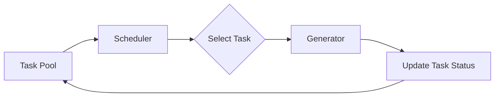

# Scheduler API

This page documents the `DiffusionScheduler` class, which manages task selection and ordering for execution.

## DiffusionScheduler

The scheduler selects which task to process next from the task pool.

### Class Definition

```python
class DiffusionScheduler:
    """
    Task scheduler for diffusion generation.
    
    Selects tasks from the pool and determines execution order.
    Currently implements FIFO (First-In-First-Out) scheduling.
    """
```

### Initialization

```python
def __init__(self, policy: str = "fifo"):
    """
    Initialize scheduler with scheduling policy.
    
    Args:
        policy: Scheduling policy ("fifo", "priority", "fair")
                Currently only "fifo" is fully implemented
    """
```

**Example**:
```python
from chitu_diffusion.scheduler import DiffusionScheduler

scheduler = DiffusionScheduler(policy="fifo")
```

## Scheduling Policies

### FIFO (First-In-First-Out)

**Default policy**: Tasks are processed in the order they arrive.

**Characteristics**:
- Simple and predictable
- No starvation
- Fair for equal-priority tasks
- Currently the only fully implemented policy

**Use Cases**:
- Single-user scenarios
- Sequential batch processing
- When all tasks have equal importance

**Example**:
```python
scheduler = DiffusionScheduler(policy="fifo")

# Tasks processed in order: A → B → C
task_a = DiffusionTask.from_user_request(params_a)
task_b = DiffusionTask.from_user_request(params_b)
task_c = DiffusionTask.from_user_request(params_c)
```

### Priority Scheduling

**Status**: Planned for future release

**Concept**: Tasks with higher priority are processed first.

**Planned Features**:
- User-defined priority levels
- Dynamic priority adjustment
- Aging to prevent starvation

**Example (planned)**:
```python
scheduler = DiffusionScheduler(policy="priority")

# High priority task processed first
params_urgent = DiffusionUserParams(prompt="Urgent request", priority=10)
params_normal = DiffusionUserParams(prompt="Normal request", priority=5)
```

### Fair Scheduling

**Status**: Planned for future release

**Concept**: Distribute resources fairly among users.

**Planned Features**:
- Round-robin among users
- Resource quotas
- Multi-tenancy support

## Core Methods

### schedule

```python
def schedule(self) -> Optional[str]:
    """
    Select next task to process.
    
    Returns:
        task_id: ID of selected task, or None if no tasks available
    """
```

**Behavior**:
1. Get pending tasks from pool
2. Apply scheduling policy
3. Return selected task ID

**Example**:
```python
task_id = scheduler.schedule()
if task_id is not None:
    task = DiffusionTaskPool.get(task_id)
    generator.generate_step(task)
```

### get_pending_count

```python
def get_pending_count(self) -> int:
    """
    Get number of pending tasks.
    
    Returns:
        count: Number of tasks waiting to be processed
    """
```

**Example**:
```python
pending = scheduler.get_pending_count()
print(f"{pending} tasks waiting")
```

## Integration with Task Pool

The scheduler works closely with `DiffusionTaskPool`:



**Workflow**:
```python
# 1. Tasks added to pool
DiffusionTaskPool.add(task1)
DiffusionTaskPool.add(task2)

# 2. Scheduler selects task
task_id = scheduler.schedule()

# 3. Generator processes task
task = DiffusionTaskPool.get(task_id)
generator.generate_step(task)

# 4. Task status updated in pool
task.status = TaskStatus.DENOISING
```

## Usage Examples

### Basic Usage

```python
from chitu_diffusion import chitu_init, chitu_start, chitu_generate
from chitu_diffusion.task import DiffusionTaskPool
from chitu_diffusion.scheduler import DiffusionScheduler
from chitu_diffusion.backend import DiffusionBackend

# Initialize
backend = DiffusionBackend(args)
scheduler = DiffusionScheduler(policy="fifo")

# Add tasks
for prompt in prompts:
    params = DiffusionUserParams(prompt=prompt)
    task = DiffusionTask.from_user_request(params)
    DiffusionTaskPool.add(task)

# Process tasks
while not DiffusionTaskPool.all_finished():
    # Scheduler selects next task
    task_id = scheduler.schedule()
    
    if task_id is not None:
        task = DiffusionTaskPool.get(task_id)
        generator.generate_step(task)
```

### With Monitoring

```python
import time

while not DiffusionTaskPool.all_finished():
    # Get statistics
    pending = scheduler.get_pending_count()
    stats = DiffusionTaskPool.get_statistics()
    
    print(f"Pending: {pending}, "
          f"Running: {stats['encoding'] + stats['denoising']}, "
          f"Finished: {stats['finished']}")
    
    # Process next task
    task_id = scheduler.schedule()
    if task_id is not None:
        task = DiffusionTaskPool.get(task_id)
        generator.generate_step(task)
    
    time.sleep(0.1)
```

### Custom Task Selection

```python
class CustomScheduler(DiffusionScheduler):
    """Custom scheduler with custom logic"""
    
    def schedule(self) -> Optional[str]:
        """Select shortest task first"""
        pending_tasks = DiffusionTaskPool.get_pending_tasks()
        
        if not pending_tasks:
            return None
        
        # Sort by number of frames (shortest first)
        shortest_task = min(
            pending_tasks,
            key=lambda tid: DiffusionTaskPool.get(tid).user_params.num_frames
        )
        
        return shortest_task

# Use custom scheduler
scheduler = CustomScheduler()
```

## Performance Considerations

### Scheduling Overhead

The scheduler has minimal overhead:
- O(1) for FIFO scheduling
- O(n) for priority scheduling (planned)
- O(n·log(n)) for fair scheduling (planned)

### Throughput Optimization

```python
# Minimize scheduling overhead
while not DiffusionTaskPool.all_finished():
    # Batch multiple steps per task
    task_id = scheduler.schedule()
    if task_id is not None:
        task = DiffusionTaskPool.get(task_id)
        
        # Process multiple denoising steps at once
        for _ in range(10):
            generator.generate_step(task)
            if task.is_finished():
                break
```

## Multi-GPU Scheduling

In distributed settings, only rank 0 runs the scheduler:

```python
import torch.distributed as dist

if dist.get_rank() == 0:
    # Rank 0: Schedule and coordinate
    task_id = scheduler.schedule()
    if task_id is not None:
        # Broadcast task_id to all ranks
        task = DiffusionTaskPool.get(task_id)
else:
    # Other ranks: Wait for task from rank 0
    task = receive_task_from_rank0()

# All ranks: Execute generation step
generator.generate_step(task)
```

## Future Enhancements

### Planned Features

#### 1. Priority Scheduling
```python
# High-priority tasks processed first
params = DiffusionUserParams(
    prompt="Urgent request",
    priority=10  # Higher = more urgent
)
```

#### 2. Resource-Aware Scheduling
```python
# Consider available VRAM
scheduler = DiffusionScheduler(
    policy="resource_aware",
    max_vram_gb=40
)
```

#### 3. Multi-User Fairness
```python
# Fair share among users
scheduler = DiffusionScheduler(
    policy="fair",
    users=["alice", "bob", "charlie"]
)
```

#### 4. Dynamic Batching
```python
# Group compatible tasks
scheduler = DiffusionScheduler(
    policy="batched",
    batch_size=4
)
```

## Troubleshooting

### No Tasks Selected

**Symptom**: `schedule()` always returns `None`

**Solutions**:
1. Check if tasks were added to pool
2. Verify task status (should be PENDING)
3. Check if all tasks are already finished

```python
# Debug
print(f"Pool size: {len(DiffusionTaskPool.pool)}")
print(f"Pending: {DiffusionTaskPool.get_pending_tasks()}")
```

### Tasks Not Processed in Expected Order

**Symptom**: FIFO order not maintained

**Solutions**:
1. Check task creation timestamps
2. Verify no custom scheduler override
3. Check for race conditions in distributed setup

### Scheduler Stalls

**Symptom**: Scheduler stops selecting tasks

**Solutions**:
1. Check for deadlocks in distributed setup
2. Verify task status updates are working
3. Check for exceptions in generator

## See Also

- [Task API](task.md) - Task management
- [Generator API](generator.md) - Task execution
- [Core API](core.md) - Main interface
- [Architecture Overview](../architecture/overview.md)
