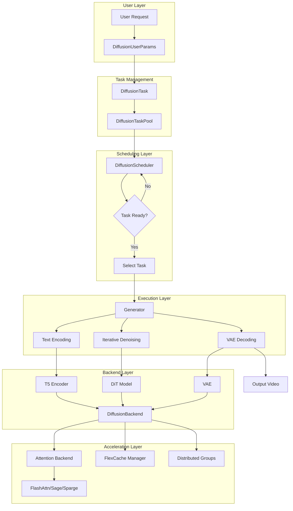
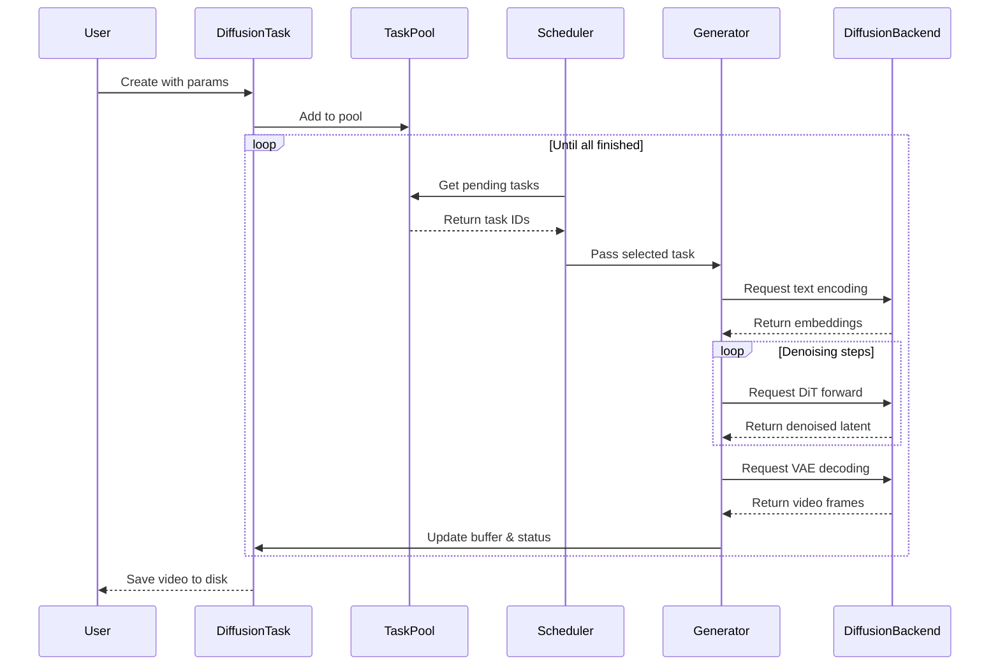
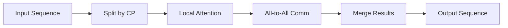
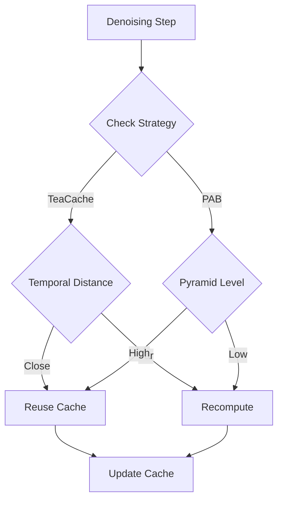

# Architecture Overview

This document provides an overview of Smart-Diffusion's architecture and design principles.

## System Architecture

Smart-Diffusion follows a modular, pipeline-based architecture optimized for high-performance diffusion inference:



## Core Components

### 1. Task Management System

**Purpose**: Manage user requests and track generation progress.

**Key Classes**:
- `DiffusionUserParams`: User-facing parameters for generation
- `DiffusionTask`: Internal task representation with buffers
- `DiffusionTaskPool`: Global task pool manager

**Features**:
- Task serialization for distributed execution
- Progress tracking
- Buffer management for intermediate states

### 2. Scheduler

**Purpose**: Select and order tasks for execution.

**Key Class**: `DiffusionScheduler`

**Strategy**: FIFO (First-In-First-Out)

**Responsibilities**:
- Task selection
- Resource allocation
- Fairness enforcement

### 3. Generator

**Purpose**: Execute the generation pipeline.

**Key Class**: `Generator`

**Pipeline Stages**:
1. **Text Encoding**: Convert prompt to embeddings using T5
2. **Denoising**: Iteratively denoise latent through DiT model
3. **VAE Decoding**: Convert latent to pixel space

**Features**:
- Multi-stage pipeline management
- Distributed communication handling
- Memory-efficient processing

### 4. Backend

**Purpose**: Manage model loading, parallelism, and resources.

**Key Class**: `DiffusionBackend`

**Responsibilities**:
- Model checkpoint loading
- Distributed group initialization
- Memory management
- Component coordination

**Components Managed**:
- Text encoder (T5)
- DiT models (single or multi-stage)
- VAE decoder
- FlexCache manager
- Attention backend

## Design Patterns

### 1. Static Singleton Pattern

The `DiffusionBackend` uses static class attributes to maintain global state:

```python
class DiffusionBackend:
    model_pool = []  # Shared across all instances
    scheduler = None
    generator = None
    # ...
```

**Rationale**: Simplifies distributed coordination and resource sharing.

### 2. Factory Pattern

Model creation uses factory methods:

```python
@staticmethod
def _build_model_architecture(args, attn_backend, rope_impl):
    model_type = ModelType(args.type)
    model_cls = get_model_class(model_type)
    return model_cls(...)
```

**Rationale**: Flexible model selection and instantiation.

### 3. Strategy Pattern

Attention backends use strategy pattern:

```python
class DiffusionAttnBackend:
    def __init__(self, attn_type):
        if attn_type == "flash_attn":
            self.impl = FlashAttention()
        elif attn_type == "sage":
            self.impl = SageAttention()
        # ...
```

**Rationale**: Easy swapping of attention implementations.

## Data Flow

### Generation Request Flow



## Memory Management

### Memory Hierarchy

Smart-Diffusion manages memory across multiple levels:

```
┌─────────────────────────────────────┐
│  GPU VRAM (Fastest)                 │
│  - Active DiT model                 │
│  - Activations                      │
│  - KV cache (if enabled)            │
└─────────────────────────────────────┘
           ↕ (Offload)
┌─────────────────────────────────────┐
│  CPU RAM (Fast)                     │
│  - Text encoder (low_mem_level≥2)  │
│  - Inactive DiT models (≥3)         │
│  - VAE (optional)                   │
└─────────────────────────────────────┘
           ↕ (Swap)
┌─────────────────────────────────────┐
│  Disk (Slow)                        │
│  - Model checkpoints                │
│  - Output videos                    │
└─────────────────────────────────────┘
```

### Memory Optimization Strategies

1. **Model Offloading**: Move unused models to CPU
2. **VAE Tiling**: Process video in tiles to reduce peak memory
3. **Gradient Checkpointing**: Recompute activations during backward pass
4. **Mixed Precision**: Use FP16/BF16 where possible

## Parallelism Strategy

Smart-Diffusion supports multiple parallelism dimensions:

### 1. Context Parallelism (CP)

Split sequence dimension across GPUs:

```
GPU 0: [frames 0-40]
GPU 1: [frames 41-80]
```

**Benefits**: 
- Handle longer sequences
- Linear memory scaling

**Communication**: All-to-all for attention

### 2. CFG Parallelism

Split positive/negative prompts:

```
GPU 0: Positive prompt
GPU 1: Negative prompt
```

**Benefits**:
- 2x speedup for CFG
- No extra memory overhead

**Communication**: All-gather for combining predictions

### 3. Data Parallelism (Future)

Process multiple requests in parallel:

```
GPU 0: Request A
GPU 1: Request B
```

**Benefits**:
- Higher throughput
- Better resource utilization

## Attention Mechanisms

### Backend Selection

Smart-Diffusion supports multiple attention implementations:

| Backend | Precision | Speed | Memory |
|---------|-----------|-------|--------|
| FlashAttention | FP16/BF16 | 1x | 1x |
| SageAttention | INT8 | ~2x | 0.5x |
| SpargeAttention | INT8 + Sparse | ~3x | 0.3x |

### Attention Flow with CP



## FlexCache System

FlexCache enables feature reuse across denoising steps:

### Architecture

```python
FlexCacheManager
├── Strategy (TeaCache / PAB)
├── Cache Buffer (GPU/CPU)
└── Indexer (which layers to cache)
```

### Cache Decision Flow



## Configuration Taxonomy

Smart-Diffusion uses a three-level configuration system:

### 1. Model Parameters (Static)

Location: `chitu_core/config/models/<model>.yaml`

Content: Architecture-specific parameters (layers, heads, hidden size)

**Cannot be changed** after checkpoint creation.

### 2. User Parameters (Dynamic)

Location: `DiffusionUserParams`

Content: Per-request parameters (prompt, steps, CFG scale)

**Can be changed** for each generation request.

### 3. System Parameters (Semi-static)

Location: Launch arguments

Content: Parallelism, operators, memory mode

**Cannot be changed** after initialization (requires restart).

## Extension Points

Smart-Diffusion is designed for extensibility:

### Adding New Models

1. Create model class in `chitu_core/models/`
2. Register in `ModelType` enum
3. Add configuration in `config/models/`

### Adding New Attention Backends

1. Implement attention interface
2. Register in `DiffusionAttnBackend`
3. Add type to configuration

### Adding New Cache Strategies

1. Implement strategy class
2. Register in `FlexCacheManager`
3. Add user parameter option

## Performance Characteristics

### Bottleneck Analysis

For typical text-to-video workloads:

```
Attention: ~50-80% of total time
Linear layers: ~10-20%
VAE decoding: ~5-10%
Communication: ~5-10%
Others: <5%
```

### Scaling Behavior

**Context Parallelism**:
- Near-linear speedup up to 8 GPUs
- Communication overhead increases beyond 8 GPUs

**CFG Parallelism**:
- 2x speedup for 2 GPUs
- No benefit beyond 2 GPUs

**Memory Scaling**:
- O(n) with sequence length (n = num_frames)
- O(1) with batch size (single request at a time)

## Next Steps

- [Parallelism Details](parallelism.md)
- [Attention Backends](attention-backends.md)
- [Design Philosophy](design-philosophy.md)
