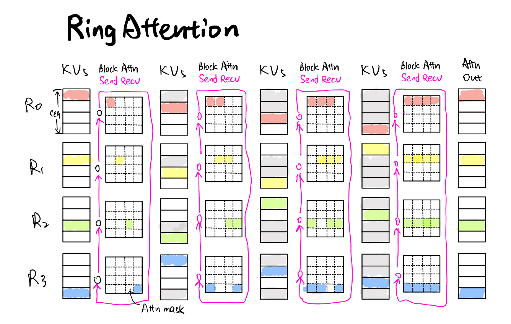
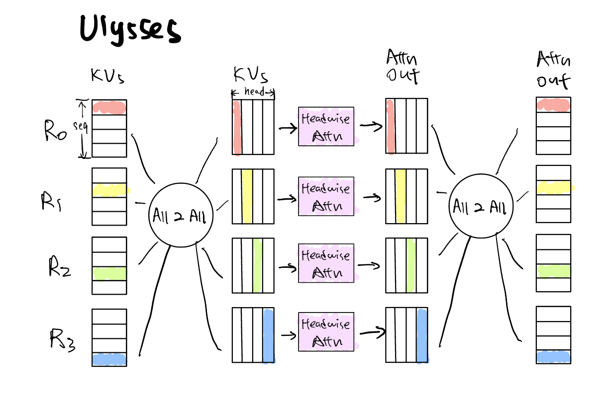
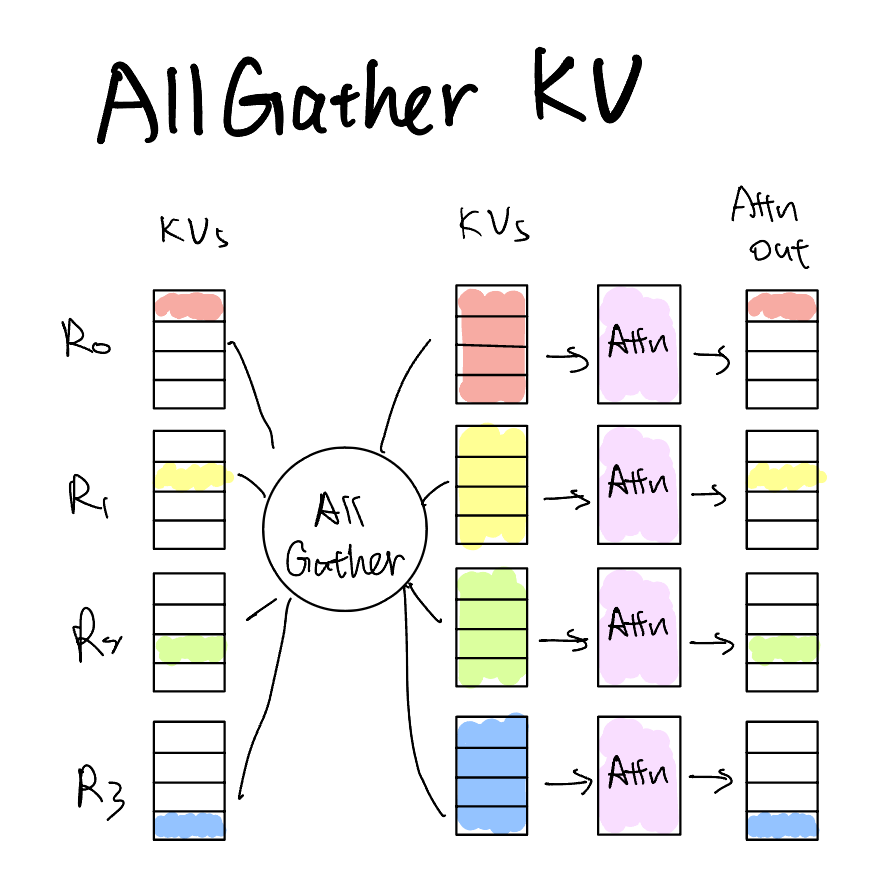
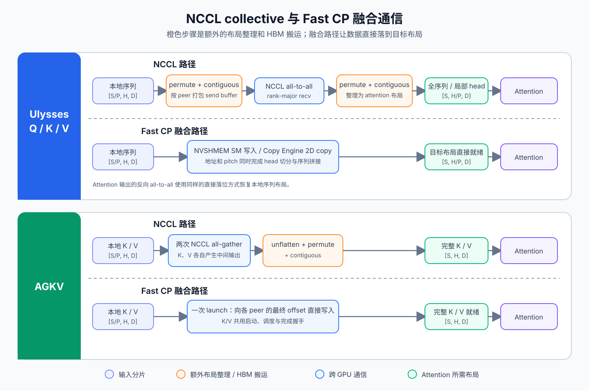
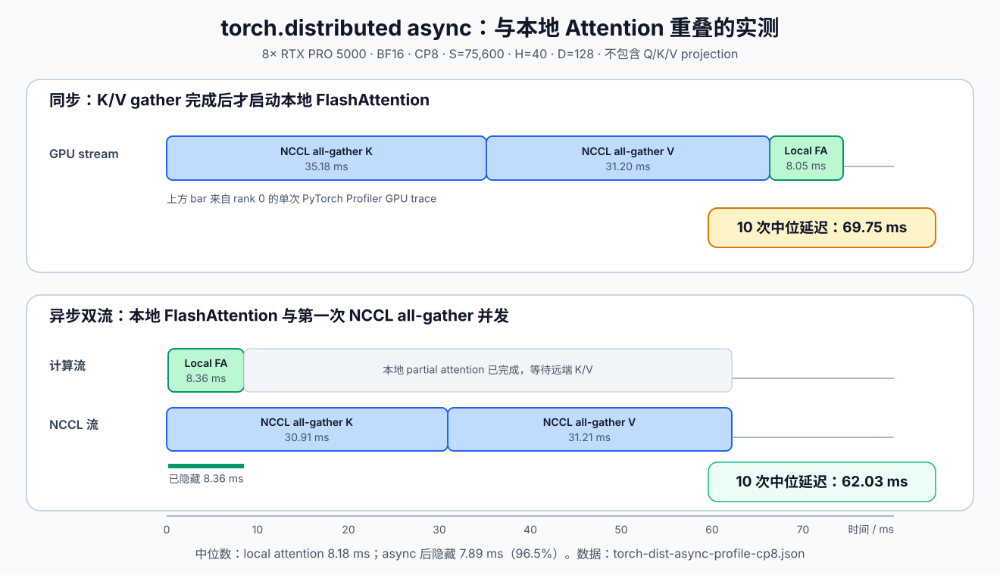

# Fast CP ｜ 将序列并行推向性能极限

序列并行在DiT类生成场景中几乎是最有效的无损scale up加速技术，笔者最近沉迷于将 ChituDiffusion 的序列并行性能拉高，作此记录。

---

序列并行（Sequence Parallelism，SP），也称为上下文并行（Context Parallelism，CP）沿序列维度将隐藏状态分给多张 GPU，由各张 GPU 共同完成与单卡等价的 Transformer 计算。在 DiT 中，MLP、归一化和位置编码等逐 token 算子可以直接处理本地分片；self-attention 中的每个 query 需要与全序列 K/V 交互，因此其通信集中在 attention。

## 一个 CP attention kernel 要解决什么

设完整的 Q、K、V 形状为 `[S, H, D]`，并沿序列维度切到 `P` 张 GPU。第 `i` 张 GPU 持有 `[S/P, H, D]` 的 `Q_i`、`K_i` 和 `V_i`，最终只需产出本地 query 对应的 `O_i`。

问题出在 attention 的全序列依赖。计算 $O_i = softmax(Q_i K^T / √D)V$ 时，`Q_i` 留在本地即可，但它必须看到完整的 K 和 V。一个 CP attention kernel 因此要同时完成两件事：把全局依赖需要的数据送到计算所在的 GPU，并让每张 GPU 只计算自己的输出分片。

Attention阶段的通信pattern形成了不同的CP方案，主要可以分为：RingAttention、Ulysses 和 AGKV。其中，Ring Attention 逐块传递 K/V 并合并 partial attention，Ulysses 把序列分片换成 head 分片，AGKV 汇聚完整 K/V 直接计算，三者计算的是同一个 attention，性能差异来自传输的数据量、数据布局，以及通信与计算能够重叠多少。

---

## 三种序列并行方法

为了比较三种方法，记一个元素占用 `b` 字节，完整 Q 张量的大小为：

$$
X = S \times H \times D \times b
$$

GPU 数量记为 `P`。下面只计算每张 GPU 接收的有效数据；发送量与接收量相同，本地拷贝和同步标记不计入其中。

### Ring Attention

沿环传递 K/V 的序列并行可以追溯到新加坡国立大学团队在 2021 年提交的 [Sequence Parallelism](https://arxiv.org/abs/2105.13120)，其中的方法名为 Ring Self-Attention。加州大学伯克利分校团队在 2023 年 10 月提出 [Ring Attention](https://arxiv.org/abs/2310.01889)，将这条路线与 blockwise attention 结合，并把 K/V 传输放到 attention 计算期间。

  

每张 GPU 固定本地 Q，让 K/V 分片沿环传递 `P-1` 次，并用 online softmax 合并每轮得到的 partial attention。每轮接收 `2X/P` 字节，因此总接收量为：

$$
C_{\mathrm{Ring}} = \frac{2X(P-1)}{P}
$$

它只需保存当前 K/V 分片和接收 buffer，但下一轮依赖上一轮传输完成。

### Ulysses

微软 DeepSpeed 团队在 2023 年 9 月提出了 [DeepSpeed-Ulysses](https://arxiv.org/abs/2309.14509)。名字来自长篇小说《尤利西斯》，对应论文处理超长序列的目标。

  

Ulysses 在 attention 前把 `[S/P, H, D]` 变为 `[S, H/P, D]`。Q、K、V 各执行一次 all-to-all，输出再执行一次反向 all-to-all。每张 GPU 的总接收量为：

$$
C_{\mathrm{Ulysses}} = \frac{4X(P-1)}{P^2}
$$

它只保存局部 head，但要求 `H` 能被 `P` 整除。

### AGKV

AllGather K/V 是对通信操作的直接描述，没有像前两种方法一样公认的首篇命名论文。NVIDIA Megatron-LM 在 2023 年 10 月[合入了 Context Parallelism 支持](https://github.com/NVIDIA/Megatron-LM/commit/37bd99a4ef6dbd9b969472b07e3758bfe3fad3c2)，其文档把 attention 所需的通信描述为收集完整 K/V。NVIDIA 后来在 [TensorRT 多设备推理](https://developer.nvidia.com/blog/scaling-ai-inference-across-multiple-gpus-using-nvidia-tensorrt-with-multi-device-inference-support/)中直接使用了 AllGather KV 这一名称。这一数据流后来也用于 vLLM 的 Prefill Context Parallelism。vLLM 在 2025 年提出的 PCP 方案沿序列切分 prefill token，并在部分 attention 后端中 all-gather 当前层的 K/V；PCP 还负责因果负载均衡和分片 KV cache，因此覆盖范围大于 AGKV 本身。

  

每张 GPU 保留本地 Q，并收集其余 GPU 的 K/V。每张 GPU 的接收量为：

$$
C_{\mathrm{AGKV}} = \frac{2X(P-1)}{P}
$$

通信后，每张 GPU 保存完整 K/V，再直接计算本地输出。AGKV 不切分 head，但完整 K/V 会占用 `2X` 字节显存。

理论通信量说明了各方法需要移动多少数据。实际延迟还取决于传输是否连续、collective 的启动和同步成本，以及通信能否被 attention 计算覆盖。

## 多维度比较

<table>
  <thead>
    <tr>
      <th>方法</th>
      <th>每张 GPU 的接收量</th>
      <th>K/V 工作集</th>
      <th>额外计算和访存</th>
    </tr>
  </thead>
  <tbody>
    <tr>
      <td>Ring Attention</td>
      <td><code>2X(P-1)/P</code></td>
      <td><code>O(X/P)</code>。本实现保存本地 K/V 和两组接收 buffer</td>
      <td><code>P-1</code> 次 online-softmax merge，每次读写 FP32 output 和 LSE 状态</td>
    </tr>
    <tr>
      <td>Ulysses</td>
      <td><code>4X(P-1)/P²</code></td>
      <td><code>2X/P</code></td>
      <td>attention前后各进行一次布局重排</td>
    </tr>
    <tr>
      <td>AGKV</td>
      <td><code>2X(P-1)/P</code></td>
      <td><code>2X</code></td>
      <td>KV汇聚完成后执行一次完整 attention</td>
    </tr>
  </tbody>
</table>

Ulysses 的接收量是另外两种方法的 `2/P`。当 `P=2` 时三者相同；继续增加 GPU 时，Ulysses 的通信量更低，但并行度不能超过 attention head 数，all-to-all 的实际延迟也取决于 GPU 拓扑。

AGKV 用**最大的显存开销**换取简单的执行过程。每张 GPU 都要保存完整 K/V，这部分显存不会随 `P` 增加而下降；得到 K/V 后，它可以直接调用一次常规 attention kernel。

Ring Attention 不保存完整 K/V，但通信量与 AGKV 相同。它还把一次 attention 拆成 `P` 个 block attention，并执行 `P-1` 次合并。合并需要反复从 HBM 读取 partial output、当前 FP32 output 和 LSE，再写回更新后的状态。这些跨 kernel 的状态合并和 HBM 往返是分块执行新增的开销。

Fast CP 优先追求速度，因此 ring attention 首先被淘汰了：通信量不如ulysses, 而长序列下，那多出来的P-1次 attention output的HBM IO会让 ring attention 比 agkv 更慢。后续我们主要优化ulysses和agkv，二者在不同情况下各有优劣，共同组成了fast cp的关键组件。

---

## Fast CP：减少中间搬运，隐藏剩余通信

三种方案执行的 attention 计算量已经确定，FlashAttention 也能让单卡计算保持较高效率。Fast CP 因此集中处理两项开销：让通信结果直接落到 attention 需要的布局，减少中间 buffer 的读写；把适合异步执行的传输交给 Copy Engine，尽量与计算重叠。

### 通信与数据重排融合

常规实现把通信库和计算库分开调用：NCCL 接收连续的 send/recv buffer，完成 all-to-all 或 all-gather；FlashAttention 接收已经排成目标布局的 Q/K/V，并不感知这些张量来自哪张 GPU。这样，NCCL 无需理解 attention 的数据布局，FlashAttention 也无需处理分布式拓扑，两者可以独立适配硬件。但它们之间必须由框架准备和整理 buffer：collective 前把待发送的数据排成 NCCL 需要的连续分块，collective 后再把 rank-major 的接收结果整理成 attention 需要的布局。NCCL 只在整个 collective 完成后报告结果可用，FlashAttention 也只能等最终张量就绪后启动。

Fast CP 的直接参考是 [triple-mu 的 Fast Ulysses](https://github.com/triple-mu/fast-ulysses/tree/6e5dcb24dc44e781ac3091d1d9b3f9fef314fb87)。以 Ulysses 为例，NCCL 路径先用 `permute + contiguous` 把每个目标 rank 对应的 head 切片打包到 send buffer，all-to-all 后再把 rank-major 的接收结果整理为 `[S, H/P, D]`。Fast Ulysses 不生成这两份中间布局：对每个 peer，源地址直接指向它需要的 head 切片，目标地址直接指向它在全局序列中的区间；二维拷贝的行宽描述连续的 head 数据，pitch 则跨过源张量中不属于该 peer 的 heads。于是序列拼接和 head 切分在跨 GPU 写入的寻址过程中同时完成，接收端得到的已经是 attention 需要的布局。Fast AGKV 使用同一思路，按照发送 rank 对应的序列 offset，把本地 K/V 直接写入各张 GPU 的完整 K/V buffer。

  

这类实现依赖 [NVSHMEM](https://docs.nvidia.com/nvshmem/api/introduction.html)。NVSHMEM 使用 Partitioned Global Address Space 模型，在各张 GPU 上分配布局一致的 symmetric heap，并提供 device-side put、get 和同步操作。CUDA kernel 可以发起远端访问，因此通信可以与索引变换、数据打包和完成通知写在同一个 kernel 中。NVSHMEM 官方支持 Volta 及更新的数据中心 GPU，互连可以是 NVLink、支持 P2P 的 PCIe，也可以是采用 GPUDirect RDMA 的 InfiniBand 或 RoCE。本文的 Fast CP 只使用单机 GPU P2P，并在 Hopper 和 Blackwell 上验证。

Fast CP 没有把整个 FlashAttention 合进通信 kernel。生产路径融合的是通信与数据落位。Fast Ulysses 把 all-to-all 和布局变换合成一次远端写入；Fast AGKV 把本地 K/V 直接写到各个 rank 最终的全局 K/V buffer，并让 K、V 共用一次 launch 和完成握手。attention 仍由现有 kernel 计算，因此可以继续使用已经优化好的 FlashAttention 实现。

### 通信与 attention 计算重叠

融合消除了中间 buffer 的搬运，但跨 GPU 传输本身仍然存在。这里讨论的 overlap 严格限制在 attention 内部：输入 Q/K/V 已经就绪，输出仍然是 O，不借用模型的 Q/K/V projection 覆盖通信。

这个边界关系到实现能否复用。不同模型产生 Q/K/V 的方式并不相同：Wan 既可能分别调用 `to_q`、`to_k`、`to_v`，也可能通过一个融合的 `to_qkv` 一次生成三者；Flux2 还可以把 QKV 与 MLP projection 融进同一个算子，并同时处理 image 和 text 两路 token；Qwen-Image 则为 image 和 text 使用不同的 projection。若 CP transport 假定固定的 projection 顺序，例如先生成 K/V、发起通信，再计算 Q，就必须为每种模型及其融合模式单独改写 attention processor。把 overlap 放回 Q/K/V 之后，CP attention 才能保持统一接口。

在这个接口下，Ulysses 和 AGKV 的依赖关系不同。Ulysses 必须先通过 all-to-all，把本地的 `[S/P, H, D]` Q/K/V 全部变成 `[S, H/P, D]`，常规 attention 才拥有完整序列上的 Q/K/V；attention 输出产生后，反向 all-to-all 才能开始。因此它的通信位于计算前后，是明确的数据依赖。AGKV 则始终把 Q 留在本地，本地 `K_i/V_i` 也可以直接使用。远端 K/V 开始传输后，GPU 可以立即计算 `Q_i` 对 `K_i/V_i` 的 local partial attention；随后再处理到达的远端 K/V，并用 output 与 LSE 完成 online-softmax 合并。这里与通信重叠的是 local attention，而不是 projection。

`torch.distributed` 的 `async_op=True` 能否做到这一点，需要实测而不能仅凭接口推断。我们在 8 张 RTX PRO 5000 上用两次 `all_gather_into_tensor` 收集 K/V，同时计算本地 FlashAttention；测试使用 BF16、`S=75,600`、`H=40`、`D=128`，不包含任何 projection。PyTorch Profiler 显示，异步 NCCL 在独立 GPU stream 上执行，本地 FlashAttention 与第一次 all-gather 实际并发。10 次测量中，串行执行的中位延迟为 `69.75 ms`，异步执行为 `62.03 ms`，本地 attention 的 `8.18 ms` 中有约 `96.5%` 被隐藏。至少在这个 shape 和拓扑上，`torch.distributed` 的异步重叠本身是有效的。

  

这组结果也说明，Fast AGKV 的价值不能简单归结为“`torch.distributed` 无法 overlap”。NCCL async 已经可以把 local attention 放到通信下方，但只能等待整个 collective 完成。Fast AGKV 进一步减少了 rank-major 中间布局及其 HBM 往返，并可用 arrival flag 表示各个远端 K/V 分片已经就绪，让 attention 不必等到全部 K/V 到齐才继续。它的通信提供 SM direct-write 和 Copy Engine 两条路径：SM 路径由 CUDA 线程执行远端写入，Copy Engine 路径使用 `cudaMemcpyAsync` 或 `cudaMemcpy2DAsync`，不占用执行 partial attention 的 SM。

两条路径的选择取决于互连架构。NVLink GPU 可以为不同 peer 提供独立链路，SM kernel 同时向多个 peer 写入往往更快。PCIe GPU 的所有 peer 共享一个 egress，增加并行写入不会增加物理带宽；此时 Copy Engine 使用较少的远端 stream 顺序提交大块传输，通常更有效。Fast CP 会探测互连，并针对具体 shape 测量 Copy Engine 的并发数。

Fast Ulysses 因此只保留通信与布局融合，不把模型外部的 projection 调度作为通用 Fast CP 的一部分。Fast AGKV 则利用 local K/V 提供的独立工作，把通信与 attention 本身重叠起来。