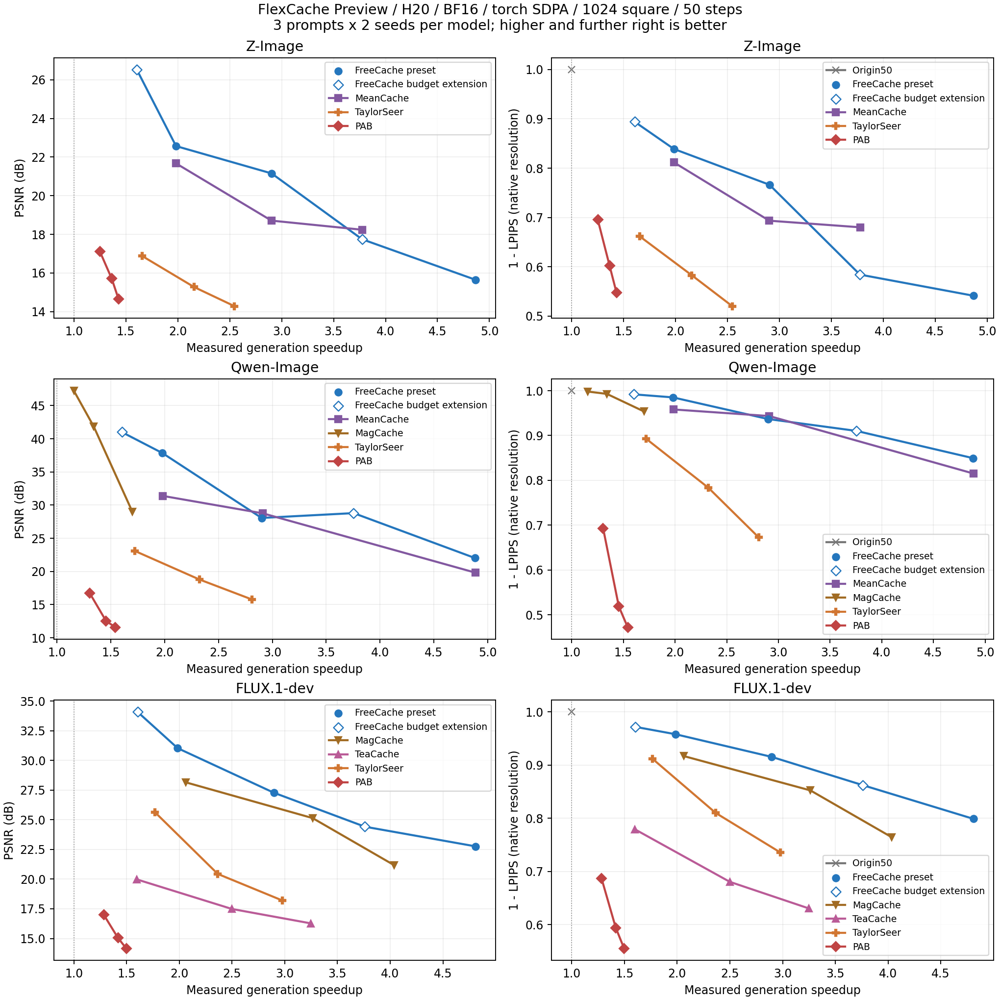
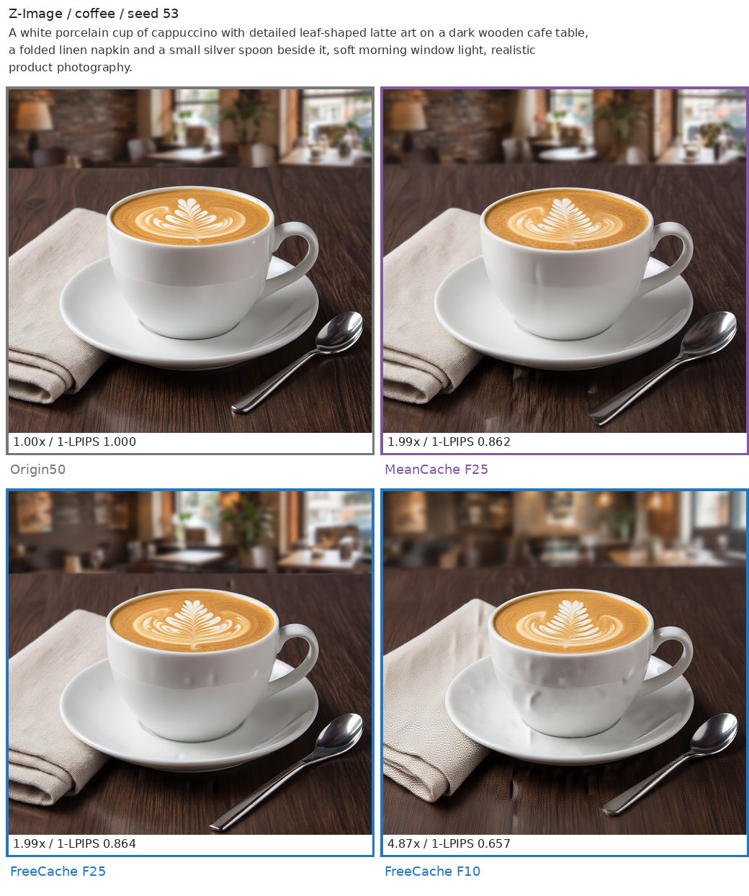

# FlexCache

FlexCache 为扩散模型提供统一的缓存加速接口。在完整计算的步骤保存输出，在后续步骤
复用或预测部分结果，从而减少生成耗时。不同策略提供不同的速度与画面保真度取舍。

## 支持策略

| 策略 | 复用对象 | 当前支持 |
| --- | --- | --- |
| FreeCache Preview | 模型输出与采样状态 | Z-Image、Qwen-Image、FLUX.1-dev |
| MeanCache | 模型输出与采样状态 | Z-Image、Qwen-Image，固定 50 steps |
| MagCache | 主干 residual | FLUX.1、Qwen-Image、Wan 1.3B 的官方 profile |
| TeaCache | block-group residual | FLUX.1、Wan 1.3B/14B 的默认标定 |
| TaylorSeer | attention、MLP 和 projection 输出 | Z-Image、FLUX.1、Qwen-Image、Wan |
| PAB | attention 输出 | Z-Image、FLUX.1、Qwen-Image、Wan |

## FreeCache Preview {#freecache-v2}

FreeCache Preview 内置模型 profile，无需读取实验文件或手动标定。
Fresh 预算支持 **1–50 的任意整数**，建议从 F25 开始。
F10 / F17 / F25 保留原有预设，其他预算自动生成调度；数字代表 50 个采样步骤中
执行完整模型计算的次数，不改变采样区间。极低预算可能明显损坏画面。

```python
from chitu_diffusion import CacheConfig, FreeCacheConfig

cache = CacheConfig(
    strategy="freecache",
    params=FreeCacheConfig.preview("zimage", fresh_budget=25),
)
```

CLI 使用 `--cache-strategy freecache --freecache-profile zimage:25`。
完整示例、三模型参数和 Slurm 命令见 [FreeCache 使用说明](../usage/freecache-v2.md)。

## 速度与质量 {#优化结果}

以下为 2026-09-09 Preview 的同轮参考评测，实际耗时随运行环境和版本变化。
单张 NVIDIA H20，BF16，1024²，50 steps；每个模型使用相同的 3 个 prompt、2 个 seed。
横轴为实测完整生成耗时的加速比，纵轴为相对无缓存结果的 PSNR / 1-LPIPS，越靠右上越好。
LPIPS 在原始 1024² 上计算，不缩放、不裁剪；耗时不含模型加载、图片保存和评测。
CFG 为 Z-Image 5、Qwen-Image 4、FLUX.1-dev 3.5，各方法使用同模型的单卡 torch SDPA 路径。

[](../assets/flexcache-preview-budget/speed_quality.png)

同方法连线连接实测工作点，仅作视觉引导；Origin 的 PSNR 为无穷大，不在 PSNR 轴上人为封顶。
FreeCache 实心圆为 F10 / F17 / F25 定档点，空心菱形为 F13 / F31 自动外推调度的实测点。
全部方法和五个 FreeCache 点在同轮重新测量，加速比相对于同轮 Origin。
图中只比较各模型支持的方法：TeaCache 在 FLUX 上测量，MagCache 在 Qwen/FLUX 上测量，
MeanCache 在 Z-Image/Qwen 上测量；FreeCache、TaylorSeer 和 PAB 覆盖三个模型。

### FreeCache 工作点

| 模型 | Fresh 预算 | 生成耗时 | 加速 | PSNR ↑ | 1-LPIPS ↑ |
| --- | --- | ---: | ---: | ---: | ---: |
| Z-Image | F31（外推） | 30.82s | 1.61x | 26.53 | 0.8942 |
| Z-Image | F25 | 24.95s | 1.98x | 22.57 | 0.8389 |
| Z-Image | F17 | 17.04s | 2.90x | 21.16 | 0.7663 |
| Z-Image | F13（外推） | 13.11s | 3.77x | 17.75 | 0.5840 |
| Z-Image | F10 | 10.17s | 4.87x | 15.65 | 0.5412 |
| Qwen-Image | F31（外推） | 38.24s | 1.60x | 41.00 | 0.9919 |
| Qwen-Image | F25 | 30.95s | 1.98x | 37.84 | 0.9852 |
| Qwen-Image | F17 | 21.13s | 2.90x | 28.06 | 0.9369 |
| Qwen-Image | F13（外推） | 16.32s | 3.75x | 28.79 | 0.9103 |
| Qwen-Image | F10 | 12.55s | 4.88x | 22.01 | 0.8496 |
| FLUX.1-dev | F31（外推） | 20.33s | 1.60x | 34.09 | 0.9718 |
| FLUX.1-dev | F25 | 16.44s | 1.98x | 31.03 | 0.9580 |
| FLUX.1-dev | F17 | 11.26s | 2.90x | 27.28 | 0.9154 |
| FLUX.1-dev | F13（外推） | 8.68s | 3.76x | 24.42 | 0.8623 |
| FLUX.1-dev | F10 | 6.78s | 4.81x | 22.76 | 0.7989 |

### 画面对比



拼图缩小展示；指标使用原尺寸图片计算。

[全部工作点 CSV](../assets/flexcache-preview-budget/summary.csv)

## 其他策略用法

```bash
chitu generate --model flux1 --model-path /path/to/Flux-1 \
  --prompt "A porcelain coffee cup on a cafe table, soft morning light." \
  --steps 50 --cache-strategy magcache --output outputs/coffee-magcache.png
```

Python API 同样通过 `CacheConfig(strategy=..., params=...)` 选择策略。
每次 `generate()` 独立维护缓存，请求结束后恢复临时 hook，不跨请求复用状态。
FreeCache Preview 仅支持单卡、50-step 的确定性 FlowMatch Euler `generate()`；
其他策略可按模型支持范围使用静态 NCCL CP / Fast CP。均不支持 EPE `serve`。

所有缓存策略都是有损加速。更换模型、采样参数或缓存档位后，应检查生成结果；
需要保持原始结果时使用 `--cache-strategy none`。
