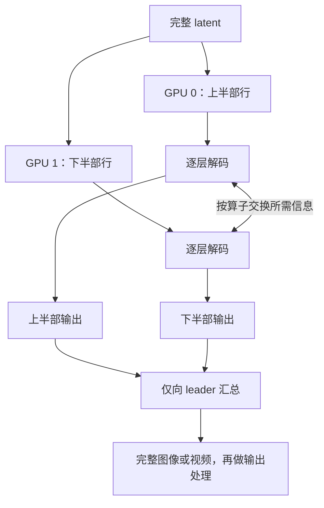
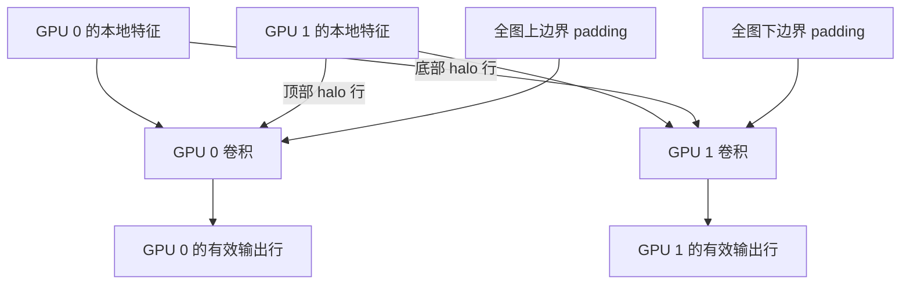
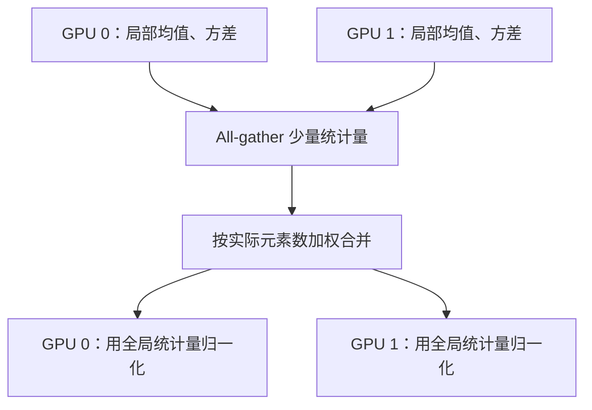
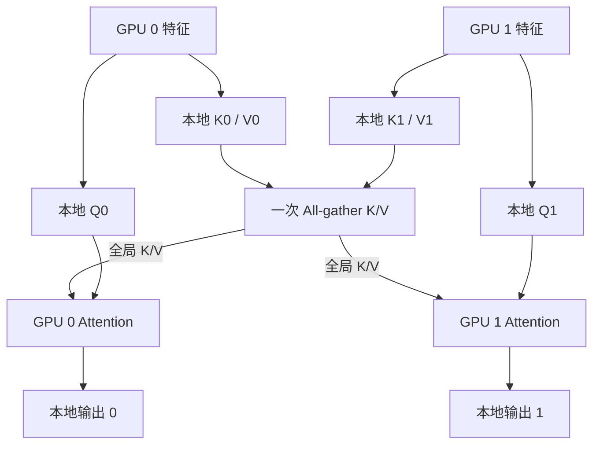

# VAEP：VAE 并行解码

VAEP 将图像或视频的 VAE 解码分到固定的一组 GPU 上，降低单卡解码计算量和中间特征显存。
核心设计是：**按高度分片，逐层补齐算子需要的邻域或全局信息**，最后由 leader 汇总输出。
当前支持静态并行，不接入动态 EPE，也不包含训练和 VAE 编码并行。

## 按高度分片，逐层解码

每张 GPU 持有一段互不重叠的高度区间，保留全部通道、宽度和本次解码调用的时间维。
区间可以不等长；上采样后，各自负责的输出区间同步扩大。



激活函数、逐点运算、仅沿通道的归一化和最近邻上采样等操作在本地执行。
卷积、GroupNorm 和 attention 则分别通过下面三种通信补齐依赖。
这样每层都保持完整图像的计算语义，分片边界无需做重叠混合来掩盖接缝。
浮点归约顺序和计算内核可能带来数值误差，不保证逐位一致。

## 卷积：交换边界行

卷积需要相邻分片的少量特征行，称为 halo。每个卷积层根据卷积核和 dilation
计算所需宽度，通过点对点通信交换边界，只保留属于本分片的卷积输出。



高度方向只在**全图外侧**使用原始 padding，内部切分处使用邻居的真实特征。
通信量取决于边界行数，无需收集整幅特征图。视频的 3D 卷积也沿高度交换 halo，
时间因果关系和缓存由原模型保留。

## GroupNorm：合并全局统计量

GroupNorm 的统计范围包含空间维。各分片需要使用同一份全局均值和方差，
否则即使卷积边界正确，也可能出现区域间的亮度或色彩差异。



对每个样本、每个通道组分别统计。设分片元素数占比为 `w_i`，则合并规则为：

```text
全局均值 = sum(w_i * 局部均值_i)
全局方差 = sum(w_i * (局部方差_i + (局部均值_i - 全局均值)^2))
```

按实际元素数加权可支持不等长分片；方差包含分片均值之间的差异。
统计使用 FP32，FP64 输入则保留 FP64。通信只传统计量，特征仍留在各卡。

## Attention：本地 Q，全局 K/V

Attention 采用 AGKV（All-Gather K/V）：各卡计算本地 Q/K/V，把 K、V 合并在一次
all-gather 中收集，再用本地 Q 对全局 K/V 做 attention。输出仍属于本地分片。



不等长分片为通信补齐的 padding 会在 attention 前移除。位置编码与 mask 使用
全局坐标，并保留原模型的注意力范围，例如 Wan 的逐帧空间 attention。
MiniMax 的 register/CLS token 可以在各卡计算 Q，但 K/V 只由一张卡贡献，避免重复计入。

## 不同模型如何复用

统一的是**算子的依赖与通信**。接入分为三层：pipeline 保留 latent 的缩放和输出处理；
模型族适配器保留布局、位置编码、mask、时间缓存与窗口；公共算子负责分片、halo、
全局统计量、AGKV 和输出汇总。原模型的模块与权重继续复用。

| 模型 | VAE 类型 | 适配重点 |
| --- | --- | --- |
| Z-Image、FLUX.1 | AutoencoderKL，2D CNN | 卷积 halo、全局 GroupNorm、AGKV |
| LLaDA-Image、FLUX.2-klein | AutoencoderKLFlux2，2D CNN | 复用公共算子，保留 latent BatchNorm 和 patch 转换 |
| Wan | 因果 3D CNN | 空间 halo、逐帧 AGKV、时间缓存 |
| Qwen-Image | 因果 3D CNN | 空间 halo、AGKV，保留自身的缓存与输出帧布局 |
| Hunyuan Image 3 | AutoencoderKLConv3D | 3D 卷积 halo、全局 GroupNorm、时空 AGKV、DCAE 上采样 |
| MiniMax-H3 视频 | ViT3DDecoder | 全局 RoPE、特殊 token 的 K/V 唯一归属、原始 mask 与时间窗口 |

模型族适配器还需要保证各卡通信次数和顺序一致。例如 Hunyuan 在并行解码中绕过
依赖局部输入大小的时间卷积分块，直接对本地行带执行卷积。
MiniMax 的串行与并行视频解码均关闭空间 tiling，保留原始时间窗口与裁剪；音频由 leader 解码。

## 使用与验证范围

各模型的启用方式与默认值见[运行说明](../usage/running.md)。标准 Diffusers tiling
需要关闭；过小的输入或不支持的结构会回退到 leader 完整解码，不支持的结构会发出警告。
当前公共卷积适配要求居中的奇数卷积核、高度 stride 为 1，其他几何需要单独适配。

八个模型入口均已接入上述范式。六类 VAE 已完成小规模结构的串行/并行输出对比，
其中 Hunyuan、MiniMax 使用发布源码构造小规模实例；完整预训练权重的实测目前覆盖
Z-Image 和 Wan。其余模型仍需补充完整权重与端到端验证，因此本功能列为实验功能。

实现位于 `chitu_diffusion/parallel/vae/exact.py`（公共算子）和 `families.py`（模型族适配）。
数值误差、性能数据和复现方法见[验证记录](../validation/vae-parallel.md)。
