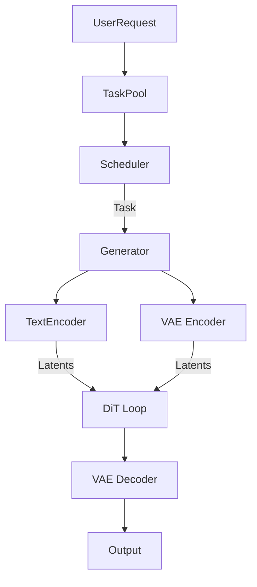

# Smart-Diffusion Documentation

Welcome to the Smart-Diffusion documentation! Smart-Diffusion is a high-performance diffusion model inference framework that provides extreme performance and flexible scheduling for AI-generated content (AIGC) workloads.

## What is Smart-Diffusion?

Smart-Diffusion is built on [Chitu](https://github.com/thu-pacman/chitu), a high-performance LLM inference framework. It extends Chitu's capabilities to support the rapidly growing Diffusion ecosystem, providing:

- **🚀 Extreme Performance**: Advanced parallelism strategies and optimized kernels
- **🔧 Flexible Architecture**: Multiple attention backend support
- **💾 Memory Efficiency**: Low memory modes with intelligent model offloading
- **📊 Smart Caching**: Feature reuse algorithms for acceleration
- **🎯 Simple API**: Easy-to-use interface with per-request configuration

## Quick Links

-   :material-clock-fast:{ .lg .middle } __Get Started__

    ---

    Install Smart-Diffusion and run your first generation in minutes

    [:octicons-arrow-right-24: Installation](getting-started/installation.md)

-   :material-book-open-variant:{ .lg .middle } __User Guide__

    ---

    Learn how to use Smart-Diffusion effectively

    [:octicons-arrow-right-24: Basic Usage](user-guide/basic-usage.md)

-   :material-tune:{ .lg .middle } __Performance Tuning__

    ---

    Optimize your inference for speed and memory

    [:octicons-arrow-right-24: Tuning Guide](user-guide/performance-tuning.md)

-   :material-api:{ .lg .middle } __API Reference__

    ---

    Detailed API documentation for all components

    [:octicons-arrow-right-24: API Docs](api/core.md)

## Key Features

### High-Performance Inference

Smart-Diffusion achieves superior performance through:

- **Parallelism**: Context parallelism (CP), CFG parallelism, and data parallelism
- **Optimized Kernels**: FlashAttention, SageAttention, SpargeAttention
- **Smart Scheduling**: Efficient task management and resource utilization

### Memory Efficiency

Run large models on limited hardware:

- **Model Offloading**: CPU offloading for DiT models and encoders
- **VAE Tiling**: Reduced memory usage during decoding
- **Flexible Configuration**: Adjustable memory levels (0-3)

### Feature Reuse

Accelerate generation with intelligent caching:

- **TeaCache**: Temporal adaptive caching (CVPR24)
- **PAB**: Pyramid attention broadcasting (ICLR25)

## Supported Models

Currently supported:

- Wan-AI/Wan2.1-T2V-1.3B (1.3B parameters)
- Wan-AI/Wan2.1-T2V-14B (14B parameters)
- Wan-AI/Wan2.2-T2V-A14B (14B parameters, two-stage)

More models coming soon!

## Architecture Overview

Smart-Diffusion follows a modular architecture:

1. **Task Management**: User requests are converted to tasks and added to the task pool
2. **Scheduling**: The scheduler selects pending tasks for execution
3. **Generation**: The generator orchestrates the full generation pipeline:
   - Text encoding (T5)
   - Iterative denoising (DiT)
   - VAE decoding
4. **Output**: Generated videos are saved to disk

## Community

Join our community:

- **GitHub**: [chen-yy20/SmartDiffusion](https://github.com/chen-yy20/SmartDiffusion)
- **Issues**: [Report bugs and request features](https://github.com/chen-yy20/SmartDiffusion/issues)
- **Discussions**: [Ask questions and share ideas](https://github.com/chen-yy20/SmartDiffusion/discussions)

## Next Steps

Ready to get started?

1. [Install Smart-Diffusion](getting-started/installation.md)
2. [Run your first generation](getting-started/quick-start.md)
3. [Explore advanced features](user-guide/advanced-features.md)
4. [Read the design philosophy](architecture/design-philosophy.md)

---

**Note**: Smart-Diffusion is under active development. We welcome contributions and feedback!
