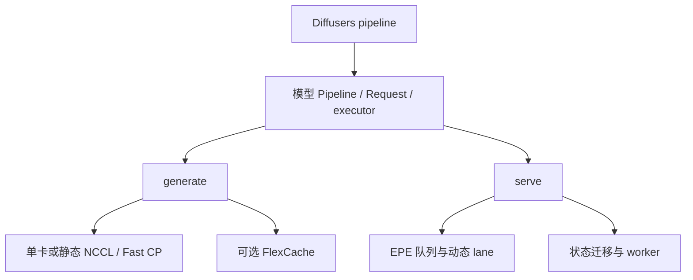

  

<h3 align="center">面向 Diffusers 模型的并行推理与缓存加速运行时</h3>

# 项目概述

扩散模型的主要计算集中在 DiT 去噪循环。输入分辨率、视频帧数和并发请求数增加后，
单卡延迟、显存占用和服务排队时间都会上升。ChituDiffusion 在 Diffusers pipeline
内替换 DiT 执行路径，保留 tokenizer、文本编码器、scheduler、VAE 和输出处理。

项目提供四项能力：

-   ### [Fast CP](features/fast-cp.md)

    将图像或视频 token 分到多张 GPU，使用 Fast AGKV 或 Fast Ulysses 降低通信开销。

-   ### [EPE](features/epe.md)

    根据实测代价、请求规模和 SLO，在服务运行期间调整每个请求占用的 GPU 数量。

-   ### [FlexCache](features/flexcache.md)

    用统一 API 接入五种特征复用方法，并保证静态 CP 各 rank 使用相同复用日程。

-   ### [Diffusers API](features/diffusers-api.md)

    通过 `Pipeline.from_pretrained()` 加载 Diffusers checkpoint，用 typed Request 发起请求。

## 执行路径

```mermaid
flowchart TD
    A[Diffusers pipeline] --> B[模型 Pipeline / Request / executor]
    B --> C[generate]
    B --> D[serve]
    C --> E[单卡或静态 NCCL / Fast CP]
    C --> F[可选 FlexCache]
    D --> G[EPE 队列与动态 lane]
    D --> H[状态迁移与 worker]
```

静态生成和 EPE 服务复用同一套模型 executor。FlexCache 只用于 `generate`，不保存
跨请求状态，也不接入动态 lane。Fast CP 只用于单机静态 CP；多机和 EPE 动态 lane
使用 NCCL。

## 支持模型

| 模型 | 静态生成 | EPE 服务 | FlexCache | 输出 |
| --- | --- | --- | --- | --- |
| Z-Image | 单卡、NCCL CP、Fast CP | 支持 | MeanCache、TaylorSeer、PAB | 图片 |
| FLUX.1-dev | 单卡、NCCL CP、Fast CP | 支持 | MagCache、TeaCache、TaylorSeer、PAB | 图片 |
| Qwen-Image | 单卡、NCCL CP、Fast CP | 支持 | MagCache、MeanCache、TaylorSeer、PAB | 图片 |
| Wan 2.1 T2V | 单卡、NCCL CP、Fast CP | 支持 | MagCache、TeaCache、TaylorSeer、PAB | 视频 |
| FLUX.2-klein | 单卡、静态 CP | 不支持 | 不支持 | 图片 |

项目目前处于开发者预览阶段。EPE 不保证任意 rank 故障后的恢复。Fast CP 和
FlexCache 的结果只适用于文档列出的硬件、模型、尺寸和参数。

从[安装](usage/installation.md)开始，然后按[运行说明](usage/running.md)执行单卡生成、
静态多卡生成或 EPE 服务。
