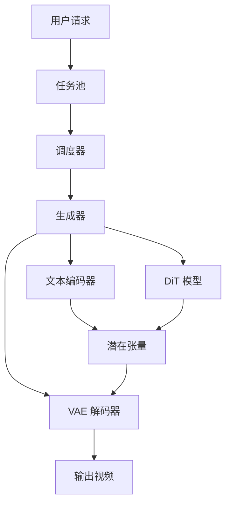

# Smart-Diffusion 文档

欢迎使用 Smart-Diffusion 文档！Smart-Diffusion 是一个高性能扩散模型推理框架，为 AI 生成内容（AIGC）工作负载提供极致性能和灵活调度。

## 什么是 Smart-Diffusion？

Smart-Diffusion 基于 [Chitu](https://github.com/thu-pacman/chitu) 构建，Chitu 是一个高性能 LLM 推理框架。它扩展了 Chitu 的能力以支持快速增长的 Diffusion 生态系统，提供：

- **🚀 极致性能**：先进的并行化策略和优化内核
- **🔧 灵活架构**：多种注意力后端支持
- **💾 内存效率**：具有智能模型卸载的低内存模式
- **📊 智能缓存**：用于加速的特征重用算法
- **🎯 简洁 API**：易于使用的接口，支持每个请求的配置

## 快速链接

-   :material-clock-fast:{ .lg .middle } __开始使用__

    ---

    安装 Smart-Diffusion 并在几分钟内运行您的第一个生成

    [:octicons-arrow-right-24: 安装指南](getting-started/installation.md)

-   :material-book-open-variant:{ .lg .middle } __用户指南__

    ---

    学习如何有效使用 Smart-Diffusion

    [:octicons-arrow-right-24: 基本用法](user-guide/basic-usage.md)

-   :material-tune:{ .lg .middle } __性能调优__

    ---

    优化您的推理速度和内存

    [:octicons-arrow-right-24: 调优指南](user-guide/performance-tuning.md)

-   :material-api:{ .lg .middle } __API 参考__

    ---

    所有组件的详细 API 文档

    [:octicons-arrow-right-24: API 文档](api/core.md)

## 主要特性

### 高性能推理

Smart-Diffusion 通过以下方式实现卓越性能：

- **并行化**：上下文并行 (CP)、CFG 并行和数据并行
- **优化内核**：FlashAttention、SageAttention、SpargeAttention
- **智能调度**：高效的任务管理和资源利用

### 内存效率

在有限硬件上运行大型模型：

- **模型卸载**：DiT 模型和编码器的 CPU 卸载
- **VAE 分块**：在解码期间减少内存使用
- **灵活配置**：可调节的内存级别 (0-3)

### 特征重用

通过智能缓存加速生成：

- **TeaCache**：时间自适应缓存 (CVPR24)
- **PAB**：金字塔注意力广播 (ICLR25)

## 支持的模型

当前支持：

- Wan-AI/Wan2.1-T2V-1.3B (13亿参数)
- Wan-AI/Wan2.1-T2V-14B (140亿参数)
- Wan-AI/Wan2.2-T2V-A14B (140亿参数，两阶段)

更多模型即将推出！

## 架构概览

Smart-Diffusion 采用模块化架构：

1. **任务管理**：用户请求转换为任务并添加到任务池
2. **调度**：调度器选择待执行的任务
3. **生成**：生成器编排完整的生成流程：
   - 文本编码 (T5)
   - 迭代去噪 (DiT)
   - VAE 解码
4. **输出**：生成的视频保存到磁盘

## 社区

加入我们的社区：

- **GitHub**：[chen-yy20/SmartDiffusion](https://github.com/chen-yy20/SmartDiffusion)
- **问题反馈**：[报告错误和功能请求](https://github.com/chen-yy20/SmartDiffusion/issues)
- **讨论**：[提问和分享想法](https://github.com/chen-yy20/SmartDiffusion/discussions)

## 下一步

准备开始了吗？

1. [安装 Smart-Diffusion](getting-started/installation.md)
2. [运行您的第一个生成](getting-started/quick-start.md)
3. [探索高级功能](user-guide/advanced-features.md)
4. [阅读设计理念](architecture/design-philosophy.md)

---

**注意**：Smart-Diffusion 正在积极开发中。我们欢迎贡献和反馈！
