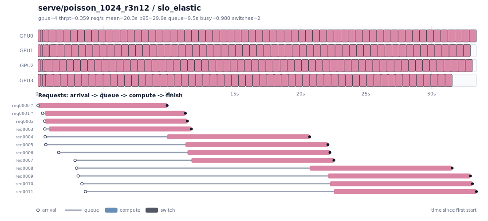
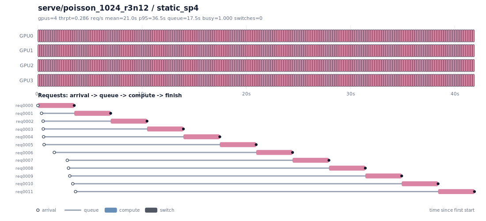
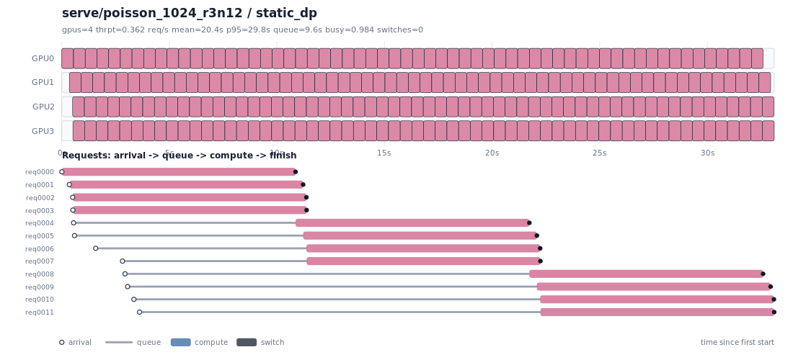
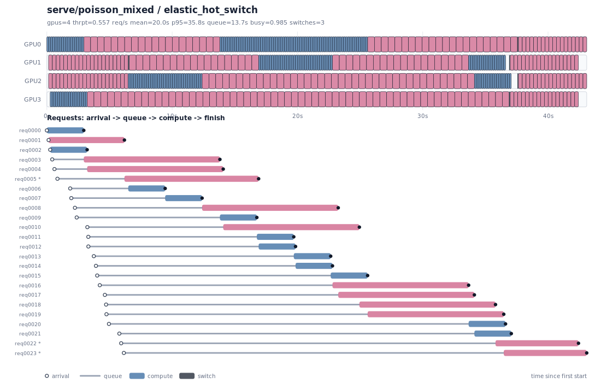
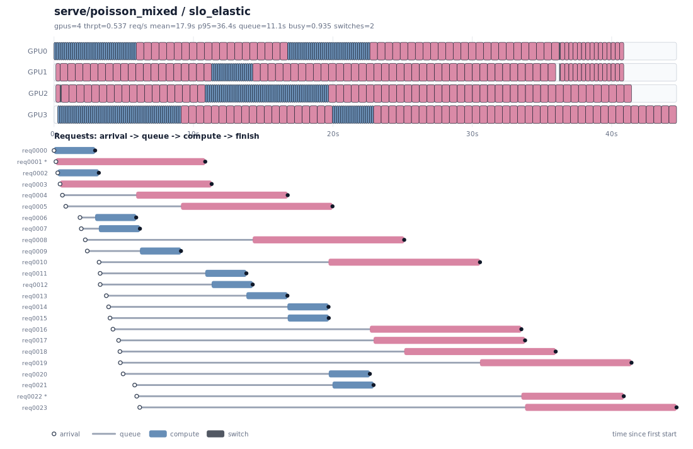
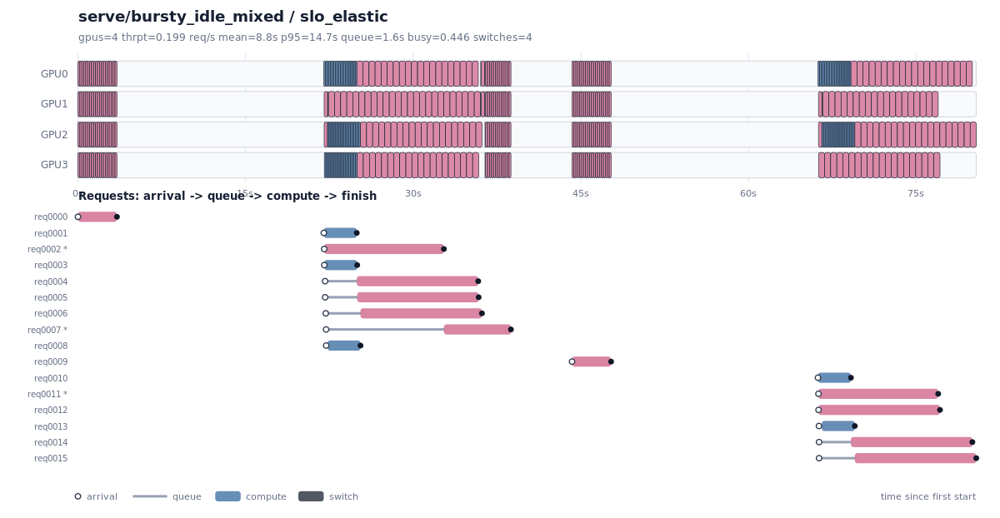
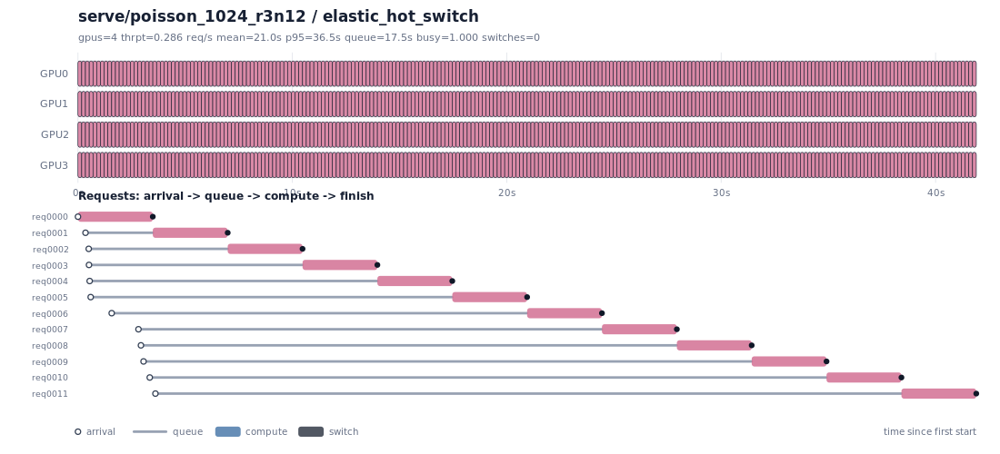
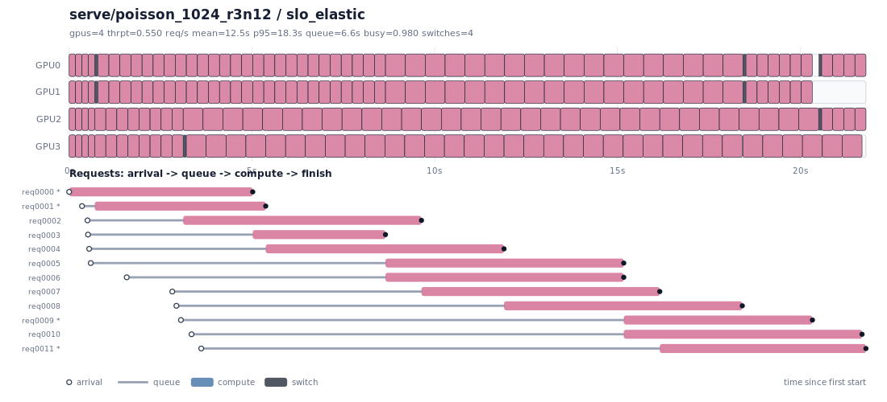

# M8 — SLO-Aware Elastic CP/DP Scheduler (`slo_elastic`, simulator, 4-GPU pool)

**Goal.** Take the M7 `elastic_hot_switch` heuristic further, following
[`slo_elastic_scheduler_strategy.md`](slo_elastic_scheduler_strategy.md): replace the
local *pairwise* economics with an **explicit, lexicographic, SLO-first optimizer** that
enumerates legal GPU layouts, scores each with a **rolling-horizon forward simulation**,
and picks the layout that is best on SLO → fairness → switches → latency, in that order.
It also adds a **FlexCache emergency gate** (simulator-only step reduction) as an SLO
rescue action. Everything is **simulator-only** (scheduler math + calibrated cost
models); no runtime/torch changes. Latencies model **denoise compute + comm only**.

`slo_elastic` is added **alongside** M7 — `elastic_hot_switch` is untouched — so every
number below is a direct A/B on the same engine, traces, and cost models.

---

## 1. What was built

### 1.1 State + metrics (strategy §3, §10)

- `RequestSpec` carries an optional `deadline_ms`; `SimRequest` now tracks
  `original_steps`, a FlexCache-reducible `effective_steps`, `flexcache_reduced_steps`,
  `switch_count`, and a per-step `degree_timeline`.
- `simulate_pool` now emits SLO/fairness/FlexCache metrics **for every policy** (so the
  comparison is apples-to-apples): `slo_miss_count`, `max/total/mean_tardiness_ms`,
  `mean/max_slowdown`, `starvation_count`, `flexcache_used_count`,
  `flexcache_reduced_steps_*`, plus per-request `deadline_ms`, `tardiness_ms`,
  `slowdown`, `executed_steps`, `flexcache_reduced_steps`, `switch_count`,
  `degree_timeline`.
- **Slowdown** (the fairness signal, strategy §3/§7) is `latency / (original_steps ·
  step_ms(dp1))` — the single-GPU DP service time. Short requests have a small
  denominator, so head-of-line blocking makes their slowdown spike, which the objective
  then targets directly.

### 1.2 The `slo_elastic` policy (strategy §4–§6)

At each decision point (arrival / step boundary / completion):

1. **Enumerate legal GPU layouts.** `_gpu_partitions` lists every non-increasing width
   multiset from `{1,2,4}` with `Σ ≤ reassignable_GPUs` (sub-full sums kept so a lone
   SP-negative request can sit at width 1 and leave GPUs idle rather than be forced into
   SP). A **work-conserving filter** discards under-packing whenever pending demand could
   still use an idle GPU. Pending requests are pruned to a key set (smallest slack first,
   then SRPT) so enumeration stays tiny for `G ≤ 8`.
2. **Map each layout to requests.** Widest SP groups go to the most SP-friendly / heaviest
   requests; DP-friendly and short requests fall to width 1. In-flight requests past the
   switch window keep their width; those inside it may switch (paying the cost).
3. **Score each layout by a rolling-horizon forward simulation.** `_slo_forward`
   list-schedules the *entire* remaining queue to completion with a **load-aware
   fallback**: when GPUs free, the most urgent waiting request is placed as DP (width 1)
   if the queue is at least as deep as the free GPUs, else at its shape degree. This is
   what lets the objective *see* that DP concurrency drains a saturated homogeneous queue
   faster than sequential SP4, and that SP is right when the pool is idle.
4. **Pick the lexicographic best** (strategy §5):

   ```
   (slo_miss_count, max_tardiness, total_tardiness, max_slowdown, starvation_count,
    flexcache_used_count, flexcache_reduced_steps, switch_count, switch_cost,
    total_flow_ms, mean_slowdown)
   ```

   The SLO/fairness fields above `switch_count` are **quantized** (tardiness to 500 ms,
   max_slowdown to 0.25) so only a *meaningful* predicted gain — not myopic prediction
   noise — is worth a switch. Genuine wins (saturated 1024: DP cuts tardiness by seconds)
   survive; sub-bucket differences collapse to a tie and the switch-count field keeps
   things put. The final `total_flow_ms` tie-breaker minimizes flow time (≈ mean latency),
   which is latency/throughput-optimal — unlike naively maximizing GPU-busy, which
   perversely rewards wide SP packing.

An optional `--decision-log` records, per decision, the chosen layout, the runner-up, and
the **deciding objective field**, so every switch is explainable (strategy §13).

### 1.3 FlexCache emergency gate (strategy §8)

Hard-gated: FlexCache is **forbidden unless** the best normal layout still leaves a
request in extreme SLO risk (predicted tardiness `>` `--flexcache-emergency-tardiness-ms`
or slack `< -`​`--flexcache-emergency-slack-ms`). Only then does the scheduler try the
**smallest** step reduction (down to `--flexcache-min-steps`) that improves the objective,
worst-missing request first. Because `flexcache_used_count` and `reduced_steps` sit right
below the SLO/fairness fields, FlexCache is used **only to rescue SLO**, and among equal
rescues the fewest requests / fewest dropped steps win. No quality model is faked.

### 1.4 Runner

`run_serve_policies.py` synthesizes a shape-proportional deadline
(`deadline = arrival + slo_factor · fastest_solo_service_time`, `--slo-factor` default 4),
adds `slo_elastic` to the default policy set, prints the new SLO/fairness columns, and
exposes all knobs (`--horizon-events`, `--starvation-ms`, `--enable-flexcache`,
`--flexcache-*`, `--decision-log`).

---

## 2. Headline results — `slo_elastic` vs M7 `elastic_hot_switch`

4-GPU pool, `switch_total_ms=85`, `slo_factor=4`. p95 in seconds; `mslow` = max_slowdown
(fairness, lower is better); `sw` = switches. **Best-static SLO miss shown for context.**

### 2.1 RTX 4090

| trace | policy | p95 s | SLO miss | max_slow | thrpt | sw |
| --- | --- | ---: | ---: | ---: | ---: | ---: |
| poisson_1024_r3n12 *(saturated homogeneous)* | elastic | 36.5 | 8 | 3.52 | 0.286 | 0 |
| | **slo_elastic** | **29.9** | 8 | **2.75** | **0.359** | 2 |
| poisson_mixed *(heavy mixed)* | elastic | 35.8 | 17 | 10.74 | 0.557 | 3 |
| | **slo_elastic** | 36.4 | **15** | **6.00** | 0.537 | 2 |
| realistic_sd3_mixed | elastic | 31.0 | 0 | 2.50 | 0.054 | 2 |
| | **slo_elastic** | 32.7 | 0 | **1.89** | 0.054 | 1 |
| poisson_1024_r016n16 | elastic | 8.3 | 0 | 0.88 | 0.184 | 0 |
| | **slo_elastic** | **8.1** | 0 | **0.81** | 0.184 | 2 |
| poisson_512_r6n16 *(SP-negative)* | elastic | 10.1 | 0 | 3.42 | 1.328 | 0 |
| | **slo_elastic** | 10.1 | 0 | 3.42 | 1.328 | **0** |
| poisson_1024_r008n12 / poisson_mixed_r018 / staggered_mixed | both | tie | 0 | tie | tie | — |
| poisson_mixed_r030n20 | elastic | **9.5** | 0 | 1.54 | 0.312 | 4 |
| | slo_elastic | 12.5 | 0 | 1.54 | 0.305 | 3 |

### 2.2 H20

| trace | policy | p95 s | SLO miss | max_slow | thrpt | sw |
| --- | --- | ---: | ---: | ---: | ---: | ---: |
| poisson_1024_r3n12 *(saturated)* | elastic | 39.6 | 8 | 3.48 | 0.266 | 0 |
| | **slo_elastic** | **33.1** | 8 | **2.78** | **0.327** | 2 |
| poisson_mixed | elastic | 41.0 | 19 | 10.01 | 0.499 | 3 |
| | **slo_elastic** | 41.2 | **17** | **9.03** | 0.502 | 4 |
| poisson_mixed_r018n20 | elastic | 6.5 | 0 | 1.54 | 0.135 | 4 |
| | **slo_elastic** | 6.6 | 0 | **1.01** | 0.134 | 3 |
| poisson_mixed_r030n20 | elastic | **13.4** | 0 | 1.35 | 0.304 | 6 |
| | slo_elastic | 14.6 | 0 | 1.99 | 0.298 | 2 |
| others (r008/r016/512/realistic/staggered) | both | ~tie | 0 | ~tie | ~tie | — |

**Reading it.** `slo_elastic` **strictly wins on the cases that bind**:

- **The M7 Pareto loss is fixed.** On the saturated homogeneous `poisson_1024_r3n12`, M7
  (and every shape-aware policy) chose sequential SP4; `slo_elastic` sees that DP
  concurrency drains the queue faster and downshifts to **4-wide DP** — p95 **36.5→29.9 s**
  (4090) / **39.6→33.1 s** (H20), throughput **+25 % / +23 %**, max_slowdown **3.52→2.75**.
- **Fairness (head-of-line blocking) improves** exactly where it should: `poisson_mixed`
  max_slowdown **10.74→6.00** (4090) with **2 fewer SLO misses**; `poisson_mixed_r018`
  max_slowdown **1.54→1.01** (H20); `realistic_sd3` **2.50→1.89** (4090).
- **SP-negative and easy cases are correct no-ops.** 512² stays on DP (0 switches);
  r008/staggered are exact ties.

**Honest costs.** On `poisson_mixed_r030` `slo_elastic` trades p95 (9.5→12.5 s on 4090)
while SLO stays 0-miss and fairness ties — the myopic layout optimizer loses a little raw
tail to M7's specific downshift heuristic in a regime where **SLO is already fully met**,
so per the strategy's priority order (SLO ≫ p95) this is an acceptable trade, not an SLO
regression.

---

## 3. GPU-usage timelines (4090)

**Saturated homogeneous `poisson_1024_r3n12` — the Pareto fix.** M7 keeps every request on
SP4 and serves them near-sequentially; `slo_elastic` packs the pool as 4 independent DP
streams, so four requests make progress at once and the queue drains.

M7 `elastic_hot_switch` (sequential SP4):


`slo_elastic` (4-wide DP concurrency):



For reference, the two static extremes:




**Heavy mixed `poisson_mixed` — fairness.** `slo_elastic` interleaves DP-width short
requests through the pool instead of letting a big SP request monopolize it.




**Burst/idle alternation `bursty_idle_mixed` — SP when idle, DP under burst.** A trace with
two isolated 1024² requests (t=0, t=44 s) separated by mixed bursts of 8 and 6 (generated
via `gen_client_trace.py --burst-sizes 1,8,1,6 --lull-ms 22000`). `slo_elastic` gives each
isolated request **all 4 GPUs (SP4)**, packs each burst as **independent DP streams** so
short requests are not blocked, and **upshifts a tail request back to SP** as the burst
drains. Result: max_slowdown **1.52 vs 5.62** (M7 elastic) / **9.00** (static SP4), best
p95 (14.7 s) and best max-tardiness (2.6 s).



---

## 4. FlexCache — emergency SLO rescue (sensitivity study)

**This is an upper-bound / sensitivity study, not a production, quality-preserving
policy** (strategy §8.4). It answers: *if* an emergency step-reduction mechanism existed,
how often would the scheduler use it under extreme SLO pressure, and how much tail could
it theoretically recover? No quality-loss model is assumed.

Impossible-SLO stress test (`--slo-factor 1.5`, saturated `poisson_1024_r3n12`,
`--flexcache-min-steps 12`, max reduce 8 steps), 4090:

| policy | p95 s | SLO miss | max_tard s | max_slow | thrpt | FlexCache reqs |
| --- | ---: | ---: | ---: | ---: | ---: | ---: |
| elastic_hot_switch | 36.5 | 11 | 33.0 | 3.52 | 0.286 | — |
| **slo_elastic + FlexCache** | **18.3** | **10** | **13.1** | **1.69** | **0.550** | 12 (of 12) |

FlexCache fires only under this extreme pressure and drives max tardiness **33.0→13.1 s**
and p95 **36.5→18.3 s**. With comfortable SLO it stays **completely idle even when enabled**
(guarded by a test). Timelines:




---

## 5. Why this is a better scheduler than M7 (strategy §9)

| M7 gap | How `slo_elastic` closes it |
| --- | --- |
| §9.1 Local pairwise economics only | Enumerates full layouts + forward-simulates the whole queue to completion; the objective sees global SLO / tail / queue evolution. |
| §9.2 No explicit SLO objective | `slo_miss_count` and tardiness are the **top** objective fields; deadlines drive decisions instead of being read off after the fact. |
| §9.3 Shape-aware degree is load-oblivious | The load-aware forward fallback makes the objective prefer **DP concurrency under saturation** and SP when idle → fixes `r3n12`. |
| §9.4 No fairness constraint | `max_slowdown` + `starvation_count` are explicit objective fields → short requests can't be silently starved. |
| §9.5 No rolling-horizon planning | Each decision is chosen by a forward simulation, not a one-step guess. |
| §9.6 No FlexCache action | Hard-gated emergency step reduction, present only in the objective's rescue band. |

---

## 6. Tests

`test/test_slo_scheduler.py` (13 assertions incl. `test_serve_sim.py`, all green) covers
the strategy §12 must-test list: 512² keeps DP; mixed/realistic are no worse on SLO than
M7; saturated homogeneous 1024 recovers DP-concurrency throughput and tail (Pareto fix);
a long SP request does not head-of-line-block short ones; FlexCache rescues an impossible
SLO and stays idle when not needed; switches only inside the window; and the
`Σ widths ≤ N` / no-double-book capacity invariant.

---

## 7. Scope & limitations

- **Simulator-only.** No runtime/torch changes; latencies are denoise compute + comm from
  `cost_models/{rtx4090,h20}.json`. VAE / text-encoder / scheduler overhead excluded.
- **Synthetic deadlines.** Traces carry no SLO, so deadlines are synthesized as
  `slo_factor ×` fastest solo service time. Absolute SLO attainment numbers move with
  `--slo-factor`; the **relative** policy comparison is what matters.
- **Myopic layout scoring.** The forward fallback approximates future re-planning, so on
  SLO-slack regimes `slo_elastic` can trade a little p95 vs M7's tuned heuristic
  (`poisson_mixed_r030`). It never regresses SLO miss on the measured traces.
- **FlexCache is a sensitivity upper bound**, not a shippable quality-preserving policy.

## 8. Reproduce

```bash
cd experiments/cp_dp_hot_switch
# Full comparison (adds slo_elastic), both boxes:
python3 run_serve_policies.py --cost-model rtx4090 --output-dir out/serve_policies_4090
python3 run_serve_policies.py --cost-model h20    --output-dir out/serve_policies_h20
# FlexCache sensitivity study (impossible SLO):
python3 run_serve_policies.py --cost-model rtx4090 --slo-factor 1.5 \
    --enable-flexcache --flexcache-min-steps 12 --flexcache-max-reduce-steps 8 \
    --serve-traces traces/serve/poisson_1024_r3n12.json \
    --output-dir out/serve_policies_4090_flexcache
# Explainable decisions:
python3 run_serve_policies.py --cost-model rtx4090 --policies slo_elastic --decision-log \
    --serve-traces traces/serve/poisson_1024_r3n12.json --output-dir /tmp/slo_log
# Tests:
python3 -m pytest test/test_slo_scheduler.py test/test_serve_sim.py -q
```
