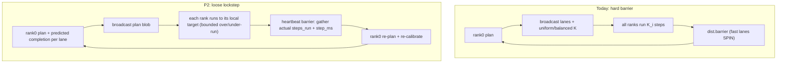

# P2 - Loose-Lockstep Self-Scheduling (scheduler #3 / #4)

Design-only follow-up to the P1 barrier-aware scheduler fixes (`#0` barrier-aware cost
model, `#1` hole-fill, `#2` placement stability). P1 makes the planner *see* the world-
barrier spin and stop wasting/churning GPUs at plan time; P2 attacks the remaining
structural loss that P1 cannot remove: the **hard world barrier every phase** in
`Generator._pool_round` ([generator.py:1134](../../chitu_diffusion/runtime/generator.py)).

This document specifies the chosen model (loose lockstep), the extended scheduler<->rank
protocol, the correctness invariants, and a staged rollout + test plan. No code here; it is
implemented after P1 is validated on real hardware.

---

## 1. Problem P1 leaves on the table

Even with latency-balanced K ([`_pool_phase_steps_per_lane`](../../chitu_diffusion/runtime/generator.py))
and straggler widening, `simulate_barrier.py` shows ~40% of GPU-seconds are still barrier
spin at `lambda=0.36`. Two residual causes are *inherent to the synchronous engine* and
map directly to the user's `#3`/`#4`:

- A lane that finishes its request mid-phase (`remaining < phase_k`) still cannot release
  its GPUs until the world barrier - the freed cards idle to the boundary (user `#3`:
  req06 on GPU7 under-fills every phase yet can't retire early).
- Every lane is frozen to a single global cadence; there is no channel for a rank to run a
  couple of extra cheap steps to reach a clean retirement point, nor for the planner to
  publish *when* it expects each lane to finish (user `#4`).



## 2. Chosen model: loose lockstep (keep a heartbeat barrier, relax intra-heartbeat)

We keep a **global barrier at each heartbeat** (so latent ownership, retirement, and
re-planning stay deterministic) but let lanes over/under-run *within* a heartbeat:

- The heartbeat is a wall-clock budget `T_hb` (derived from the balanced-K budget already
  computed: `T_hb = base_k * max_lane_step_ms`), not a fixed step count.
- Each lane runs as many of *its own* steps as fit in `T_hb` (this is what balanced-K
  already approximates via `k_i`), **plus** two new freedoms:
  - **Early release (`#3`)**: if a lane is the *last work on its GPUs* and would finish its
    request within a small overrun window `T_hb + slack`, it keeps stepping to completion,
    then parks. Its cards are re-planned at the next heartbeat instead of spinning.
  - **Bounded local adjust (`#4`)**: a lane may run +/-1..2 steps around its planned `k_i`
    to land on a clean boundary (e.g. finish the request, or stop just before an expensive
    step), reporting the actual `steps_run` at the heartbeat.

Crucially we do **not** go fully async (ranks never stop hard-barriering): that would
require per-lane ownership epochs and non-deterministic planning, which is out of scope and
high-risk. Loose lockstep is the minimal relaxation that recovers the two wins above.

## 3. Extended scheduler <-> rank protocol (`#4`)

Today rank0 broadcasts only `lanes` (JSON) + `k_list` (int vector)
([generator.py:986-1037](../../chitu_diffusion/runtime/generator.py)). P2 extends the
downstream and upstream messages:

### 3a. Downstream (rank0 -> world), added to the plan blob
| field | meaning | used by |
|---|---|---|
| `heartbeat_budget_ms` | `T_hb` wall budget for this heartbeat | every rank's local loop |
| `lane_target_step[i]` | absolute `current_step` rank0 expects lane `i` to reach | lane loop stop condition |
| `lane_overrun_slack_ms[i]` | extra ms a *terminal* lane may use to finish (`#3`) | early-release gate |
| `lane_is_terminal[i]` | lane holds the last work on its GPUs AND is near done | early-release gate |
| `lane_predicted_comp_ms[i]` | planner's predicted completion (from P1 `_slo_barrier_forward`) | logging / drift detection |

These are all derived on rank0 from data P1 already computes (`predicted_spin_ms`,
per-lane `step_ms`, `remaining`), so no new cost-model work is needed - only serialization.

### 3b. Upstream (world -> rank0), at the heartbeat barrier
Reuse the **non-intrusive** `pool_lane_local` records already emitted per rank
([generator.py:1111](../../chitu_diffusion/runtime/generator.py)) rather than adding an
in-band `all_gather` on the critical path (that perturbation was explicitly removed
earlier). Concretely:

- Each rank keeps a **local clock** and writes its lane's actual `steps_run`,
  `local_compute_ms`, and reached `current_step` into the existing `pool_lane_local` event.
- At the heartbeat, the *already-present* `_pool_sync_steps`
  ([generator.py:1147](../../chitu_diffusion/runtime/generator.py)) - a tiny int-vector
  sync of `current_step` - is the single authoritative upstream signal rank0 reads to learn
  each lane's true progress (it already runs every phase in targeted mode; P2 just makes
  rank0 *use* it to reconcile plan vs actual). No extra collective is added.
- The online calibrator ([`RuntimeCalibrator`](../../chitu_diffusion/runtime/cost_model.py))
  keeps consuming `pool_denoise_ms` exactly as today; P2 adds no new calibration path.

### 3c. Local lane loop (each rank), replacing the fixed `for _ in range(phase_k_local)`
Pseudologic (bounded, deterministic given the broadcast plan):
```
deadline = t_start + heartbeat_budget_ms
target   = lane_target_step[i]
while current_step < target and now() < deadline:
    denoise_one_step()
# early release (#3): terminal lane finishes its request within the slack window
if lane_is_terminal[i] and remaining <= EARLY_RELEASE_MAX_STEPS \
   and now() + est_step_ms*remaining <= deadline + lane_overrun_slack_ms[i]:
    while not request_done:
        denoise_one_step()
```
`EARLY_RELEASE_MAX_STEPS` and the slack keep the overrun tiny and bounded so lanes still
re-meet at the heartbeat.

## 4. Correctness invariants (must hold on every rank)

1. **Intra-lane lockstep is preserved.** All members of a width>1 lane run the *same*
   number of steps in lockstep (they share the lane's CP/CFG subgroups
   [`set_active_lane_group`](../../chitu_diffusion/runtime/generator.py)). Local
   over/under-run is decided **per lane**, identically on all its member ranks, from the
   broadcast plan (never from a rank-local race), so CP collectives never desync.
2. **Deterministic decisions.** `lane_target_step`, `lane_is_terminal`, and the overrun gate
   are computed on rank0 and broadcast; ranks only *execute* them. The only rank-local input
   is wall-clock `now()`, which gates *stopping early* (safe: a lane that stops earlier just
   reports fewer `steps_run`) - it never causes two members to diverge because the member
   ranks of one lane share the same `lane_target_step` and hit the same request-done state.
3. **Latent ownership stays consistent.** `_pool_owner` is still advanced at the heartbeat
   by the existing `_pool_update_owners` / `_pool_sync_steps`
   ([generator.py:1147-1148](../../chitu_diffusion/runtime/generator.py)); early-released
   lanes simply reach `current_step == num_steps` and retire via the normal world-
   synchronized `_pool_retire_finished`. No latent moves mid-heartbeat.
4. **Planning determinism.** rank0 re-plans at the heartbeat from `current_step` values that
   every rank agrees on (via `_pool_sync_steps`), so `plan_pool_round` is a pure function of
   world-consistent state - unchanged from today.

## 5. Interaction with P1

- The planner's `_slo_barrier_forward` (P1 `#0`) already predicts per-lane completion under
  balanced-K; P2 exports those predictions as `lane_predicted_comp_ms` / `lane_target_step`
  and flags terminal lanes for early release. So P2 is a *runtime realization* of foresight
  P1 gave the planner - no second cost model.
- Hole-fill (P1 `#1`) still runs at each heartbeat; early release makes freed cards
  available *sooner* to the next heartbeat's hole-fill, compounding the win.
- Placement stability (P1 `#2`) means early-released cards are re-granted to the same/most-
  affine lane next heartbeat, avoiding churn.

## 6. Staged rollout

1. **Instrumentation only (no behavior change).** Broadcast the new downstream fields and
   log predicted-vs-actual completion drift; verify the plan's `lane_target_step` matches
   what balanced-K already runs (should be byte-for-byte). Gate behind `CHITU_POOL_LOOSE_LOCKSTEP=0`.
2. **Early release (`#3`) only.** Enable the terminal-lane overrun; measure GPU-idle
   reduction on the `lambda=0.36` trace vs P1. Expect the 30-40s GPU7-style holes to shrink.
3. **Bounded local adjust (`#4`).** Allow +/-1..2 step landing; re-check makespan and SLO.
4. Promote to default only after simulator + real-machine A/B show no SLO/quality regression.

## 7. Test plan

- **Simulator (zero GPU):** extend `simulate_barrier.py` to model early release (a terminal
  lane runs to completion within the heartbeat+slack) and confirm the projected spin drops
  toward the "busiest-GPU useful compute" floor it already reports.
- **Unit (torch-free):** rank0 plan export - given a near-done terminal lane, assert
  `lane_is_terminal=True` and a bounded `lane_target_step`; given a non-terminal lane,
  assert no overrun is offered.
- **Engine (torch, multi-GPU):** in `test_pool_engine.py`, assert intra-lane member ranks
  always run identical `steps_run` (invariant #1) and that `current_step` agreement holds
  after the heartbeat (invariant #4), with loose lockstep on.
- **A/B:** `lambda=0.36` 3-arm (dp8 / cp8 / elastic) with `CHITU_POOL_LOOSE_LOCKSTEP` off vs
  on; compare makespan, SLO attainment, and measured `pool_barrier_ms`.

## 8. Explicitly out of scope

- Fully asynchronous execution (no heartbeat barrier) - deferred; too risky for the latent-
  ownership / determinism guarantees above.
- Cross-lane work stealing mid-heartbeat.
- Any change to CP/CFG backends or the calibration math.
