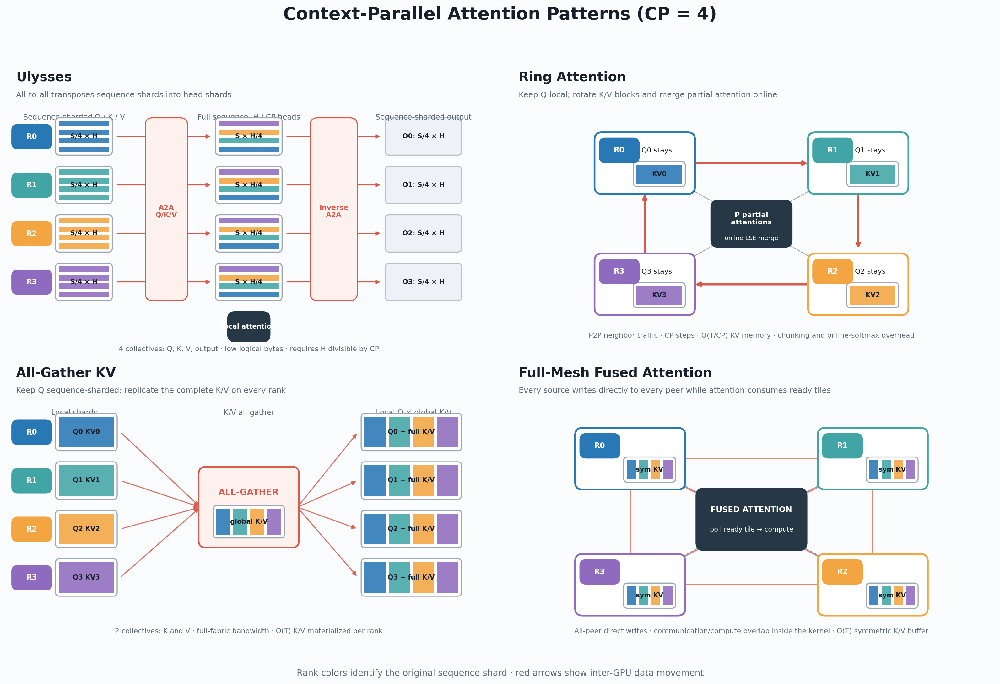

# Context Parallel Attention 探索数据与结论

> 状态：探索已收敛；第七、八部分可作为实现与选型摘要。
> 更新日期：2026-08-17
> 目标：集中保存本轮 CP 探索中可复用的公式、实验口径、数据、结论及其适用边界，
> 作为后续撰写技术文章的事实基础。

本文按「理论能预测什么 → 怎样才算公平测量 → 通信层单独分析 → 完整 attention
实测 → Full-Mesh 专项 → 性能汇总」组织。前四部分是所有 CP 方法的共同底座，
第五部分是本轮新增的实现，第六部分把全部结论收敛成一张表。

| 部分 | 章节 | 回答的问题 |
| --- | --- | --- |
| 一 理论 | 1–5 | 计算量、通信量、显存三者能推出什么，推不出什么 |
| 二 方法 | 6–9 | kernel、上限、口径：什么样的比较才成立 |
| 三 通信层 | 10–12 | 隔离通信的实测，Ring 的瓶颈到底在哪 |
| 四 完整 attention | 13–16 | 端到端 attention-core 实测与 crossover |
| 五 Full-Mesh | 17–23 | 把通信藏进 attention kernel 的两版实现 |
| 六 结论 | 24–28 | 性能汇总、选择决策、被推翻的假设、复现索引 |

---

# 第一部分 理论：三种 CP 形式能预测什么

## 1. 范围与符号

本文只讨论 dense、non-causal DiT self-attention 的 context parallel（CP）核心，
不包含 QKV projection、FFN、VAE、跨层调度和真实模型端到端时间，除非某一节明确说明。

| 符号 | 含义 |
| --- | --- |
| `N` | CP degree / 参与 attention 的 GPU 数 |
| `S` | 全局序列长度 |
| `H` | attention head 数 |
| `D` | head dimension |
| `b` | 单元素字节数；BF16/FP16 为 2 |
| `T = S·H·D·b` | 一个全局 Q、K、V 或 output 张量的字节数 |
| `S_local = S/N` | 每个 rank 初始持有的序列长度 |

主要比较以下三种语义等价的 CP 形式：

1. **AGKV / split-Q + all-gather K/V**
   - 每个 rank 保留 `S/N` 的 Q；
   - all-gather K/V 后，每个 rank 用 local Q 对完整 K/V 做一次 attention；
   - 输出天然保持 sequence-sharded，无需 output collective。
2. **Ulysses / head-sharding**
   - Q/K/V 通过 all-to-all 从 `[S/N, H]` 变为 `[S, H/N]`；
   - 在完整序列、局部 heads 上执行一次 attention；
   - output 再做一次反向 all-to-all。
3. **Ring Attention**
   - 每个 rank 保留 local Q；
   - K/V shard 沿 ring 轮转 `N-1` 次；
   - 每轮对一个 K/V block 执行 partial attention，并用 LSE/online softmax 合并状态；
   - 不 materialize 完整 K/V。

这里的 Ulysses 指纯 head-sharding，不等于 USP。USP 是 Ulysses 与 Ring 的二维组合；
本轮单机比较主要针对纯 Ulysses、AGKV 和纯 Ring。

第五部分引入的 **Full-Mesh** 不是第四种数学形式：它的数据流与 AGKV 完全相同
（物化完整 K/V、Q 保持 sharded），区别只在于 K/V 的到达顺序与 attention 消费
K/V block 的顺序对齐，从而让通信藏进 kernel。见第 17 节的谱系说明。

## 2. 计算量：三者理论 FLOPs 相同

忽略 softmax、mask 和 layout 操作，只计算 QK 与 PV 两个矩阵乘：

```text
single-GPU dense attention FLOPs ≈ 4 · S² · H · D
per-rank CP attention FLOPs       ≈ 4 · S² · H · D / N
```

三种 CP 的理想 attention FLOPs 相同：

- AGKV：`Q=[S/N,H,D]`，`K/V=[S,H,D]`；
- Ulysses：`Q/K/V=[S,H/N,D]`；
- Ring：`N` 次 `Q=[S/N,H,D]` 对 `K/V block=[S/N,H,D]` 的 partial attention。

因此三者的理论 compute scaling 都是 `O(S²/N)`。性能差异不来自数学 FLOPs，
而来自：

- 通信量与链路利用方式；
- collective 固定开销；
- attention kernel 与 shape；
- layout/contiguous copy；
- Ring 的 online-softmax merge；
- 能否把通信和计算放到同一关键路径上。

四种主要 pattern 的统一 `CP=4` 示意图：



可独立用于文章小节的矢量图位于 `kernels/figures/cp_patterns/`：
`ulysses.svg`、`ring.svg`、`agkv.svg` 与 `full-mesh.svg`。图中 rank 颜色表示
token 的原始 sequence shard，红色箭头表示跨 GPU 数据移动。

### 2.1 实测的 chunking 代价

单张 H20、无通信、BF16、`S=4096,H=40,D=128`，将一次完整 attention
拆成 `N` 个 K/V block：

| CP degree | 单次 full attention | N 次 block attention | chunking 额外开销 |
| --- | ---: | ---: | ---: |
| CP2 | 2.093 ms | 2.106 ms | 0.013 ms |
| CP4 | 1.173 ms | 1.203 ms | 0.030 ms |
| CP8 | 0.715 ms | 0.764 ms | 0.049 ms |

上述数据使用 cuDNN；CP2/CP4/CP8 的 chunking penalty 为
`0.014/0.030/0.054 ms`。结论是：在这些 shape 下，将 attention 拆成多个
K/V block 本身只产生 0.6%–约 12% 的代价，不是 Ring 的主要瓶颈。第 8 节在
长序列上给出了同一问题的更精确版本。

## 3. 通信量：Ring = AGKV = (N/2) × Ulysses

以下“通信量”统一指**每个 rank、单方向、off-rank 的逻辑字节数**，
不等同于全局 fabric 上所有 link 的物理流量之和。

| 方法 | 每 rank 通信量 | 相对 Ulysses |
| --- | --- | ---: |
| Ring K/V P2P | `2(N-1)/N · T` | `N/2` |
| AGKV K/V all-gather | `2(N-1)/N · T` | `N/2` |
| Ulysses：Q/K/V + output 共 4 次 all-to-all | `4(N-1)/N² · T` | `1` |

关键结论：

1. **Ring 与 AGKV 的逻辑通信量完全相同。**
2. **Ulysses 比 Ring/AGKV 少搬 `N/2` 倍数据。**
3. **CP2 时三者通信量完全相同。** 这使 CP2 成为唯一可以直接对照通信算子
   实现质量、而不被通信量差异污染的并行度。
4. 当 `N` 增大时：
   - Ring/AGKV 的每 rank 通信量趋近 `2T`；
   - Ulysses 的每 rank 通信量约为 `4T/N`，随并行度下降。

该公式假设 `H` 能被 `N` 整除且没有 head padding。若模型 head 数不可整除，
Ulysses 需要 padding 或回退，通信量和真实性能会改变。这是 Ulysses 唯一的
结构性约束，也是它在真实模型上最常见的失效原因（例：Wan 1.3B 只有 12 heads，
CP8 不可整除）。

## 4. 显存：只有 Ring 与 Ulysses 是 O(T/N)

仅列 attention 状态的量级，不包含模型权重、projection 和 allocator workspace：

| 方法 | K/V 状态量级 | 特征 |
| --- | --- | --- |
| AGKV | 每 rank materialize 完整 K/V，约 `2T` | 最简单；长序列显存压力最大 |
| Full-Mesh | 同 AGKV，约 `2T`（在 symmetric heap 内） | 显存与 AGKV 同级，不继承 Ring 的省显存特性 |
| Ulysses | 完整 sequence、`H/N` heads，约 `O(T/N)` | head 必须可切分；需要 A2A buffer |
| Ring | local K/V 双缓冲和 local running state，约 `O(T/N)` | 不保存完整 K/V；需 partial LSE merge |

因此 Ring 即使在单机性能不占优，仍有一个不可替代的适用点：当完整 K/V 无法在每个
rank 上 materialize 时，Ring 能以 sequence-streaming 方式控制峰值显存。

必须强调 Full-Mesh **没有**继承这一点：它按 source shard 流式到达，但仍然把完整
全局 K/V 落在 symmetric buffer 里，峰值与 AGKV 同为 `O(T)`。显存受限时能选的
仍然只有 Ring 或 USP。

## 5. 理论的边界：它决定不了什么

前四节的公式能可靠预测的只有三件事：三者 FLOPs 相同、Ring 与 AGKV 通信量相同、
Ulysses 通信量少 `N/2` 倍。以下都**不能**由公式推出，必须实测：

- **有效带宽。** 逻辑字节数相同不代表耗时相同：Ring 只用一个 peer link，
  AGKV/Ulysses 用全 fabric（第 10 节）。
- **短序列排序。** collective 固定开销与小消息效率会反转通信量优势（第 16 节）。
- **kernel 质量。** 同一 pattern 换 backend 可以差 1.57 倍（第 7 节）。
- **能否 overlap。** 通信量小不等于容易隐藏；隐藏能力取决于通信到达顺序
  能否与 kernel 的数据消费顺序对齐（第五部分）。
- **相对收益随序列长度的方向。** 通信是 `O(S)`、compute 是 `O(S²/N)`，
  所以长序列下可隐藏的**绝对毫秒数**变大而**相对收益**变小（第 12 节）。

---

# 第二部分 方法：怎样才算公平比较

## 6. 实验环境与统计口径

除特别注明外：

- GPU：单节点 NVIDIA H20，8 卡 NV18 全互联；
- 理论 aggregate 单向 NVLink 带宽约 450 GB/s；BF16 峰值算力 `148 TFLOPS`；
- Torch：`2.9.1+cu130`；
- dtype：BF16；
- 典型 attention shape：`B=1,H=40,D=128`；
- 延迟：CUDA Event，预热后统计所有 rank 样本的 median；
- correctness：Ring/AGKV/Ulysses 输出相对 full-attention reference 做容差比较；
- 所有比较都使用 static full-world CP，不包含动态 EPE lane。

注意：不同小节可能使用 `H=24`、`H=12` 或 `H=40`。只允许在同一 shape、同一
backend、同一测试中做严格横向比较。

**跨 run 噪声下限约 0.5%**（长序列）到 **约 1.5%**（`S=4096` 且迭代数偏少时）。
小于该量级的差距不应解读为实现差异。第 22 节给出了一个具体标定。

## 7. 统一 cuDNN attention 基线

Ring 需要 partial attention 同时返回 output 与 LSE，因此不能只调用隐藏 LSE 的
高层 `F.scaled_dot_product_attention` 接口。本文将 cuDNN 作为统一的 attention
基线；H20、`q=512,kv=4096,H=40,D=128` 下，`aten_cudnn` 延迟为 `0.452 ms`，
达到 `95.1 TFLOPS`。

结论：

- 公平比较 Ring 时必须显式使用返回 LSE 的 cuDNN op；
- `aten_cudnn` 返回 LSE `[B,H,S,1]`，merge 前必须归一化 layout；
- AGKV、Ulysses 与 Ring 的所有基线数据均以 cuDNN attention 为准。

Full-Mesh fused 是唯一例外：其融合的 TMA producer、arrival polling 与 online
softmax 不能通过 cuDNN 的公开接口实现，因此使用自定义 CuTe SM90 kernel。文中
会显式标记这条实现路径，不把它伪称为 cuDNN；其余所有 attention path 统一 cuDNN。

## 8. 无通信算力上限（compute ceiling）

早期 compute-ceiling harness（结论已固化于本节，脚本后来被统一 benchmark
取代）：计时区间内不含任何 collective，所有 rank 执行相同本地计算。
三种 pattern 的 FLOPs 严格相等
（`S_local·S_global·H` 与 `S_global²·H/CP` 在 `S_local=S_global/CP` 时相同，
脚本内 assert）。`S=75776`、`H=40`、`D=128`、BF16 的 median：

| pattern | shape | CP2 | CP4 | CP8 |
| --- | --- | ---: | ---: | ---: |
| gather + cuDNN | `Q=S_local, KV=S_global, H` | 413.11 ms | 207.41 ms | 103.98 ms |
| Ulysses + cuDNN | `Q=KV=S_global, H/CP` | 413.62 ms | 207.40 ms | 103.95 ms |
| Ring + cuDNN | `CP × (S_local × S_local)` + merge | 417.72 ms | 213.22 ms | 110.20 ms |

关键结论：**长序列下不存在 pattern 形状优势**。gather 与 Ulysses 的上限差
在 0.2% 以内，全部达到 `141–143 TFLOPS`，即 H20 BF16 峰值 `148 TFLOPS`
的 95%–96%；compute 已饱和，kernel shape 不再是变量。唯一有结构性代价的是
Ring，其分块 + online-softmax merge 相对 gather 多付
`+1.1%/+2.8%/+6.0%`，且随 CP degree 上升——这是第 2.1 节 chunking 代价在
长序列上的精确版本。

这张表的作用是把「实现好坏」与「pattern 好坏」分开：每个方法都应该和它
**自己 pattern 的上限**比，而不是和别人的实测比。第 22 节据此给出剩余差距。

## 9. 口径陷阱：compute_only / transport_only / 隐藏率

Full-Mesh 的 harness 报告三个量，含义必须精确理解，否则会得出错误结论：

- **`compute_only`**：K/V 已经预先 gather 好，直接跑一次 attention。它既
  **无通信**也**无物化**，因此是一个偏乐观的参考点——真实路径每步都必须把
  K/V 写进 buffer，这部分 HBM 带宽是不可省的。
- **`transport_only`**：只跑传输并同步到完成。它包含 host 侧下发开销，
  因此**高估**了可隐藏的延迟。
- **`hidden_percent = 1 - max(0, fused - compute_only) / transport_only`**：
  分子偏大（含物化成本）、分母偏大（含 host 开销），所以这个比值只适合看
  趋势，不适合当作精确的隐藏率。

因此判断 overlap 是否成立，应优先看**暴露的绝对毫秒数**及其占总时长的比例，
并辅以第 8 节的 pattern 上限；当暴露时间落到跨 run 噪声以内，`hidden_percent`
会按定义饱和到 100%，此时它不再携带信息。

从 NVSHMEM symmetric heap 读 K/V 相对普通 HBM 的额外成本可以排除：
CP2 `S=75776` 实测 `414.68` vs `414.72 ms`，即 `0.01%`
（`outputs/full_mesh_attention/stage0b-long-cp2-s75776.json`）。

---

# 第三部分 通信层：把 Ring 的瓶颈钉死

## 10. 隔离通信实测：延迟与有效带宽

### 10.1 S=4096，H=40，D=128

表中格式为“逻辑通信量 / median 延迟 / 有效带宽”：

| CP | Ring P2P chain | AGKV K/V all-gather | Ulysses 4×all-to-all |
| --- | --- | --- | --- |
| CP2 | 41.9 MB / 0.180 ms / 233 GB/s | 41.9 MB / 0.213 ms / 197 GB/s | 41.9 MB / 0.250 ms / 168 GB/s |
| CP4 | 62.9 MB / 0.443 ms / 142 GB/s | 62.9 MB / 0.255 ms / 247 GB/s | 31.5 MB / 0.176 ms / 179 GB/s |
| CP8 | 73.4 MB / 1.000 ms / 73 GB/s | 73.4 MB / 0.279 ms / 263 GB/s | 18.4 MB / 0.119 ms / 154 GB/s |

解释：

- **CP2 是最干净的通信算子对照。** 三者字节数相同，且只有一个 peer。
  Ring 的裸 send/recv 最快，比 all-gather 快 15%，比 4×all-to-all 快 28%。
- CP4 以后，Ring 同时失去两项优势：
  1. 相对 Ulysses 多搬 `N/2` 倍数据；
  2. 每轮只使用一个 peer link，不能利用全互联 fabric。
- AGKV all-gather 的有效带宽最高，不是 Ulysses：
  - 它能使用所有 peer link；
  - 每个 peer 消息较大；
  - Ulysses 虽也使用全链路，但消息被切为 `1/N²`，小消息效率较低。
- Ulysses 的胜因主要是**通信量更小**，而不是单纯“带宽利用率最高”。

### 10.2 CP8 随序列长度变化

| S | Ring chain | Ring BW | AGKV all-gather | AGKV BW | Ulysses A2A | Ulysses BW |
| ---: | ---: | ---: | ---: | ---: | ---: | ---: |
| 1,024 | 0.358 ms | 51 GB/s | 0.096 ms | 192 GB/s | 0.100 ms | 46 GB/s |
| 4,096 | 1.000 ms | 73 GB/s | 0.279 ms | 263 GB/s | 0.119 ms | 154 GB/s |
| 8,192 | 2.036 ms | 72 GB/s | 0.502 ms | 292 GB/s | 0.194 ms | 189 GB/s |
| 16,384 | 3.772 ms | 78 GB/s | 0.946 ms | 310 GB/s | 0.344 ms | 213 GB/s |

Ring 在中大消息下稳定约 72–78 GB/s。该数值接近 8 卡 NV18 中单个 peer pair
可获得的带宽份额，说明 NCCL P2P 已经接近单链路上限，并非实现“太垃圾”。

## 11. Ring 的瓶颈是单链路带宽，不是实现

三个独立证据指向同一结论。

**证据一：依赖链不是主要问题。** CP8 S=4096：

- 正常 7-hop dependent chain：`1.002 ms`；
- 将同样 7 个 hop 作为无依赖 burst 一次性下发：`0.979 ms`；
- 差异仅约 2%。

因此 Ring 的主要问题不是 host launch、NCCL rendezvous 或 hop 间 dependency。
换成 device-initiated NVSHMEM put 可以降低固定延迟，但无法把单 peer link 的
带宽提高到全 fabric aggregate 带宽。

**证据二：有效带宽稳定在单链路份额。** 见 10.2，中大消息下 72–78 GB/s，
与消息大小基本无关，说明已经打满而不是没打满。

**证据三：roofline 已被通信锁死。** CP8 S=4096、cuDNN Ring：

- block compute：约 `0.505 ms`；
- Ring communication：约 `1.002 ms`；
- Ring 为 comm-bound；
- 即使通信与计算完美 overlap，下限也是 `max(0.505, 1.002) = 1.002 ms`；
- 而当前 Torch Ulysses 完整 attention 只需 `0.628 ms`。

因此在该单机全互联拓扑下，换 kernel、融合 merge、CUDA Graph，甚至把通信做进
persistent kernel，都不能突破 Ring 的单链路带宽下限。Ring 在 CP8 的结构性劣势
不是当前 Python/CUDA Graph 实现造成的。

**这一节直接导出了第五部分的动机**：如果 Ring 的问题是「流式但只用一条链路」，
而 AGKV 的问题是「用满链路但不流式、无法 overlap」，那么值得尝试的就是
「用满链路 + 按 attention 消费顺序流式到达」，即 Full-Mesh。

## 12. 通信时间随序列长度的 scaling

Wan14B-like shape：BF16、`H=40,D=128`。下表选择每个 CP degree 下
Fast AGKV/Fast Ulysses 中更快的同步通信：

| S | CP2 | CP4 | CP8 |
| ---: | ---: | ---: | ---: |
| 4,096 | 0.128 ms | 0.155 ms | 0.136 ms |
| 8,192 | 0.243 ms | 0.273 ms | 0.226 ms |
| 16,384 | 0.475 ms | 0.439 ms | 0.354 ms |
| 32,768 | 0.938 ms | 0.782 ms | 0.622 ms |
| 49,152 | 1.406 ms | 1.192 ms | 0.866 ms |
| 65,536 | 1.871 ms | 1.550 ms | 0.994 ms |
| 75,600 | 2.151 ms | 1.901 ms | 1.272 ms |

通信近似 `O(S)`，dense attention compute 近似 `O(S²/N)`。因此：

- 序列越长，可隐藏通信的**绝对毫秒数**越大；
- 但通信占完整 attention 的**相对比例**快速下降；
- CP8 的理想完整 overlap 降幅：
  - S=4096：约 23.2%；
  - S=75600：约 1.22%。

若假设 Wan14B 有 40 层、50 denoise steps，即 2000 次 attention：

| S=75600 | CP2 | CP4 | CP8 |
| --- | ---: | ---: | ---: |
| 纯 CP 通信累计 | 4.303 s | 3.803 s | 2.545 s |

这是 communication-only 的线性外推，不等于模型端到端可获得的加速。

这张表同时界定了 Full-Mesh 的收益天花板：长序列下把通信完全藏掉最多值
1.2%–1.5%，所以第五部分的目标不是「大幅加速」，而是「把这 1% 拿满，并且
不引入新的开销」。

---

# 第四部分 完整 attention 实测

## 13. Torch kernel-matched 基线

BF16、`H=40,D=128`，Ring 使用 cuDNN partial attention，AGKV/Ulysses 使用
Torch/NCCL + SDPA/cuDNN。

### 13.1 S=4096

| CP | AGKV | cuDNN Ring | Ulysses | 最快 |
| --- | ---: | ---: | ---: | --- |
| CP2 | 1.556 ms | 1.715 ms | 1.749 ms | AGKV |
| CP4 | 1.001 ms | 1.337 ms | 1.000 ms | AGKV ≈ Ulysses |
| CP8 | 0.727 ms | 1.575 ms | 0.628 ms | Ulysses |

### 13.2 S=8192

| CP | AGKV | cuDNN Ring | Ulysses | 最快 |
| --- | ---: | ---: | ---: | --- |
| CP2 | 5.400 ms | 5.742 ms | 5.748 ms | AGKV |
| CP4 | 3.126 ms | 3.818 ms | 3.119 ms | AGKV ≈ Ulysses |
| CP8 | 1.980 ms | 3.687 ms | 1.783 ms | Ulysses |

CP2 下 AGKV 的加法模型几乎精确成立：

```text
cuDNN full attention 1.344 ms + all-gather 0.213 ms
= 1.557 ms
≈ measured AGKV 1.556 ms
```

这个加法模型是理解全文的锚点：**未优化的 AGKV 完全不隐藏通信**，
所以它的时间就是 compute 加通信。第五部分要做的正是把这个加号消掉。

CP2 Ring 虽然通信算子最快，但仍需支付多次 partial attention 的 online-softmax merge；
Ulysses 则支付 head layout 和 all-to-all 相关开销。因此最终 AGKV 最快，
Ring 与 Ulysses 接近。

## 14. Torch/NCCL 与 Fast transport

本节的对照只改变**通信实现**，不改变 CP 数学形式与 cuDNN attention：

- **Torch / naive**：调用 PyTorch distributed 的 NCCL collective。AGKV 分别对 K、
  V 做 `all_gather_into_tensor`；Ulysses 对 Q、K、V 和 output 分别做
  `all_to_all_single`，并在 Python/Torch 侧完成 reshape、permute、contiguous。
- **Fast**：调用 `fast-ulysses` 的 CUDA/NVSHMEM extension；预分配 symmetric
  heap，直接写入最终 peer buffer，并把完成状态以 tag/epoch 交给调用端。

### 14.1 短序列：H=24，S=4096

`H=24,D=128,S=4096` 的完整 attention：

| CP | Torch AGKV | Fast AGKV | AGKV 加速 | Fast Ulysses |
| --- | ---: | ---: | ---: | ---: |
| CP2 | 0.895 ms | 0.829 ms | 7.4% | 0.869 ms |
| CP4 | 0.622 ms | 0.575 ms | 7.6% | 0.566 ms |
| CP8 | 0.502 ms | 0.475 ms | 5.4% | 0.398 ms |

该短序列实验原始记录没有同时采集 Torch Ulysses；因此不能从此表推导 Fast
Ulysses 相对 Torch Ulysses 的百分比。两者严格的同-shape对照使用下节的
`H=40,S=75600` 数据。

- CP2：通信量相同，Fast AGKV 的 paired K/V direct-write 最有优势；
- CP4：Fast AGKV 快 7.6%，Fast Ulysses 与其接近，应由模型 shape、head 数和
  实际 transport capability 决定；
- CP8：Fast Ulysses 是表中最快路径；其通信量优势来自 Ulysses 的 `N/2` 公式，
  但相对 Torch Ulysses 的精确百分比须以同-shape数据为准；
- Fast AGKV CP8 大 shape 的 fan-out 可能慢于 NCCL，不能无条件启用；
- Fast AGKV 的 Q projection overlap 只在 CP2/CP4 默认开启，CP8 会因资源竞争退化。

### 14.2 长序列：H=40，S=75600

长序列使用精确 `S=75600,H=40,D=128`，所有行均为 cuDNN attention：

| CP | Torch AGKV | Fast AGKV | AGKV 加速 | Torch Ulysses | Fast Ulysses | Ulysses 加速 |
| --- | ---: | ---: | ---: | ---: | ---: | ---: |
| CP2 | 417.95 ms | 416.02 ms | 0.46% | 419.81 ms | 416.09 ms | 0.89% |
| CP4 | 211.11 ms | 210.43 ms | 0.32% | 211.07 ms | 209.63 ms | 0.68% |
| CP8 | 107.90 ms | 107.83 ms | 0.06% | 105.87 ms | 104.70 ms | 1.11% |

长序列的加速远小于短序列，并非 Fast transport 失效，而是 attention compute 已经
占 `>98%` 的总时长；第 12 节的通信上限表已经预示了这一点。此时 Fast 的价值是
减少距离无通信 ceiling 的剩余差距：Fast Ulysses 为 `1.06%/1.54%/1.19%`，
Fast AGKV 为 `1.17%/1.92%/4.18%`（第 22 节）。

### 14.3 Fast Ulysses CE-overlap

在 Wan 1.3B processor 上（`S=75600,H=12,D=128`）把 Q/K 的 all-to-all 改成
CE async，与后续独立的 K/V projection、norm/RoPE 重叠，Q/K 使用 grouped
handshake；V 的 A2A 和 inverse A2A 仍在关键路径上：

| CP | Torch Ulysses | Fast sync | Fast CE-overlap | CE 增益 | 相对 Torch |
| --- | ---: | ---: | ---: | ---: | ---: |
| CP2 | 137.164 ms | 136.062 ms | 135.771 ms | 0.21% | 1.0% |
| CP4 | 69.031 ms | 68.524 ms | 68.277 ms | 0.36% | 1.1% |

该配置只有 12 heads，CP8 不可整除，故不测 CP8——这是第 3 节末尾提到的
Ulysses 结构性约束的真实案例。CE 增益小的原因是：长序列 attention 已经计算
主导，而 CE 只能优化 projection 窗口内的前向 A2A，**无法与 attention 本体
重叠**。要跨过这条线，必须把等待搬进 attention kernel，这正是 Full-Mesh 的
做法。CE-overlap 保持默认打开。

### 14.4 Fast 为什么更快，代价是什么

| 路径 | Fast 实现采用的技术 | 相对 Torch/NCCL 省掉的工作 | 代价与适用边界 |
| --- | --- | --- | --- |
| Fast Ulysses | CUDA/NVSHMEM extension 在 symmetric heap 内执行固定形状的 4D head↔sequence swap；每个 Q/K/V/output 使用 tag 区分完成状态；直接得到最终布局 | 通用 NCCL A2A 的调度与额外 tensor 组织；Torch 侧的通用 reshape/permute/contiguous 路径 | 仅单机 NVLink、static full-world、Hopper；仅连续 4D FP16/BF16；只支持 head↔sequence swap；不支持 CUDA Graph replay、动态 EPE lane 或任意 A2A layout；需预留 symmetric pool（默认按 Q/K/V/output 四份结果加余量） |
| Fast AGKV | 在同一 NVSHMEM pool 内把 local K/V shard direct-write 到每个 peer 的最终 `[B,S_global,H,D]` 位置；K/V 合并为一次 CUDA launch 与一次完成握手 | 两次独立 NCCL all-gather 的中间组织、独立 launch 与独立完成同步；输出无需再 concat | 仅单机 NVLink、static full-world CP（2–8 ranks）；连续 4D FP16/BF16 BSHD，行宽需 16-byte 对齐；每 rank 都需完整 K/V buffer（与 AGKV 相同的 `O(T)` 显存）；动态 lane 回退 Torch/NCCL |
| Fast AGKV async | 将 K/V gather 放到通信 stream；caller stream 并行计算独立的 Q projection、norm 与 RoPE | 部分 K/V 通信落在 Q 前处理窗口内 | 只能隐藏 projection 窗口而不能隐藏 attention；融合 QKV projection 时不可用；CP8 强制开启会因 SM/调度竞争变慢，默认只在 CP2/CP4 自动启用 |
| Fast Ulysses CE async | Q/K 前向 A2A 交给 Copy Engine，与独立的 K/V projection、norm、RoPE 重叠；grouped handshake 控制依赖 | 部分前向 A2A 不再位于 processor 关键路径 | V A2A 与 inverse A2A 仍在关键路径；长序列总收益仅 `0.21%/0.36%`；Wan 1.3B 的 12 heads 不能使用 CP8 |

Fast 并没有改变 AGKV/Ulysses 的逻辑通信量或 attention FLOPs；它减少的是
**collective 调度、buffer 组织、重复 launch/同步，以及少量可安全重叠的通信窗口**。
因此短序列中固定开销占比高时收益更明显，长序列中则受 `O(S²)` attention compute
主导而自然收敛。

## 15. Ring / Graph Ring 专项

### 15.1 CUDA Graph 能做什么

极短序列、CP8、S=1024：

```text
eager Ring 1.396 ms -> Graph Ring 0.457 ms
```

CUDA Graph 能消除 Python loop、kernel launch 和跨 rank enqueue skew。
但 S≥2048 后，Graph Ring 与 eager Ring 基本持平；launch 已不在关键路径上。

### 15.2 Online-softmax merge

S=4096、CP8、单卡无通信：

- eager FP32 merge 额外耗时约 `0.438 ms`；
- 仅使用 `torch.compile` 融合可降到约 `0.081 ms`；
- merge 实现确实粗糙，但分布式端到端中融合 merge 没有显著收益：
  `fused_merge_ring 1.734 ms` vs eager `1.700 ms`。

原因是减少 merge 计算后，只会暴露更多 P2P 通信——又一次印证第 11 节的
comm-bound 判定。

### 15.3 Ring 仍适用的场景

- CP2：只有一个 peer，Ring 通信算子最轻，完整 attention 可与 Ulysses 竞争；
- 完整 K/V 无法 materialize：Ring 的 streaming memory 特征有价值，且这一点
  Full-Mesh 不能替代（第 4 节）；
- 跨机：当每个 rank 本来就受单 NIC/per-peer bandwidth 限制时，
  单机全互联上的链路利用率劣势可能不再成立；
- USP：将高亲和的组内并行交给 Ulysses，仅让较小的跨组维度走 Ring。

## 16. 短序列 crossover

通信量公式不能单独决定短序列性能。短序列下：

- collective 固定开销占比上升；
- Ulysses 的每个 all-to-all peer 消息缩小到 `O(T/N²)`；
- AGKV 虽多搬数据，但消息更大、更容易利用链路；
- 不同 head 数、padding、layout 和 transport 实现会显著移动 crossover。

示例：CP8、`H=40,D=128,S=1024` 的隔离通信：

- AGKV all-gather：`0.096 ms`；
- Ulysses 4×all-to-all：`0.100 ms`。

此时 AGKV 已与 Ulysses 持平甚至略快。不能简单地根据
“Ulysses 字节更少”推断所有短序列下 Ulysses 都更快。

历史 Torch crossover sweep（`H=24,D=128`）还观察到：

- CP4：约在 S=1024–1280 从 AGKV 优势转向 Ulysses 优势；
- CP2：两者长期接近，约在 S≈7168 后 Ulysses 才略快；
- 这些数字来自早期 Torch transport，不能直接替代当前 Fast transport 的决策门限。

---

# 第五部分 Full-Mesh：把通信藏进 attention kernel

## 17. 动机与设计谱系

第 11 节和第 13 节给出了两个互补的失败模式：

- **Ring 流式但只用一条链路**，CP8 下被单 peer 带宽锁死在 `1.002 ms`；
- **AGKV 用满链路但不流式**，它的时间严格是 `compute + 通信` 的加法。

Full-Mesh 取两者的交集：**按 source shard 全 fabric 并发到达（拿 AGKV 的带宽），
且到达顺序与 attention 消费 K/V block 的顺序对齐（拿 Ring 的流式）**。

由此可以把四种方法放进一个统一谱系：

| 方法 | 数据流 | 相对 AGKV 的改动 | 代价 |
| --- | --- | --- | --- |
| AGKV | 物化完整 K/V | 基线 | 通信不隐藏 |
| Ring | 流式 K/V block | 省显存到 `O(T/N)` | 单链路 + merge，CP8 结构性劣势 |
| Full-Mesh | 物化完整 K/V，但按 shard 流式抵达 | 隐藏通信 | 显存仍 `O(T)`，需要改 attention kernel |
| Ulysses | 换并行维度到 head | 通信量少 `N/2` 倍 | 受 head 数整除约束 |

即：**Ring 是 AGKV 的省显存版本，Full-Mesh 是 AGKV 的藏通信版本，
而 Ulysses 自成一派**——它换的是并行维度而非调度方式，代价是 head 约束。

关键设计判断：要让「到达顺序」真的能被利用，等待必须发生在 attention kernel
**内部**的 TMA producer 循环里。任何 kernel 外的 handshake 都只能与 attention
之前的算子重叠（第 14.3 节已经量化过这条路的天花板：0.2%–0.4%）。

## 18. 第一版原型：Full-Mesh Tiled KV Streaming

### 18.1 调度

原型位于 `chitu_diffusion/parallel/nccl/full_mesh_attention.py`。

每个 rank 将 local K/V shard 再切成 `N` 个 stripe。第 `p` 个 phase 中，
source rank 向 destination `d` 发送 stripe `(d+p) mod N`。因此每个 destination
在一个 phase 内从所有 source 收到同编号的 stripe，组成长度 `S/N` 的 K/V block；
`N` 个 phase 恰好覆盖完整全局 K/V。

当前实现：

- 每个 phase 都并发使用所有 peer link；
- K/V 在同一 receive buffer 中配对；
- phase `p+1` 的通信与 phase `p` 的 cuDNN partial attention 重叠；
- 只保留双缓冲 receive stripe，不 materialize 完整 K/V；
- receive buffer 是 source-major contiguous layout，可直接 reshape 为 sequence，
  不执行 concat；
- CP2/CP4 使用 direct full-mesh P2P；
- CP8 使用 paired K/V `all_to_all_single`，并对完整 phase loop 做 CUDA Graph capture；
- online-softmax merge 仍为独立 PyTorch elementwise 表达式，尚未与 attention 融合。

限制：static、non-causal、无 dropout；CUDA BF16/FP16；batch size 1；
contiguous BSHD；`S_local` 必须能被 `N` 整除；尚未接入模型 processor。

### 18.2 Correctness

CP2/CP4/CP8、`S=4096,H=40,D=128` 均通过：

- 相对 AGKV full-attention reference：`rtol=2e-2, atol=2e-3`；
- 相对现有 Ring reduction order 的差异符合 BF16 attention contract；
- 单 rank CPU fallback 与 `F.scaled_dot_product_attention` 一致；
- causal 请求显式拒绝。

### 18.3 验收结果与它没能证明的事

H20、BF16、`S=4096,H=40,D=128`：

| CP | legacy Graph Ring | Full-Mesh Tiled | latency reduction | speedup |
| --- | ---: | ---: | ---: | ---: |
| CP2 | 2.457 ms | 1.968 ms | 19.9% | 1.25× |
| CP4 | 1.692 ms | 1.472 ms | 13.0% | 1.15× |
| CP8 | 1.735 ms | 1.704 ms | 1.8% | 1.02× |

“比现有 Graph Ring 更快”的验收条件在三个 degree 均满足。但该结果需要谨慎
解释：历史 Graph Ring 与原型的 attention backend 不一致，不能作为公平比较。
与 kernel-matched 的 cuDNN Ring 比较：

| CP | cuDNN Ring | Full-Mesh Tiled |
| --- | ---: | ---: |
| CP2 | 1.710 ms | 1.968 ms |
| CP4 | 1.339 ms | 1.472 ms |
| CP8 | 1.579 ms | 1.704 ms |

**第一版全面落后于公平的 Ring**，因此并未证明 full-mesh 拓扑本身的优势。
剩余开销包括：`N` 个 phase 的 collective/P2P 调度；每 phase 的 stripe packing
或多个 P2P descriptor；外部 online-softmax merge；CP8 CUDA Graph 的 static
input copy 与 output clone；NCCL communication kernel 与 cuDNN attention 的
资源竞争。

这份失败清单直接决定了第 19 节的设计：**把 merge 消掉（一个 kernel 内完成
online softmax）、把 phase launch 消掉（一次传输 + flag）、把 SM 竞争消掉
（Copy Engine）**。

## 19. NVSHMEM Full-Mesh Fused 实现

### 19.1 实现要点

- 基础 kernel：自定义 CuTe DSL SM90 fused forward kernel。它在同一 kernel 中
  完成 arrival polling、TMA K/V load 与 online softmax；cuDNN 的公开接口无法
  插入该等待点，因此无法用于这条融合路径。
- 验证环境为 CUTLASS DSL 4.6.1 / quack-kernels 0.6.2。
- K/V 使用 symmetric layout，是对全局 K/V 的共同置换，不改变 attention 数学
  结果。每个 source 数据落地后写入 destination 的 arrival flag；CuTe producer
  在 TMA load 前用 `ld.global.cv` 轮询，避免 peer DMA 写入后读到 stale L2
  cache line。
- online softmax 全程留在一个 kernel 内，**不产生任何 partial output/LSE
  merge**——这是相对第一版原型最重要的结构性改动。
- epoch 由 runtime tensor 提供，不进入 CuTe compile key。早期把 epoch
  放入 compile key 会导致每步重新 JIT，表现为约 1.09 秒“kernel latency”；
  该结果是测量错误，已修正。
- CuTe JIT 不负责 NVSHMEM transport：它没有受支持的 NVSHMEM device
  header/device-link 集成。fast-ulysses 在 host 侧解析 symmetric peer pointer，
  编译 CUDA kernel 使用普通 system-visible peer store。

两种 transport：

- **Copy Engine（CE）**：完全不占 SM，是当前所有 CP degree 的默认；
- **SM direct-write**：device kernel 直接写 peer symmetric pointer，
  与高占用率的 attention kernel 抢 SM，保留为实验开关。

### 19.2 门禁与 correctness

- Stage 0a 自定义 fused kernel 裸算力（CP2/4/8）：`122.3/106.9/85.4 TFLOPS`；
  对应 cuDNN 为 `126.0/111.4/90.4 TFLOPS`。
- Stage 0b symmetric source overhead：`0.03%/0.12%/0.14%`。
- CP2/CP4/CP8 相对 AGKV full attention 均通过
  `rtol=2e-2, atol=2e-3`，最大绝对误差均为 `9.77e-4`。
- 仅支持 H20/SM90、单节点 static full-world、BF16/FP16、dense non-causal；
  batch 支持任意正数，head dimension 支持 `[8,256]` 内 8 的倍数。batch、
  head 数与序列长度为 runtime shape；head dimension 保留上游逐 shape
  专门化的最优 SM90 配置。

### 19.3 短序列结果（S=4096）

`S_global=4096,H=40,D=128`，median：

| 方法 | CP2 | CP4 | CP8 |
| --- | ---: | ---: | ---: |
| fused full-mesh（source-chunk CE，当前默认） | 1.546 ms | 0.957 ms | 0.696 ms |
| source-chunk SM direct-write | - | 1.021 ms | 0.755 ms |
| phase-stripe CE | 1.549 ms | 1.050 ms | 1.100 ms |
| phase-stripe SM direct-write | 1.581 ms | 1.032 ms | 0.675 ms |
| cuDNN Ring | 1.708 ms | 1.337 ms | 1.577 ms |
| 第一版 Full-Mesh Tiled | 1.966 ms | 1.475 ms | 1.708 ms |
| Torch AGKV | 1.553 ms | 1.003 ms | 0.727 ms |
| Torch Ulysses | 1.750 ms | 1.002 ms | 0.627 ms |

默认路径相对 cuDNN Ring 降低 `9.5%/28.4%/55.9%`，相对第一版 Full-Mesh 降低
`21.4%/35.1%/59.3%`，满足“超过 kernel-matched Ring 和第一版原型”的验收条件。

隐藏率只有 `28.4%/51.3%/52.4%`（暴露 `0.141/0.163/0.200 ms`），但这是预期
行为：attention 是 `O(S²)`、通信是 `O(S)`，`S=4096` 时 compute 只有
0.5–1.4 ms，本来没有足够的时间可供隐藏。**判断 overlap 是否成立必须用长序列。**

### 19.4 中序列 sweep 与 CP8 crossover

此前根据通信量公式把中序列粗略分配给 AGKV/Ulysses，没有 Full-Mesh 的直接数据；
这项外推不成立。补测 `S=8192/16384/32768`，统一
`B=1,H=40,D=128,BF16`、cuDNN 基线、50 iterations：

| S | CP | Full-Mesh | Fast AGKV | Torch AGKV | Fast Ulysses | Torch Ulysses | 最快 |
| ---: | ---: | ---: | ---: | ---: | ---: | ---: | --- |
| 8,192 | 2 | **5.252 ms** | 5.279 ms | 5.399 ms | 5.295 ms | 5.739 ms | Full-Mesh |
| 8,192 | 4 | **2.885 ms** | 3.038 ms | 3.126 ms | 2.940 ms | 3.119 ms | Full-Mesh |
| 8,192 | 8 | 1.730 ms | 1.947 ms | 1.993 ms | **1.693 ms** | 1.788 ms | Fast Ulysses |
| 16,384 | 2 | **19.806 ms** | 19.965 ms | 20.179 ms | 19.998 ms | 20.855 ms | Full-Mesh |
| 16,384 | 4 | **10.272 ms** | 10.782 ms | 10.895 ms | 10.536 ms | 10.923 ms | Full-Mesh |
| 16,384 | 8 | **5.574 ms** | 6.238 ms | 6.290 ms | 5.687 ms | 5.868 ms | Full-Mesh |
| 32,768 | 2 | **78.461 ms** | 78.943 ms | 79.303 ms | 78.859 ms | 80.550 ms | Full-Mesh |
| 32,768 | 4 | **39.041 ms** | 40.423 ms | 40.644 ms | 39.663 ms | 40.483 ms | Full-Mesh |
| 32,768 | 8 | **20.338 ms** | 21.840 ms | 21.964 ms | 20.665 ms | 21.135 ms | Full-Mesh |

结论不是“Full-Mesh 在中序列退化”，而是：**CP2/CP4 从 S=4096 起就是最优；
CP8 存在一个由 Ulysses 切换到 Full-Mesh 的真实 crossover。** 对 CP8 加密测试：

| S | Full-Mesh | Fast Ulysses | Full-Mesh 相对差距 | 最快 |
| ---: | ---: | ---: | ---: | --- |
| 4,096 | 0.696 ms | 0.627 ms | +11.00% | Fast Ulysses |
| 8,192 | 1.730 ms | 1.693 ms | +2.21% | Fast Ulysses |
| 10,240 | 2.471 ms | 2.472 ms | -0.06% | 持平 |
| 12,288 | 3.355 ms | 3.410 ms | -1.60% | Full-Mesh |
| 14,336 | 4.396 ms | 4.459 ms | -1.42% | Full-Mesh |
| 16,384 | 5.574 ms | 5.687 ms | -2.00% | Full-Mesh |
| 32,768 | 20.338 ms | 20.665 ms | -1.58% | Full-Mesh |
| 75,600 | 103.740 ms | 104.700 ms | -0.92% | Full-Mesh |

CP8 crossover 约为 `S≈10k`；`S=10240` 的 `0.06%` 差异低于噪声，应视为持平，
稳健门禁可用 `S>=12288` 选择 Full-Mesh。该边界只对当前 H20、`H=40,D=128`
成立，自动策略仍应按真实 shape 校准。

### 19.5 xDiT / xFuser sequence parallel 对照

补测当前环境的 `xFuser 0.4.5 + yunchang 0.6.4`。统一 H20、BF16、
`B=1,H=40,D=128`、5 warmups + 30 iterations。主对照使用 pure Ulysses
（`ulysses_degree=CP, ring_degree=1`）和 `TORCH_CUDNN`，从而与本文 Fast CP
的 attention backend 一致；xDiT 默认 FA2 另行测量。

| S | xDiT cuDNN CP2/4/8 | 当前 Fast CP winner CP2/4/8 | xDiT 相对差距 CP2/4/8 |
| ---: | ---: | ---: | ---: |
| 4,096 | 1.911 / 1.125 / 0.789 ms | 1.546 / 0.957 / 0.627 ms | +23.60% / +17.54% / +25.91% |
| 8,192 | 6.018 / 3.322 / 1.884 ms | 5.252 / 2.885 / 1.693 ms | +14.58% / +15.16% / +11.28% |
| 16,384 | 21.346 / 11.187 / 6.043 ms | 19.806 / 10.272 / 5.574 ms | +7.78% / +8.91% / +8.42% |
| 32,768 | 81.496 / 41.107 / 21.286 ms | 78.461 / 39.041 / 20.338 ms | +3.87% / +5.29% / +4.66% |
| 75,600 | 420.608 / 212.085 / 106.608 ms | 412.090 / 206.940 / 103.740 ms | +2.07% / +2.49% / +2.76% |

这里的 Fast winner：CP2/CP4 全部为 Full-Mesh；CP8 的 `S=4096/8192`
为 Fast Ulysses，之后为 Full-Mesh。xDiT cuDNN 对本文 Torch Ulysses 的差距
也从短序列的 `9.2%/12.3%/25.9%` 收敛到 `S=75600` 的
`0.2%/0.5%/0.7%`。说明 xDiT 并没有不同的通信量优势；短序列差距主要来自
它对 Q/K/V 分别执行三次 `SeqAllToAll4D` 及每次的
reshape/transpose/contiguous，而 Chitu 在 CP≤4 合并 NCCL collective，
Fast Ulysses 进一步使用预分配 symmetric buffer 与 NVSHMEM。

xDiT 默认 FA2 比同一 pure-Ulysses cuDNN 路径慢 `31.5%–55.1%`，因此不能
把默认 backend 结果直接解释为 USP 算法本身的开销。对所有 U×R 分解补测
`S=4096/75600` 后：

- CP4/CP8 的 FA2 最优 topology 均为 pure Ulysses；增加 Ring degree 更慢；
- CP2 的 pure Ring 只比 FA2 pure Ulysses 快 `3.8%/0.2%`，仍远慢于 cuDNN
  pure Ulysses；
- `use_pack_qkv=True` 在 CP2/CP4 及长序列均更慢；仅 CP8/S4096 median
  从 `0.789` 降到 `0.731 ms`，但 p95 升到 `3.636 ms`，不构成稳定赢家；
- 当前 xFuser FA3 分支把 keyword arguments 传给 `autograd.Function.apply`，
  直接报 `TypeError`；yunchang 的 `TORCH_CUDNN` 返回占位 LSE，因此
  ring degree > 1 的正确 merge 不能用该 backend，混合 USP 只以 FA2 测量。

结论：在单节点 H20、head 可被 CP 整除时，xDiT 的最佳可用配置是
**pure Ulysses + cuDNN**，但没有超过现有 Fast CP 系列。长序列差距缩小是
attention `O(S²)` 掩盖了 framework/collective 固定开销，不是 xDiT 通信更优。

### 19.6 SGLang / vLLM-Omni diffusion CP attention 对照

继续以相同 H20、BF16、`B=1,H=40,D=128`、5 warmups + 30 iterations
补测 SGLang `1ebd6fa` 与 vLLM-Omni `9159ced`。为避免框架版本冲突，基准从
Apache-2.0 上游抽取 collective、layout 和 Ring merge，所有 Ulysses/AGKV
路径统一使用 cuDNN SDPA；只有 vLLM-Omni Ring 保留上游
`aten._scaled_dot_product_efficient_attention`，因此 Ring 行同时包含 backend
差异，不能只解释为通信差异。

表中 Fast CP 是本轮同场运行的 Fast Ulysses/Fast AGKV 较快者：CP2 为
Fast AGKV，CP4/CP8 为 Fast Ulysses。三元组依次为 CP2/CP4/CP8 median。

| S | Fast CP | SGLang packed Ulysses | Omni Ulysses | Omni AGKV | Omni Ring |
| ---: | ---: | ---: | ---: | ---: | ---: |
| 4,096 | 1.499 / 0.923 / 0.604 ms | 1.801 / 1.052 / 0.656 ms | 1.829 / 1.055 / 0.658 ms | 1.566 / 1.015 / 0.740 ms | 3.327 / 2.168 / 1.962 ms |
| 8,192 | 5.313 / 2.966 / 1.716 ms | 5.880 / 3.205 / 1.813 ms | 5.870 / 3.229 / 1.815 ms | 5.419 / 3.138 / 1.991 ms | 11.965 / 6.927 / 5.019 ms |
| 16,384 | 20.046 / 10.530 / 5.691 ms | 21.146 / 11.057 / 5.899 ms | 21.104 / 11.048 / 5.914 ms | 20.227 / 10.915 / 6.285 ms | 45.690 / 24.832 / 15.127 ms |
| 32,768 | 78.668 / 39.895 / 20.693 ms | 81.185 / 40.984 / 21.165 ms | 81.033 / 40.942 / 21.139 ms | 79.338 / 40.711 / 21.903 ms | 178.371 / 94.158 / 51.379 ms |
| 75,600 | 415.245 / 209.667 / 105.033 ms | 418.278 / 212.244 / 106.283 ms | 417.983 / 211.890 / 105.931 ms | 414.415 / 211.494 / 107.613 ms | 932.524 / 504.466 / 255.546 ms |

SGLang packed-QKV 用一个输入 NCCL A2A 代替 Q/K/V 三个 A2A，但仍比本轮
Fast winner 慢 `0.7%–20.1%`；收益随计算占比上升而收敛。CP2 CUDA-IPC
direct-write 路径为 `1.704/5.674/20.740/80.291/416.378 ms`，相对 Fast
winner 仍慢 `13.6%/6.8%/3.5%/2.1%/0.3%`，没有替换 Fast transport 的理由。

vLLM-Omni Ulysses 与 Torch Ulysses、Omni AGKV 与 Torch AGKV 基本重合，
验证它们是同类算法而不是新优化。Omni Ring 比 Fast winner 慢
`2.22x–3.25x`；它为每个 Ring step 重复 attention 并做 FP32 online-softmax
merge，在单节点全互联 H20 上不占优。除 Omni Ring 最大绝对误差
`<=9.77e-4` 外，其余路径相对 full cuDNN reference 均为零误差。

vLLM 主仓的 prefill/decode CP 依赖 causal/paged-KV/MLA contract，不与 DiT
dense non-causal attention 直接比较；这里的“vLLM 对照”特指 vLLM-Omni 的
diffusion 实现。结论仍是 **benchmark-only，不替换 Fast CP**。此前独立环境中
验证的 Full-Mesh 结果继续保留，但本轮环境的 CUTLASS DSL 缺少 `ThrMma`，统一
harness 将其明确标记 unavailable，未把旧环境数字伪装成同场结果。

### 19.7 专用环境原生 Ulysses strong-scaling speedup

在 `.venv-vllm-omni` 与 `.venv-sglang-diffusion` 中直接调用各 release 的
原生 Ulysses 通信路径，重新执行 CP2/4/8 主矩阵。speedup 定义为
`同一软件环境的单卡完整 cuDNN attention median / CP attention median`，
不是以 CP2 归一化。Fast CP 也在 Chitu/PyTorch `2.9.1+cu130` 环境中单独补测
单卡分母，避免跨 Torch 版本混用 reference。

- `S=4096`：Fast CP 为 `1.700/2.767/4.207×`，vLLM-Omni 为
  `1.405/2.397/3.604×`，SGLang 为 `1.256/2.215/3.620×`；
- `S=8192`：Fast CP 为 `1.845/3.314/5.700×`，vLLM-Omni 为
  `1.670/3.034/5.366×`，SGLang 为 `1.542/2.848/5.119×`；
- `S=16384`：Fast CP 为 `1.949/3.713/6.846×`，vLLM-Omni 为
  `1.844/3.533/6.582×`，SGLang 为 `1.765/3.367/6.360×`；
- `S=32768`：Fast CP 为 `1.968/3.904/7.507×`，vLLM-Omni 为
  `1.916/3.801/7.322×`，SGLang 为 `1.874/3.685/7.175×`；
- `S=75600`：Fast CP 为 `1.970/3.943/7.819×`，vLLM-Omni 为
  `1.964/3.904/7.729×`，SGLang 为 `1.942/3.858/7.674×`。

所有 45 个 framework/CP/sequence 组合相对 full-attention reference 的
max absolute error 都为 0。Fast CP 在全部 15 个 CP/sequence shape 上保持
最低 latency；优势主要在短序列，`S=4096,CP2` 相对 vLLM-Omni/SGLang
分别低 `17.3%/25.8%`，到 `S=75600,CP8` 收敛到 `1.1%/2.4%`。这说明
长序列接近线性扩展主要来自 `O(S²)` compute 主导，而短序列仍由 collective
次数、layout 和固定调度成本决定。

可复现入口为 `kernels/benchmark_omni_native_cp.py` 与
`kernels/plot_omni_cp_speedup.py`；原始 JSON、PNG、SVG 和汇总 JSON 位于
`outputs/omni_native_cp/`。

## 20. 三轮传输与 polling 优化

### 20.1 第一轮：phase-stripe

沿用原型的 `[phase, source, stripe]` layout，每个 source 完成一个 stripe 后
发布 `[phase, source_rank]` flag。CP8 短序列下 SM direct-write 最快
（`0.675 ms`），据此曾把 CP8 默认设为 SM——第 20.3 节说明这是错误调参。

### 20.2 第二轮：local-first source-chunk + 每 phase 一次 polling

- 每个 rank 先把本地完整 K/V 放到 attention 最先访问的最高 slot，
  于是 `1/CP` 的工作立即可做，且本地数据根本不上 fabric；
- 远端按完整 source shard 广播，CE descriptor 数量相对 stripe 方案减少 CP 倍；
- producer 每个 CTA、每个 phase 只 polling 一次；source-chunk 每 phase
  只需一个 source-ready flag。

短序列收益很小（CP2 `1.549 → 1.546 ms`），真实收益出现在长序列。

### 20.3 第三轮的前提：CE 全面替代 SM direct-write

长序列直接对照，暴露时间差一个量级：

- CP4 `S=75776`：CE 暴露 `0.52 ms`，SM 暴露 `3.29 ms`（6.3×）；
- CP8 `S=75776`：phase-stripe SM 暴露 `3.59 ms`，source-chunk CE `0.40 ms`。

因此把 CP8 固定为 SM direct-write 是按短序列调出来的错误参数：CE 让 attention
独占全部 SM，只要 compute 占主导就更快。最终**所有 CP degree 统一使用
source-chunk CE**，SM direct-write 与 phase-stripe 降级为实验开关。

### 20.4 第二轮的长序列结果

此时 fused TMA 路径仍要求每 rank local sequence 被 128 整除，`75600` 不满足，
故使用 tile 对齐代理 `75776`（compute 高 0.23%，对 Full-Mesh 偏不利）；
Fast AGKV/Ulysses 使用精确 `75600`。该约束在第 21 节被移除。

| 方法 | CP2 | CP4 | CP8 |
| --- | ---: | ---: | ---: |
| Full-Mesh source-chunk CE | 415.86 ms | 208.29 ms | 104.22 ms |
| Full-Mesh source-chunk SM | - | 210.94 ms | - |
| Full-Mesh phase-stripe SM | - | - | 107.30 ms |
| Fast AGKV | 416.02 ms | 210.43 ms | 107.83 ms |
| Fast Ulysses + SDPA | 416.09 ms | 209.63 ms | 104.70 ms |

CE 路径的暴露时间：

| CP | fused | compute-only | 暴露 | 占总时长 | 隐藏率 |
| --- | ---: | ---: | ---: | ---: | ---: |
| CP2 | 415.86 ms | 414.81 ms | 1.05 ms | 0.25% | 49.3% |
| CP4 | 208.29 ms | 207.77 ms | 0.52 ms | 0.25% | 91.2% |
| CP8 | 104.22 ms | 103.82 ms | 0.40 ms | 0.38% | 93.4% |

**结论修正：长序列下通信基本可以隐藏**，`O(S²)` vs `O(S)` 的直觉成立。此前
“最多只能隐藏一半”的结论来自两个口径问题：用 `S=4096` 判断 overlap，
compute 本身不够长；以及 CP8 被固定为 SM direct-write。

剩余暴露不是可隐藏的延迟，而是物化 gathered K/V 的 HBM 带宽成本：它随
本地 K/V 拷贝量（CP2/4/8 为 `1.55/0.78/0.39 GB` 读写）单调下降，与
CP2/4/8 的 `1.05/0.52/0.40 ms` 同序。CP2 的 `49.3%` 隐藏率分母仅
`2.07 ms`，不代表 overlap 失效（见第 9 节口径说明）。

## 21. 任意序列长度：去掉 128/CP 整除约束

### 21.1 约束的真实来源

第二轮之前，fused 路径把 flag 映射写成 `phase = n_block // blocks_per_phase`，
要求所有 shard 等长且被 128 整除。**这不是 TMA 的限制**——当前 fused kernel
本身支持非 128 对齐的 `seqlen_k`（向上取整 block 数 + 尾列 mask），限制来自
overlay 自己的 flag-to-tile 映射。

### 21.2 slot 阈值表

把整数除法换成 slot 阈值表：每个 shard 一个到达 flag。Python 只传 token
起点 `off[j]`，producer 使用当前 head-dimension-specialized kernel 自己的
`tile_n` 一次性计算 `thresh[j] = ceil(off[j] / tile_n)`；kernel 内
`slot = max{j : n_block >= thresh[j]}`，即「该 block 触及的最低 slot」。
因此不需要在 Chitu 侧复制 FlashAttention 的 tile 选择逻辑。

正确性来自消费顺序：block 从高地址往低地址走，所以当某个 block 跨越两个 shard
边界时，更高的那个 slot 在本次下行中已经等过，只补等最低 slot 即可，跨界 block
因此自动安全。如果多个短 shard 落在同一个 tile 内，阈值会并列；producer 的慢
分支会一次等完最低 slot 到上一 slot 之间的全部 flag。常规大 shard 仍走单 slot
快路径。由此最小约束降为每 rank 一个 token（`S_global >= CP`）。

工程上有两点关键：

- 阈值与 epoch 放在同一个 device tensor 里，**序列长度不进 compile key**，
  换 shape 不触发重编译；
- batch 与 head 数同样不进 compile key；head dimension 进入上游正常 compile
  key，以保留各 `tile_n` bucket 的最佳 kernel；
- 切分用 `shard_lengths`：均衡到 1 个 token（低 rank 吃余数），不 padding、
  不留空洞、**保留 local-first**（后者是第 20.2 节 overlap 效果的来源，
  不能为灵活性牺牲）。传输层的 slot 偏移改为按 shard 长度做前缀和。

### 21.3 Correctness

shard 长度不等且都不是 128 的倍数：`S=1000/CP2`（500+500）、
`S=1001/CP4`（251+250×3）、`S=1234/CP8`（155×2+154×6）全部通过，
`max_abs_error <= 9.8e-4`。

动态 batch/head dimension 修正后，在 H20 BF16 上补测：

- CP2：`B2/D64/S1024`、`B3/D96/S1025`、`B2/D192/S1025`、
  `B2/D256/S1025`；
- CP4：`B2/D256/S1027`；CP8：`B2/D80/S1031`；
- 极短 shard：`B2/D96/S9/CP2`，一个 tile 同时覆盖两个 source slot。

全部与未融合 CuTe reference 对齐，最大绝对误差不超过 `1.953e-3`，极短
multi-slot case 为 0。原 `B1/S4096/H40/D128/CP8` 稳态 50 次 median 为
`0.694 ms`，历史文档值为 `0.696 ms`，在噪声内，无原 fast path 回退。

### 21.4 精确 S=75600 的结果

| 方法 | CP2 | CP4 | CP8 |
| --- | ---: | ---: | ---: |
| Full-Mesh source-chunk CE | 412.09 ms | 206.94 ms | 103.74 ms |
| Fast AGKV | 416.02 ms | 210.43 ms | 107.83 ms |
| Fast Ulysses + SDPA | 416.09 ms | 209.63 ms | 104.70 ms |

Full-Mesh 在三个 degree 上都成为最快路径，相对次优分别快
`0.94%/1.28%/0.92%`。CP2/CP4 的暴露通信已落在噪声内（隐藏率按定义饱和到
100%），CP8 为 `0.23 ms`（96.3%）。注意 CP2 的 Fast AGKV 与 Fast Ulysses
只差 `0.07 ms`，谁是「次优」在噪声内没有意义。

无性能回退：tile 对齐的 `75776` 仍为 `415.95/207.91/104.12 ms`，与第二轮的
`415.86/208.29/104.22 ms` 同一噪声带，说明阈值查表相对整数除法不可测；
`S=4096` 短序列与 phase-stripe 实验路径同样无变化。去掉 padding 本身在
CP2 上值 `0.35%`。

## 22. 相对各自上限的剩余差距

方法实测值与其**对应 pattern 的 cuDNN 上限**（第 8 节）的差距。上限测于
`S=75776`，实测为 `S=75600`，故按 FLOPs 比 `(75600/75776)² = 0.9954`
把上限折算到 `75600`：

| 方法 | pattern 上限 | 折算上限 | 实测 | 差距 | 相对 |
| --- | ---: | ---: | ---: | ---: | ---: |
| Full-Mesh CP2 | 413.11 ms | 411.21 ms | 412.09 ms | 0.88 ms | 0.21% |
| Full-Mesh CP4 | 207.41 ms | 206.46 ms | 206.94 ms | 0.48 ms | 0.23% |
| Full-Mesh CP8 | 103.98 ms | 103.50 ms | 103.74 ms | 0.24 ms | 0.23% |
| Fast AGKV CP2 | 413.11 ms | 411.21 ms | 416.02 ms | 4.81 ms | 1.17% |
| Fast AGKV CP4 | 207.41 ms | 206.46 ms | 210.43 ms | 3.97 ms | 1.92% |
| Fast AGKV CP8 | 103.98 ms | 103.50 ms | 107.83 ms | 4.33 ms | 4.18% |
| Fast Ulysses CP2 | 413.62 ms | 411.72 ms | 416.09 ms | 4.37 ms | 1.06% |
| Fast Ulysses CP4 | 207.40 ms | 206.45 ms | 209.63 ms | 3.18 ms | 1.54% |
| Fast Ulysses CP8 | 103.95 ms | 103.47 ms | 104.70 ms | 1.23 ms | 1.19% |

以统一 cuDNN ceiling 为参照，Full-Mesh 的差距为 `0.21%–0.23%`，且在三个
degree 上高度一致。这个一致性本身是个有意义的信号：剩余项不随 CP degree 变化，
符合「K/V 物化的 HBM 成本」而不是「未隐藏的通信」。其余方法为
`1.06%–4.18%`，可优化余量主要在 Fast AGKV CP8 的 fan-out。

**噪声标定**：第 20.4 节的 `compute_only`（同 run 内测量）为
`414.81/207.77/103.82 ms`，与第 8 节独立 run 的 `413.11/207.41/103.98 ms`
相差约 0.5%，即跨 run 噪声下限；小于该量级的差距不应解读为实现差异。

## 23. 采用边界

适用边界随序列长度分化：

- **长序列（Wan14B 量级）**：CP2/CP4/CP8 都是最快路径，且不再需要 padding
  到 tile 对齐长度。通信基本完全隐藏，剩余为 HBM 物化成本。
- **短序列（`S=4096`）**：CP4 比 Torch AGKV 快 4.6%，但 CP8 仍慢于
  Torch Ulysses 约 11%；此时 compute 不足以隐藏通信，Ulysses 的通信量
  优势直接体现。
- **显存受限**：Full-Mesh 与 AGKV 同为 `O(T)`，**不能**替代 Ring（第 4 节）。

因此当前结论是：

- 作为长序列 static full-world CP 的候选路径，已具备实用性能，且序列长度
  只需满足 `S_global >= CP`；
- 短序列仍保留 Ulysses/AGKV，不做无条件替换；
- 显存受限场景仍走 Ring / USP；
- 暂不接入 Diffusers pipeline，等真实模型端到端、FP16 与更完整 shape sweep；
- SM direct-write 与 phase-stripe 降级为实验开关，默认不启用。

---

# 第六部分 结论

## 24. 性能总结

本节把全文数据收敛成三张可直接引用的表。三表均为 H20、BF16、`H=40,D=128`、
median 延迟，只覆盖 attention core，不含 projection 与端到端。

### 24.1 表 A：短序列 `S=4096`

| 方法 | CP2 | CP4 | CP8 |
| --- | ---: | ---: | ---: |
| **Full-Mesh fused（CE，默认）** | **1.546 ms** | **0.957 ms** | 0.696 ms |
| Torch AGKV + cuDNN | 1.553 ms | 1.003 ms | 0.727 ms |
| Torch Ulysses + cuDNN | 1.750 ms | 1.002 ms | **0.627 ms** |
| cuDNN Ring | 1.708 ms | 1.337 ms | 1.577 ms |
| 第一版 Full-Mesh Tiled | 1.966 ms | 1.475 ms | 1.708 ms |

- 最快：CP2/CP4 为 Full-Mesh（相对次优快 `0.5%/4.5%`），CP8 为 Ulysses
  （Full-Mesh 落后 `11.0%`）；
- Ring 在任何 degree 都不是最优，CP8 落后最快路径 `2.5×`；
- 短序列的隐藏率只有 `28%–52%`，compute 窗口不足是根因，不是实现缺陷；
- 口径提示：AGKV、Ulysses 与 Ring 统一使用 cuDNN。Full-Mesh 是为实现
  kernel 内通信等待而保留的自定义 fused kernel；其裸算力比 cuDNN 低约 3%
  （第 19.2 节），因此表 A 对 Full-Mesh 略偏不利。

`H=24` 下的 Fast transport 对照见第 14 节（不同 `H`，不可与本表混用）。

### 24.2 表 B：中序列胜者

| S | CP2 | CP4 | CP8 |
| ---: | --- | --- | --- |
| 8,192 | Full-Mesh 5.252 ms | Full-Mesh 2.885 ms | Fast Ulysses 1.693 ms |
| 16,384 | Full-Mesh 19.806 ms | Full-Mesh 10.272 ms | Full-Mesh 5.574 ms |
| 32,768 | Full-Mesh 78.461 ms | Full-Mesh 39.041 ms | Full-Mesh 20.338 ms |

完整五方法数据见第 19.4 节。唯一 crossover 位于 CP8、`S≈10k`：
`S=10240` 两者持平，`S>=12288` 后 Full-Mesh 稳定领先。原先“中序列 CP2 选
Fast AGKV、CP4 需实测、CP8 选 Fast Ulysses”的策略图缺少实测支撑，现已推翻。

### 24.3 表 C：长序列 `S=75600`（Wan14B 量级）

| 方法 | CP2 | CP4 | CP8 |
| --- | ---: | ---: | ---: |
| pattern 无通信上限（折算） | 410.85 ms | 206.39 ms | 103.44 ms |
| **Full-Mesh fused（CE，默认）** | **412.09 ms** | **206.94 ms** | **103.74 ms** |
| Fast Ulysses + SDPA | 416.09 ms | 209.63 ms | 104.70 ms |
| Fast AGKV | 416.02 ms | 210.43 ms | 107.83 ms |
| Torch Ulysses + SDPA | 419.81 ms | 211.07 ms | 105.87 ms |
| Torch AGKV + SDPA | 417.95 ms | 211.11 ms | 107.90 ms |

- 最快：Full-Mesh 在三个 degree 全部第一，相对次优快 `0.94%/1.28%/0.92%`；
- 距统一 cuDNN pattern 上限：Full-Mesh `0.21%/0.23%/0.23%`，
  Fast Ulysses `1.06%/1.54%/1.19%`，Fast AGKV `1.17%/1.92%/4.18%`；
- Full-Mesh 的 CP scaling 接近线性：相对 CP2 为 `1.99×`（CP4）、`3.97×`（CP8）；
- 除 Full-Mesh 的自定义 fused kernel 外，表中所有 attention 路径统一使用 cuDNN，
  因此策略差异不再受 attention backend 混杂影响。

### 24.4 三句话总结

1. **长序列上序列并行已经基本触及上限。** 三种 pattern 的无通信算力上限
   彼此相差 0.2% 以内、达到 H20 BF16 峰值的 95%–96%；最好的实现距统一
   cuDNN 上限 0.23%。剩余空间不足 1%，继续优化通信的收益已经很小。
2. **能拿到的收益来自「通信是否与 kernel 的数据消费顺序对齐」，
   而不是「通信量更小」。** Ulysses 少搬 `N/2` 倍数据，但在长序列上仍慢于
   把通信藏进 attention kernel 的 Full-Mesh；kernel 外的 CE overlap 天花板
   只有 0.2%–0.4%（第 14.3 节）。
3. **没有单一赢家。** 长序列选 Full-Mesh，短序列高 degree 选 Ulysses，
   显存受限选 Ring。第 25 节给出完整判据。

## 25. 方法选择决策表

单节点 H20 全互联：

| 条件 | 当前优先方法 | 原因 |
| --- | --- | --- |
| `S>=4096`，CP2/CP4 | Full-Mesh fused | 4096、8192、16384、32768、75600 的直接测量均为最快 |
| CP8 且 `S<10240` | Fast Ulysses | Full-Mesh 的 compute 窗口不足；4096/8192 分别落后 11.0%/2.2% |
| CP8 且 `S≈10240` | Full-Mesh ≈ Fast Ulysses | 实测差 0.06%，低于噪声 |
| CP8 且 `S>=12288` | Full-Mesh fused | 12288–75600 的直接测量均领先，长序列距统一 cuDNN 上限约 0.23% |
| 长序列但显存放不下完整 K/V | Ring / USP | Full-Mesh 与 AGKV 同为 `O(T)`，不省显存 |
| 长序列但 `H` 不能被 `N` 整除 | Full-Mesh 或 AGKV | Ulysses 需 padding 或回退（例：Wan 1.3B 12 heads） |
| 极短序列（`S ≲ 1024`） | AGKV 可能胜 Ulysses | A2A 小消息固定开销会吃掉通信量优势 |
| `S_global < N` | 无合法 CP 切分 | Full-Mesh 要求每 rank 至少一个 token |
| 跨机 | USP 或 Ring 值得重新评估 | 单机 NV18 的全链路优势不能直接外推到网络 |
| 需要 SM90 之外的硬件 | AGKV / Ulysses | Full-Mesh fused kernel 仅 SM90 |

## 26. 已推翻或修正的假设

为了避免文章重复错误推理，记录以下修正。前六条来自通信层分析，
后五条来自 Full-Mesh 实现。

1. **错误：Ring 的每 hop 约 143 µs 主要是 NCCL P2P 固定延迟。**
   修正：中大消息下有效带宽稳定约 72–78 GB/s，主要是单 peer link 带宽上限。
2. **错误：去掉 hop dependency 或换 NVSHMEM 即可把 Ring 通信大幅压缩。**
   修正：dependent chain 与 independent burst 只差约 2%；device-initiated put
   不能提升单链路带宽。
3. **错误：Ring 与 Ulysses 通信量相同。**
   修正：Ring 与 AGKV 相同；相对 Ulysses 多 `N/2` 倍。
4. **不完整：Ulysses 更快是因为链路利用率更高。**
   修正：AGKV all-gather 的有效带宽通常最高；Ulysses 主要靠通信量更少获胜。
5. **不公平比较：历史 Ring 与其他路径的 attention backend 不一致。**
   修正：本文的 AGKV、Ulysses 与 Ring 基线统一使用 cuDNN；历史结果不再放进
   横向性能表。
6. **错误外推：长序列更适合 overlap，所以相对收益更高。**
   修正：绝对可隐藏时间增加，但 dense compute 为 `O(S²)`，相对收益下降。
7. **错误：Full-Mesh 最多只能隐藏一半通信。**
   修正：该结论同时来自两个口径问题——用 `S=4096` 判断 overlap（compute
   窗口不足）以及 CP8 被固定为 SM direct-write。长序列改用 CE 后暴露降到
   `0.23–1.05 ms`，占总时长 0.25%–0.38%。
8. **错误：Ulysses 有更优的 attention kernel shape。**
   修正：该推测源自「Fast Ulysses 总时间低于 full-mesh 的 compute-only」。
   实测 `ulysses_cudnn = 103.95 ms` 与 `gather_cudnn = 103.98 ms` 基本相同，
   差值属跨 run 噪声。
9. **错误：K/V 长度必须被 128 整除是 TMA 的限制。**
   修正：自定义 fused kernel 原生支持非 128 对齐的 `seqlen_k`；限制来自 overlay 自己的
   `n_block // blocks_per_phase` flag 映射，换成 slot 阈值表即可解除。
10. **错误调参：CP8 应默认使用 SM direct-write。**
    修正：该选择按 `S=4096` 调出，长序列下 SM 抢占使暴露时间放大 6.3×。
    CE 让 attention 独占全部 SM，是所有 degree 的正确默认。
11. **错误：Full-Mesh 因为「流式」而继承了 Ring 的省显存特性。**
    修正：Full-Mesh 仍在 symmetric buffer 中物化完整全局 K/V，峰值 `O(T)`
    与 AGKV 同级。显存受限时只能选 Ring 或 USP。

## 27. 可复现实验索引

历史 JSON、Nsight report、SQLite、CSV 与图片均写入被 git 忽略的 `outputs/`，
只用于单次分析，工作树清理时会删除。第 31 节矩阵和
[`fast_cp_results.md`](fast_cp_results.md) 是权威数值记录；下面保留生成入口，
而不依赖某个历史输出文件名。

### 27.1 通信层与基线（第三、四部分）

- `kernels/benchmark_ce_p2p_scaling.py`：Ring、fanout、双向 P2P 的通信量、延迟与带宽；
- `kernels/benchmark_fast_ulysses_a2a_bandwidth.py`：production-layout A2A；
- `test/test_fast_agkv_gpu.py`、`test/test_wan_fast_agkv_gpu.py`：transport 和模型
  overlap correctness；
- `kernels/benchmark_flash_ring_roofline.py`：无通信 full/shard attention 与 merge
  分解。

### 27.2 Fast AGKV attention（Fused Full-Mesh）

- `test/test_full_mesh_fused_attention_gpu.py`：分布式 correctness 与延迟；
- `test/test_full_mesh_dynamic_shapes_gpu.py`：动态 shape/epoch 回归；
- `kernels/full_mesh_attention/benchmark_stage0{a,b}.py`：CuTe bare-kernel bring-up；
- `script/install_full_mesh_cute.py`、`script/install_fast_agkv.py`：版本化 overlay；
- `kernels/benchmark_upstream_cp_attention.py --methods full_mesh fast_ulysses`：
  最终统一矩阵与 CP8 crossover。

### 27.3 Fast Ring

- `test/test_flash_ring_attention.py`、`test/test_ring_ce_transport.py`：host protocol；
- `test/test_flash_ring_attention_gpu.py`、`test/test_ring_state_merge_gpu.py`：
  distributed attention 与 Triton merge correctness；
- `kernels/benchmark_flash_ring_attention.py`：online/prefetched/transport 统一测量；
- `kernels/plot_nsys_timeline.py`、`plot_fast_cp_timeline_comparison.py`：
  从 `.nsys-rep`/SQLite 重建 steady-state timeline。

### 27.4 外部实现对照

- `test/test_xdit_sequence_parallel_gpu.py`：xFuser Ulysses/Ring degree、attention
  backend 和 packed QKV；
- `kernel_adapters/upstream_cp_attention.py`：带 commit provenance 的 SGLang
  packed/IPC Ulysses 与 vLLM-Omni Ulysses/AGKV/Ring 最小适配层；
- `kernels/benchmark_upstream_cp_attention.py`：统一 correctness、all-rank
  critical-path median/p95 与可用性报告；
- `kernels/benchmark_omni_native_cp.py`：隔离环境中的原生框架复现。

## 28. 后续文章仍需补充的内容

当前数据足以支撑理论和单机 H20 分析，但正式文章还应补充：

1. 用统一 shape、统一 backend、统一 transport 重新绘制 CP2/4/8 crossover，
   并把 Full-Mesh 纳入同一张 crossover 图；
2. 对 head padding、GQA/MQA、replicated text tokens 建立修正公式；
3. 单独测量 layout transpose/contiguous copy，而不是只测 raw collective；
4. 在 PCIe、跨 NUMA、跨节点 IB 上复测，验证 Ring/USP 的适用边界；
5. 加入峰值显存实测，量化 Ring 相对 AGKV/Full-Mesh 的 memory advantage；
6. 将 Full-Mesh 的动态 shape 覆盖扩展到所有合法 head dimension、FP16 和
   更大的 batch；当前已覆盖 batch 1/2/3、CP2/4/8 与
   `D=64/80/96/128/192/256`；
7. 用至少一个真实 image model 和 Wan 14B 做端到端验证；
8. 正式文章中区分：
   - 理论逻辑通信量；
   - 物理 fabric 流量；
   - 有效带宽；
   - attention-core latency；
   - 完整 DiT / generation latency。

---

# 第七部分 收敛：Fast CP 三方案定稿

探索到此收敛。前六部分保留了完整的历史推理路径（含被推翻的假设），本部分给出
最终口径下的三方案定稿，供实现与选型直接引用。

## 29. 命名与口径重置

**第五部分的 fused Full-Mesh 就是现在的 Fast AGKV。** 它与原 Fast AGKV 的数学
形式、通信量和显存量级完全一致，区别只在于把等待从 collective 移进了 attention
kernel。原来那个「先 all-gather 完再算」的 Fast AGKV 已被完全取代，不再作为候选
方案，第 24.3 节表 C 中的 `Fast AGKV 107.83 ms` 应理解为历史实现。

因此最终只剩三个方案，且**都允许 attention kernel 内部的 overlap**：

| 方案 | 数学形式 | 本仓实现 |
| --- | --- | --- |
| **Fast AGKV** | Q sharded，物化全局 K/V，一次 attention | fused Full-Mesh CuTe kernel（source-chunk CE + local-first + per-phase arrival polling） |
| **Fast Ulysses** | Q/K/V all-to-all 换到 head 维，一次 attention，output 反向 A2A | NVSHMEM symmetric heap 内的定形 4D head↔sequence swap + stock SDPA |
| **Fast Ring** | N 次 partial attention，LSE online-softmax 合并 | 双缓冲 CE ring + CuTe partial attention + Triton 融合 merge |

## 30. 理论：三条轴决定一切

只有三条轴是结构性的，其余都是实现质量：

| | 每 rank 通信量 | attention 状态显存 | 等待能否进 attention kernel |
| --- | --- | --- | --- |
| Fast AGKV | `2(N-1)/N · T` | `O(T)` | **能**，窗口是整个 attention |
| Fast Ulysses | `4(N-1)/N² · T`（少 `N/2` 倍） | `O(T/N)` | **不能**，A2A 是硬屏障 |
| Fast Ring | `2(N-1)/N · T`（与 AGKV 相同） | `O(T/N)` | 能，但要额外付分块与 merge |

三条关键推论：

1. **Fast Ring 相对 Fast AGKV 没有任何通信优势。** 两者每 rank 进出都是
   `N-1` 个 shard；第 10 节已证明扇出不提升出口带宽，所以 AGKV 的「并发发给
   `N-1` 个 peer」与 Ring 的「顺序发给同一个右邻居」压在同一个约 390 GB/s 的
   出口上。Ring 换来的只有显存。
2. **Fast Ulysses 的 A2A 无法与 attention 重叠，这是数学决定的。** 必须拿到
   全部 rank 的完整序列才能开始算局部 head，不存在「先算一部分」的切口。
   kernel 外的 CE overlap 只能藏进 projection 窗口，实测天花板 `0.21%/0.36%`
   （第 14.3 节）。它靠的是**根本不用搬那么多**，不是靠藏。
3. **Fast Ring 为 `O(T/N)` 付的价钱有两笔，且都不可通过调度消除。** 把一次
   attention 拆成 N 次，就必须把 online-softmax 状态落到 HBM：一笔是 FP32
   running accumulator 的常驻显存，一笔是每 phase 读写它的带宽。两者都是
   AGKV/Ulysses 留在寄存器里的东西。

## 31. 实测矩阵

H20、BF16、`B=1,H=40,D=128`、median、attention core。同一 shape 下三方案直接
对照，`flash-ring-online-cp*-s*.json` 为本轮新测，其余取自第 19/21 节原始 JSON。

| `S` | CP | Fast AGKV | Fast Ulysses | Fast Ring | 最快 |
| ---: | ---: | ---: | ---: | ---: | --- |
| 4,096 | 2 | 1.531 ms | **1.506 ms** | 1.689 ms | Ulysses |
| 4,096 | 4 | 0.945 ms | **0.902 ms** | 1.116 ms | Ulysses |
| 4,096 | 8 | 0.684 ms | **0.583 ms** | 1.627 ms | Ulysses |
| 8,192 | 2 | **5.252 ms** | 5.295 ms | 5.527 ms | AGKV |
| 8,192 | 4 | **2.885 ms** | 2.940 ms | 3.159 ms | AGKV |
| 8,192 | 8 | 1.730 ms | **1.693 ms** | 2.009 ms | Ulysses |
| 16,384 | 2 | **19.806 ms** | 19.998 ms | 20.234 ms | AGKV |
| 16,384 | 4 | **10.272 ms** | 10.536 ms | 10.797 ms | AGKV |
| 16,384 | 8 | **5.574 ms** | 5.687 ms | 6.082 ms | AGKV |
| 32,768 | 2 | **78.461 ms** | 78.859 ms | 79.027 ms | AGKV |
| 32,768 | 4 | **39.041 ms** | 39.663 ms | 40.173 ms | AGKV |
| 32,768 | 8 | **20.338 ms** | 20.665 ms | 21.315 ms | AGKV |
| 75,600 | 2 | **412.09 ms** | 416.09 ms | 416.99 ms | AGKV |
| 75,600 | 4 | **206.94 ms** | 209.63 ms | 210.20 ms | AGKV |
| 75,600 | 8 | **103.74 ms** | 104.70 ms | 106.96 ms | AGKV |

三个可直接读出的事实：

- **Ulysses 的优势区是短序列，且随 degree 放大**：`S=4096` 相对 AGKV 快
  `1.6%/4.5%/14.8%`（CP2/4/8）。通信量少 `N/2` 倍的公式在 compute 不足时
  直接兑现。
- **AGKV 的优势区是 `S>=16384` 的全部 degree**，长序列距统一 cuDNN 上限
  `0.21%/0.23%/0.23%`，且该残差在三个 degree 上是平的——这是 K/V 物化的
  HBM 成本，不是没藏住的通信。
- **Fast Ring 在 15 个格子里一次都没赢**。最好的成绩是长序列低 degree 与
  Ulysses 持平（CP2 `+0.2%`、CP4 `+0.3%`），最差是 `S=4096,CP8` 落后
  `2.4×`。

## 32. Fast Ring 落后的归因

单卡拆解（`benchmark_flash_ring_roofline.py`，CP8 `S=75600`，无通信）：

| 阶段 | median | 增量 |
| --- | ---: | ---: |
| 一次 gathered attention（AGKV 算的东西） | 103.73 ms | — |
| 8 个 shard attention，不做 merge | 104.47 ms | +0.74 ms（0.71%） |
| 再加 7 次 FP32 merge | 105.75 ms | +1.27 ms（1.23%） |

即长序列的计算差距三分之二是 merge 的 HBM 流量（7 个中间 phase 共 3.42 GB），
只有 0.71% 是分块本身——`9450×9450` 的 tile 仍能打满 MMA。分布式再多出的约 1%
是 8 卡 all-rank critical path 的 skew。

短序列是另一个机制：每 phase 一次 launch 带来约 `1.5 ms` 与序列长度无关的 host
dispatch 常数，`S=4096` 时 GPU 大部分时间在等 CPU 发命令。此外 Ring 的
store-and-forward 是串行的（hop `k+1` 必须等 hop `k` 落地），而 AGKV 的 `N-1`
次传输之间无依赖、可一次灌满出口——**短序列下 Ring 的链式结构是劣势而非优势**。

显存也没有想象中的优势。CP8 `S=75600`：

| 方案 | attention 状态 | 组成 |
| --- | ---: | --- |
| Fast AGKV | 1.65 GB | 全局 K/V 1.55 GB + output 97 MB |
| Fast Ulysses | 387 MB | symmetric pool 四份 `[S, H/N, D]` |
| Fast Ring | 582 MB | K/V 双槽 387 MB + FP32 running O/LSE 195 MB |

**Fast Ring 比 Fast Ulysses 更慢且更占显存。** 那 195 MB 的 FP32 累加器正是
拆分 attention 的代价，Ulysses 跑一次不分块的 attention 就不需要它。

## 33. 选择策略

单节点 H20 全互联、dense non-causal。按以下顺序判断：

```
1. 全局 K/V 能否放进 HBM？
   否 ──> H % N == 0 ? Fast Ulysses : Fast Ring
   是 ──> 2

2. S 是否低于 crossover？（CP2/CP4: 8192；CP8: 10240）
   是 ──> H % N == 0 ? Fast Ulysses : Fast AGKV
   否 ──> Fast AGKV
```

对应的推荐表：

| 条件 | 方案 | 依据 |
| --- | --- | --- |
| `S >= 16384`，任意 degree | **Fast AGKV** | 9 个格子全部第一，距 cuDNN 上限 0.23% |
| `S >= 8192`，CP2/CP4 | **Fast AGKV** | 8192 起已领先 Ulysses `0.8%/1.9%` |
| `S <= 8192` 且 CP8 | **Fast Ulysses** | crossover 在 `S≈10240`，之下通信量优势主导 |
| `S <= 4096`，任意 degree | **Fast Ulysses** | 快 `1.6%/4.5%/14.8%` |
| `H % N != 0` | **Fast AGKV** | Ulysses 不可用；短序列也不要退到 Ring（`S=4096,CP8` 相差 `2.4×`） |
| 全局 K/V 放不下 且 `H % N == 0` | **Fast Ulysses** | 同为 `O(T/N)` 且更快更省 |
| 全局 K/V 放不下 且 `H % N != 0` | **Fast Ring** | 唯一同时满足 `O(T/N)` 与无 head 整除约束的方案 |
| `S_global < N` | 无合法切分 | 每 rank 至少一个 token |
| 非 SM90 | Fast Ulysses | AGKV/Ring 均依赖自定义 CuTe kernel |
| 跨机 | 重新评估 | 每 rank 受 NIC 限制时 Ring 的单链路劣势不再成立 |

**Fast Ring 的适用范围只剩最后一格**：显存装不下全局 K/V，且 head 数不能被 CP
degree 整除。Wan 1.3B（12 heads，CP8 不可整除）是这一格的真实案例。除此之外它
被另外两个方案严格支配。

## 34. 若要继续，唯一值得做的一件事

`kernels/flash_ring_attention/phase_state_overlay.md` 描述的单 launch persistent
phase loop 能同时消除 Fast Ring 的两个结构性成本：短序列的 `1.5 ms` host 常数，
和长序列 3.42 GB 的 merge 流量。上界是把长序列差距压到 0.71% 的分块惩罚以内，
并让短序列不再崩塌。但即便完全做成，Fast Ring 也只是**追平** Fast AGKV，不会
超过——所以这项工作只有在显存约束真实存在时才值得投入。

在此之前，长序列选 Fast AGKV、短序列高 degree 选 Fast Ulysses，是已被 15 个
格子直接测量支撑的结论。

---

# 第八部分 最终调度修复与保留产物

## 35. Short-sequence scheduling 收尾

第 31 节是统一 15 格基线。随后只针对 `CP4,S=4096` 的 host issue 顺序做了最终
A/B，不把不同运行批次的数字混入该矩阵：

- **Fast AGKV direct launcher**：正常调用先完成 CuTe specialization，warm 后直接
  调用已编译 TVM-FFI runner，仅替换 Q/K/V、arrival flags 与 epoch 指针并复用
  O/LSE scratch。同节点 wrapper/direct 为 `1.113/1.058 ms`（`-4.9%`），稳态
  `max_abs_error=4.88e-4`；nsys 中 attention 约提前 `26 us`。
- **Fast Ring forwarding prepost**：后续 hop 一次性提交到 CE stream，由 GPU-side
  arrival ticket 放行；ACK 使用独立 stream，并同时等待 attention 与 forwarding
  完成。CP2/4/8 correctness 通过。CP4/S4096 两次无 profiler 结果为
  `0.957/0.960 ms`，此前为 `0.962 ms`；GPU drain 在 profiler 下缩短约 `44 us`。
- **拒绝的 AGKV local-only split**：attention 虽再提前约 `24 us`，但第二次
  transport 调用把全部 P2P 推迟约 `200 us`，kernel 在 remote slot 上自旋，
  latency 回退到 `1.162 ms`。实现已回滚，仅在 worklog 中保留反例。

这轮修复不改变 Fast Ring 的选型结论。Fast AGKV 与 Fast Ulysses 在
`CP4,S=4096` 已接近噪声边界；保守默认仍选 Ulysses，具体机器应运行同场 benchmark。

## 36. 最小复现与 canonical artifacts

统一 attention benchmark：

```bash
script/srun_direct.sh 1 4 kernels/benchmark_upstream_cp_attention.py \
  --methods full_mesh fast_ulysses --sequences 4096 8192 16384 32768 \
  --warmup 5 --iterations 30

script/srun_direct.sh 1 4 kernels/benchmark_flash_ring_attention.py \
  --global-sequence 4096 --warmup 5 --iterations 30
```

设置 `CHITU_NSYS_RANKS=0` 与 `CHITU_NSYS_OUTPUT=<prefix>` 可在 rank 0 生成
`.nsys-rep`；`kernels/plot_fast_cp_timeline_comparison.py` 从三个 SQLite export
重建对比图。生成结果默认位于被 git 忽略的 `outputs/`，不应提交。

本轮本地只需长期保留以下小集合，其余 JSON/CSV/SQLite/旧 timeline 均可重建：

- `fast-cp-summary-matrix.json`：第 31 节统一基线；
- `fullmesh-{wrapper,direct}-final-cp4-s4096.json`：direct launcher A/B；
- `flash-ring-online-prepost-cp4-s4096-run{1,2}.json`：Ring 最终复测；
- `trace-direct-fast-agkv-cp4-s4096.rank0.nsys-rep`、
  `trace-fast-ulysses-cp4-s4096.rank0.nsys-rep`、
  `trace-prepost-fast-ring-cp4-s4096.rank0.nsys-rep`；
- `fast-cp-cp4-s4096.optimized.timeline-comparison.png`。
